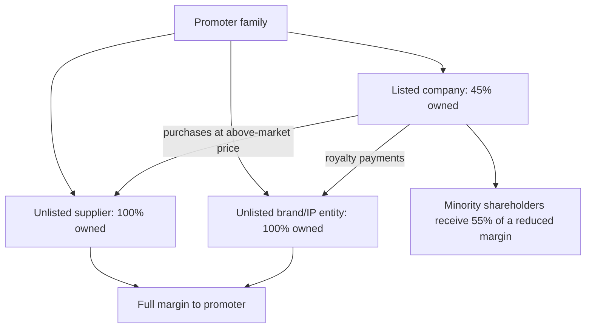

# Related-Party Transactions and Group Structures

## The Problem / Why this matters
In a market where a majority of listed companies are promoter-controlled and most sit within a larger family or business group, the central governance question is not whether management is competent but whether value flows to all shareholders or to the controlling shareholder. Related-party transactions are the mechanism through which value is extracted, and the group structure is the map showing where it can go. This is where minority shareholders in India have lost the most money, and it is disclosed — in a note most analysts skim.

## Core Idea
Read the related-party note as a **map of where cash can leave the company**, and read the group structure as the set of destinations. The question is never whether related-party transactions exist — they are normal — but whether they are at arm's length and whether the direction of value flow is toward or away from the listed entity.

## Why it works this way
A controlling shareholder who owns 100% of an unlisted supplier and 45% of a listed customer captures the full margin on the supplier and 45% of the margin on the customer. That asymmetry creates a permanent incentive to shift margin toward the wholly owned entity — legally, through pricing decisions that are individually defensible and collectively material.

## Full technical content

### What the disclosure contains

The related-party note discloses, by category of relationship, the nature and value of transactions and outstanding balances. Categories typically include holding and subsidiary companies, associates and joint ventures, key management personnel and their relatives, and **enterprises over which key management personnel exercise significant influence** — that last category being where the substantive issues usually sit.

### The transaction types that matter most

| Type | Extraction mechanism | What to check |
|---|---|---|
| **Purchases from promoter entities** | Above-market pricing shifts margin out | Gross margin versus peers; the proportion of total purchases |
| **Sales to promoter entities** | Below-market pricing, or revenue recognised on non-arm's-length sales | Realisation versus third-party realisation; receivable ageing on these balances |
| **Royalty / brand fees** | A charge for group brand use, often as a percentage of revenue | Quantum versus peers and versus profit; whether it rises when profits rise |
| **Loans and advances to related parties** | Cash leaves and may not return | Interest charged, tenor, repayment history, and whether balances are rolled |
| **Corporate guarantees** for group entities | Contingent liability that can become real | Amount versus net worth; the guaranteed entity's financial condition |
| **Premises leased from promoters** | Above-market rent | Rent per square foot versus market |
| **Managerial remuneration** | Direct extraction | Versus peers and versus profit; whether it rises when profits fall |
| **Acquisition of promoter-owned assets** | Purchase at inflated valuation | Independent valuation; the price versus the promoter's own cost |

### The tests to apply

**1. Quantum against a base.** Express related-party purchases as a percentage of total purchases, related-party revenue as a percentage of total revenue, and loans to related parties as a percentage of net worth. Absolute numbers mean nothing; proportions do.

**2. Direction of the flow.** Net cash out to related parties, sustained over years, is the pattern that matters — as distinct from operational transactions that net roughly to zero.

**3. Trend.** A steady rise in the proportion of related-party transactions over several years is more informative than any single year's level.

**4. Correlation with profitability.** Royalty or remuneration that increases in years of high profit and does not fall in weak years is extraction rather than compensation.

**5. Arm's-length evidence.** Compare the pricing to the third-party equivalent — market rent, peer royalty rates, prevailing interest rates on the loans made. **Where the company asserts arm's-length pricing without evidence, treat the assertion as unverified**, since the counterparty is not independent.

**6. Balance behaviour.** Loans and advances to related parties that are rolled over rather than repaid are, in economic substance, capital transferred out. Check whether the balance has ever gone down.

### Reading the group structure

The related-party note tells you what happened; the group structure tells you what can happen.

**What to build:** a map of the listed entity, its subsidiaries and their ownership percentages, associates and joint ventures, and — as far as public disclosure allows — the unlisted promoter entities that appear in the related-party note.

**What to look for:**
- **Where the cash-generating assets sit** versus where the debt sits. Cash in a subsidiary with minority shareholders is only partially available to the parent's shareholders.
- **Cross-holdings** between group companies, which obscure economic ownership and can entrench control with limited economic stake.
- **Layering** — chains of holding companies with no operating purpose. Complexity without a stated commercial rationale is itself a signal; legitimate structures usually have an explanation (regulatory, tax, joint-venture partner) that management can give.
- **Overseas subsidiaries** in jurisdictions with limited disclosure, particularly where a material share of consolidated revenue or assets sits there and is audited by other auditors. This combination has featured repeatedly in Indian accounting failures.
- **Recent restructuring** that moves assets between group entities, which changes who owns what and deserves close reading of the valuation basis.

### The regulatory framework

SEBI's LODR requirements subject material related-party transactions to **audit committee approval and, above defined thresholds, shareholder approval in which related parties do not vote**. Practical uses for the analyst:

- **Read the explanatory statement** accompanying a related-party resolution in a shareholder notice — it frequently contains detail on pricing and rationale not disclosed elsewhere.
- **Track voting outcomes.** A resolution passed with a large proportion of institutional votes against is a governance signal, and voting data is published. Proxy-advisory recommendations are also public and often contain useful analysis.
- **Watch for transactions structured just below approval thresholds**, or split into tranches that individually fall below them.

### How this enters the valuation

Three defensible approaches, in increasing severity:

1. **Adjust the numbers.** Where extraction is quantifiable — an above-market royalty, an inflated rent — restate earnings at arm's-length rates and value the restated business. This is the most rigorous treatment because it is explicit and testable.
2. **Apply a governance discount** to the multiple, stated and justified rather than assumed.
3. **Decline to recommend.** Where the structure permits extraction at management's discretion and history shows it happening, no multiple is low enough to compensate, because the minority shareholder's claim on future cash flow is not secure. **This is the honest answer more often than analysts are comfortable saying.**

The management-quality chapter's point applies here in its strongest form: governance is not one factor among many in a scoring framework, it is a precondition. Everything else in the analysis assumes that the cash flows you are valuing will reach the shareholders you are valuing them for.

## Common mistakes
- Skimming the related-party note instead of reading it.
- Looking at **absolute amounts** rather than proportions of the relevant base.
- Accepting an unevidenced **arm's-length assertion**.
- Missing **rolled-over** loans to related parties, which are transfers in substance.
- Ignoring **corporate guarantees** to group entities as contingent exposure.
- Not checking whether royalty and remuneration **fall in weak years**.
- Treating structural complexity as neutral when management cannot explain its purpose.
- Applying a vague governance discount instead of **restating** quantifiable extraction.
- Recommending a stock on cheapness where extraction is ongoing and unconstrained.

## Interview angle
"How do you assess whether a promoter is treating minority shareholders fairly?" Go to the related-party note and be concrete about the tests: express related-party purchases and sales as proportions of the totals rather than as absolute numbers; check the direction and persistence of net cash flow to related parties; look at whether royalty and managerial remuneration fall in weak years or only ratchet up; and check whether loans to related parties have ever actually been repaid or are simply rolled. Then move to the structure — where the cash-generating assets sit relative to the debt, whether there is layering without a stated commercial rationale, and whether material overseas subsidiaries are audited by someone other than the principal auditor. Finish with the treatment: quantifiable extraction should be restated into the numbers rather than handled with a vague governance discount, and where the structure permits discretionary extraction and history shows it occurring, the right answer is often that no multiple compensates for it.
