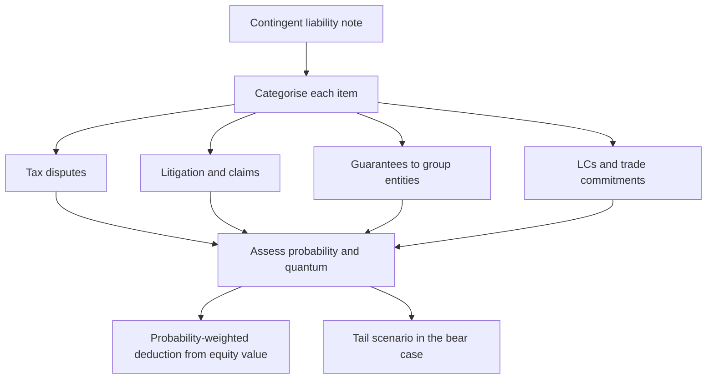

# Contingent Liabilities and Off-Balance-Sheet Exposure

## The Problem / Why this matters
The balance sheet shows what a company owes. The contingent-liability note shows what it might owe — tax demands under dispute, litigation, guarantees given for other entities, letters of credit, and claims not acknowledged as debts. These are excluded from net debt by definition, which means every enterprise-value calculation ignores them unless the analyst deliberately brings them in. For some Indian companies the contingent-liability disclosure exceeds net worth, and an analyst who has not read it is valuing a company while ignoring an exposure larger than its equity.

## Core Idea
Contingent liabilities are **probability-weighted claims on equity value**. They should be assessed item by item, and the material ones brought into the valuation explicitly — not treated as a footnote because accounting standards keep them off the balance sheet.

## Why it works this way
Accounting recognises a provision when an outflow is probable and estimable; below that threshold, the item is disclosed rather than recognised. The threshold is an accounting convention, not an economic one. An investor holding equity is exposed to the full distribution of outcomes, including the ones the standard declines to recognise.

## Full technical content

### The categories, and how they differ

| Category | Typical nature | Analytical treatment |
|---|---|---|
| **Disputed tax demands** (direct and indirect) | Often large, long-running, frequently resolved well below the demanded amount | Assess history of similar resolutions; interest accrual matters |
| **Litigation and claims** | Commercial disputes, consumer claims, regulatory penalties | Read the description; check whether it is quantified at all |
| **Guarantees given** on behalf of subsidiaries, associates or group entities | The most dangerous category | Assess the guaranteed entity's ability to service its own obligations |
| **Letters of credit and bank guarantees** in the ordinary course | Operational, usually routine | Low weight, but check the trend against revenue |
| **Capital commitments** | Contracted capex not yet incurred | Not a risk but a future cash-flow claim; include in the model |
| **Claims not acknowledged as debts** | A residual disclosure category | Read the wording — the framing signals management's own view |

### Tax disputes — the largest category in India, and the most misread

Indian companies commonly carry substantial disputed tax demands, and the naive readings in both directions are wrong.

- **Do not assume the full amount is payable.** A large proportion of demands are reduced or extinguished on appeal, and the disclosed figure often includes demands the company has strong grounds to contest.
- **Do not assume it is nothing.** Some crystallise, and the resolution can take a decade during which interest accrues on the disputed amount.

**The useful work:**
- Read the **description** for each material item — the issue in dispute is often stated, and some issues (transfer pricing, classification disputes) have known precedent.
- Check the **company's own history**: what proportion of past demands were ultimately paid? A company that has settled most past disputes at a small fraction of the demand deserves a lower weighting than one with a record of losing.
- Check whether the demand relates to a **recurring issue**, in which case similar demands will follow for subsequent years — the disclosed figure understates the ultimate exposure.
- Check whether **amounts have been deposited** pending appeal, which is cash already out and often sitting in other assets.
- **Sector patterns matter**: indirect-tax classification disputes are chronic in some manufacturing sectors, transfer-pricing disputes in IT services and pharma.

### Guarantees to group entities — the highest-risk item

This is where contingent liabilities have most often become real losses for Indian minority shareholders, because it combines the group-structure problem with an off-balance-sheet exposure.

- A guarantee given by a cash-generating listed entity for a leveraged unlisted group company means **the listed company's shareholders are underwriting the promoter's other ventures**.
- The exposure crystallises exactly when the guaranteed entity is in distress, which is typically when the group is under stress generally — so the correlation is adverse.
- **Assess the guaranteed entity directly** where possible: its leverage, its cash generation, its ability to service the guaranteed debt. If it cannot, the guarantee is not contingent in any meaningful sense; it is debt with a delay.
- Express the guarantee as a **percentage of the listed company's net worth**. Where it approaches or exceeds net worth, the equity is effectively a leveraged claim on the group rather than on the listed business.

### Other off-balance-sheet exposures worth checking

- **Put options written to joint-venture or subsidiary minority partners**, obliging the company to buy their stake at a formula price. These can be very large and are frequently buried in the notes.
- **Take-or-pay and long-term purchase contracts** — not a liability in form, but a fixed cost commitment that behaves like leverage in a downturn.
- **Securitised or assigned receivables with recourse**, where credit risk has not actually transferred.
- **Factoring and supply-chain financing arrangements**, which can present borrowing as trade payables and understate reported debt. Check payable days for a sudden extension without a stated commercial reason.
- **Operating-lease commitments** are now largely on balance sheet under current standards, but check the disclosure for short-term and low-value exclusions where they are material.

### Bringing it into the valuation

The defensible method:

1. **List every material item** with its amount and description.
2. **Assign a probability** to each, with a stated basis — resolution history, precedent, the guaranteed entity's condition. Do not give a false impression of precision; broad bands are honest and sufficient.
3. **Compute a probability-weighted amount** and deduct it from equity value.
4. **Model the full amount** of the largest items in the bear case, since the point of a bear case is the tail.
5. **Disclose what you have done** in the note, so the reader can substitute their own probabilities.

**Illustration.** A company with an equity value of ₹9,200cr discloses ₹1,850cr of contingent liabilities: ₹1,200cr of disputed tax where the company has historically settled at roughly 20% of demands, ₹400cr of guarantees to a group entity with weak cash generation, and ₹250cr of routine LCs.

- Tax: 1,200 × 25% ≈ ₹300cr
- Guarantee: 400 × 60% (weak guaranteed entity) = ₹240cr
- LCs: negligible
- **Probability-weighted deduction ≈ ₹540cr, or about 6% of equity value.**
- **Bear case: the full ₹1,600cr of tax and guarantee exposure**, or 17% of equity value, on top of the operational bear case.

That last line is the point of the exercise. A bear case that flexes only earnings and the multiple, as the common-mistakes lists throughout these chapters warn, misses this entirely.

### Where it changes the recommendation

- Where contingent liabilities are large relative to **net worth or market capitalisation**, they belong in the investment thesis rather than in a risk section, and the note should say so in the summary.
- **Resolution is a genuine catalyst** in both directions — a favourable ruling on a long-running dispute can be a substantial re-rating event, and it is dated in the sense that the process has a known stage.
- The **trend** matters: contingent liabilities rising much faster than revenue indicates either an accumulating dispute problem or an expanding guarantee book, and both deserve investigation.

## Common mistakes
- Not reading the contingent-liability note at all.
- Assuming either the **full amount** or **none** of it will crystallise.
- Ignoring **guarantees to group entities**, the highest-risk category.
- Failing to express guarantees as a proportion of **net worth**.
- Missing **written put options** to minority partners buried in the notes.
- Treating capital commitments as a risk rather than as a modelled cash outflow.
- Building a bear case that flexes earnings and the multiple but ignores contingent exposure.
- Overlooking **amounts already deposited** under protest, which are cash out.
- Ignoring the **trend** in contingent liabilities relative to revenue.

## Interview angle
"Contingent liabilities are 40% of the company's net worth. What do you do?" Refuse both easy answers — neither ignoring it nor deducting the full amount is right — and instead break it into categories, because they behave completely differently. Disputed tax demands should be weighted using the company's own resolution history and the nature of the issue, since a large share are typically settled well below the demanded amount, though interest accrues over long appeal periods. Guarantees given for group entities are the dangerous category and deserve direct assessment of whether the guaranteed entity can service its own debt — if it cannot, this is not contingent, it is deferred debt, and it crystallises exactly when the group is already under stress. Routine letters of credit carry little weight. Then say what you do with it: deduct a probability-weighted amount from equity value with the probabilities stated so a client can substitute their own, and model the full exposure in the bear case, since that is precisely what a bear case is for.
