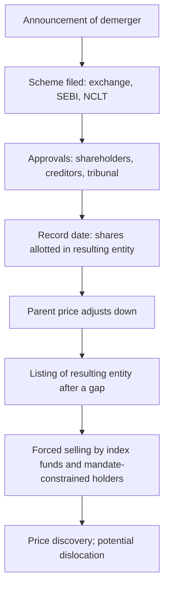

# Demergers, Spin-offs and Value Unlocking

## The Problem / Why this matters
Demergers are among the most reliable sources of large, analytically tractable returns in equity markets, and among the most poorly analysed. A conglomerate separating its businesses creates two or more listed entities whose combined value frequently exceeds the pre-announcement value of the parent — but the mechanics are complex, the record date arithmetic confuses many holders, and forced selling in the smaller entity after listing regularly creates dislocations. An analyst who understands the sequence can anticipate both the re-rating and the post-listing distortion.

## Core Idea
A demerger creates value by **removing the conglomerate discount, allowing separate capital structures and management focus, and creating a pure-play that a different investor base will pay for** — and by producing a temporary supply/demand dislocation that has nothing to do with value.

## Why it works this way
A diversified group is valued by investors who must hold all its businesses to own any of them. Investors who want the good business but not the weak one simply do not buy. Separation lets each business attract its natural shareholder base, and the pure-play typically re-rates toward the multiple of its comparable peers rather than the blended group multiple.

## Full technical content

### The mechanics and the timeline

A demerger in India proceeds through a **scheme of arrangement**, requiring exchange and SEBI observations, shareholder and creditor approval, and sanction by the National Company Law Tribunal. The full process commonly takes twelve to eighteen months from announcement, and delays are routine.

The sequence that matters for price:

1. **Announcement.** The stock typically re-rates immediately as the market anticipates the unlock.
2. **Approval process.** Long, with limited news flow; the price often drifts as attention fades.
3. **Record date.** Holders of the parent receive shares in the resulting entity in the stated ratio. **The parent's price adjusts downward** to reflect the value transferred out — this is arithmetic, not a fall, and the exchanges publish the adjustment basis.
4. **Listing gap.** The resulting entity's shares are allotted but not immediately tradeable; the gap between record date and listing can run to several weeks.
5. **Listing and price discovery.** Often volatile, for reasons below.

### The post-listing dislocation — where the opportunity is

This is the part worth understanding in detail, because it recurs reliably:

- **Index funds must sell.** The resulting entity is generally not in the indices the parent belonged to, so every passive fund holding the parent receives shares it is mandated to sell, regardless of price.
- **Mandate constraints force selling.** A large-cap fund receiving shares in a mid-cap entity, or a diversified fund receiving a sector it cannot hold, must sell.
- **Small holders sell.** Retail holders who receive a small odd-lot position in an unfamiliar company frequently sell without analysis.
- **No analyst coverage exists yet.** The resulting entity has no research, no history as a standalone, and no earnings track record — so buyers are scarce precisely when sellers are forced.

**The result is heavy, price-insensitive selling into a market with no natural buyer base**, which regularly pushes the resulting entity well below any reasonable estimate of value in the weeks after listing. This is one of the more durable inefficiencies in equity markets, documented across geographies, and it persists because the sellers are constrained rather than uninformed.

**For the analyst:** initiating coverage on the resulting entity early, before the forced selling completes, is high-value work — it is a situation where research genuinely creates the buyer base that is missing.

### Analysing the entities before separation

The work should be done well before the record date:

1. **Obtain the segment financials.** The scheme document and the information memorandum filed before listing contain the resulting entity's carve-out financials — often the first standalone view available, and read by very few people.
2. **Allocate the balance sheet.** Which entity takes the debt? Which takes the cash? The scheme specifies this, and it drives the relative valuations more than the operating split does.
3. **Identify shared costs.** Corporate overheads allocated in segment reporting may not reflect the standalone cost of running each entity — a business carved out of a group typically incurs *higher* standalone costs (its own treasury, compliance, listing costs), and segment margins therefore overstate standalone margins.
4. **Check ongoing arrangements** between the entities — supply agreements, brand licensing, shared services. These become related-party transactions after separation, and their pricing determines value flow between the two.
5. **Value each on its own peer set**, which is the entire point of the exercise. A pure-play consumer business separated from an industrial group is valued against consumer peers, not the group's blended multiple.
6. **Sum and compare** to the pre-announcement market capitalisation to size the unlock.

### The conglomerate discount

The theoretical basis for the unlock, and worth stating honestly:

**Why it exists:**
- Investors cannot express a view on one business without taking the others.
- Cross-subsidisation lets weak businesses consume the cash of strong ones.
- Complexity and opacity in reporting.
- Management attention divided.
- No natural analyst home — sector specialists each cover part of it and none covers all.

**Why it sometimes should not be removed:**
- Genuine operational synergies, if they exist, are lost on separation.
- Diversification can lower the cost of debt.
- Shared corporate functions are cheaper in aggregate; duplicating them raises combined costs.

**The honest position:** the discount is usually real and usually larger than the lost synergies, which is why demergers typically create value — but "sum of the parts is higher than the market cap" is not automatically an investment case. It is only actionable if a **credible, dated mechanism** for the separation exists. The holding-company chapter's warning applies with full force: an unexploited discount can persist indefinitely, and holding-company discounts frequently widen for years rather than closing.

### Other value-unlocking structures

| Structure | Mechanism | Analytical note |
|---|---|---|
| **Subsidiary IPO** | Partial listing establishes a market value for a stake | Creates a visible mark but may not close the holding-company discount; the parent often continues to trade below the sum |
| **Asset sale** | Cash realised, often at a premium to the implied market value | Cleaner than a demerger; the question is what the cash is used for |
| **Buyback funded by an asset sale** | Returns proceeds directly | The most shareholder-friendly form, and rare |
| **Reverse merger** | An unlisted business gains listing through a listed shell | Scrutinise the swap ratio and the valuation basis |
| **Promoter stake consolidation** | Simplifies structure | Watch the pricing and whether minorities are treated equally |

### What to write in the note

- The **timeline**, with the approval stages and realistic dates, since the process slips routinely.
- **Separate valuations** for each entity against its own peer set, with the balance-sheet allocation stated.
- The **standalone cost adjustment** — the segment margins overstate what each entity earns alone.
- An explicit statement about the **post-listing dislocation**, and whether the recommendation is to hold through it or to buy into it.
- The **ongoing related-party arrangements** between the entities and their pricing.
- **What could go wrong**: approval delays, an unfavourable allocation of liabilities, and the risk that the resulting entity's standalone cost base is worse than modelled.

## Common mistakes
- Recommending a stock on a **sum-of-the-parts gap** with no dated mechanism to close it.
- Reading the parent's **record-date price adjustment** as a decline.
- Using **segment margins** as standalone margins, ignoring the higher cost of operating independently.
- Missing which entity receives the **debt** — often the dominant driver of relative value.
- Ignoring the **forced-selling dislocation** after listing, or mistaking it for a fundamental verdict.
- Not reading the **information memorandum**, which contains carve-out financials few others read.
- Overlooking **ongoing inter-company arrangements** that transfer value after separation.
- Assuming approval timelines will be met.

## Interview angle
"A conglomerate announces a demerger. Walk me through your analysis." Start with the balance sheet, not the businesses: the scheme specifies which entity takes the debt and which takes the cash, and that allocation usually drives relative value more than the operating split. Then value each entity against its own peer set, since removing the conglomerate discount by letting each business attract its natural shareholder base is the entire economic rationale — but adjust segment margins downward for the standalone costs each entity will now bear alone, which is the step most often missed. Cover the timeline realistically, since a scheme of arrangement through NCLT commonly takes over a year and slips. Then show you understand the trade: after the record date and listing, index funds and mandate-constrained holders must sell the resulting entity regardless of price, into a market with no coverage and no natural buyer base, which reliably creates a dislocation — so the question for the recommendation is whether to hold through that or to buy into it. Finish with the caution that a sum-of-the-parts gap alone is not an investment case without a dated mechanism to close it.
