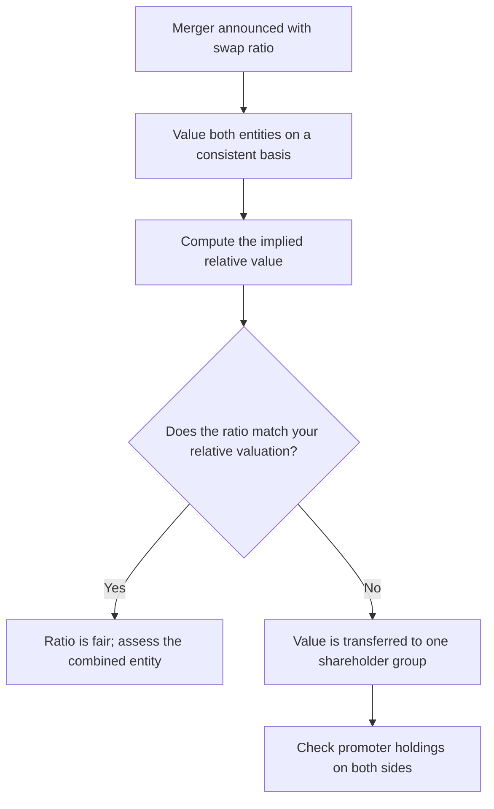

# Mergers, Swap Ratios and Schemes of Arrangement

## The Problem / Why this matters
When two listed companies merge, shareholders of one receive shares of the other in a fixed ratio. That ratio is the entire economics of the transaction for a minority shareholder, and it is determined by valuers appointed by the boards — parties who are not independent of the promoters who negotiated the deal. Assessing whether a swap ratio is fair, and understanding how the two share prices behave between announcement and completion, is a recurring and highly analysable situation.

## Core Idea
In a share-swap merger, the question is not "is the target being acquired at a good price" but **"is the ratio fair to the shareholders of the entity I hold"** — and the answer requires valuing both entities on a consistent basis rather than accepting the valuer's report.

## Why it works this way
A swap ratio is a relative valuation. If the acquirer is overvalued relative to the target, its shareholders benefit from issuing expensive paper; if undervalued, they are diluted. Because both sides are often negotiated by parties with overlapping promoter interests, the ratio can transfer value between shareholder groups in ways that no cash consideration would permit.

## Full technical content

### Reading the swap ratio

**The ratio states how many shares of the surviving entity a shareholder of the merging entity receives.** For example, "7 shares of A for every 10 shares of B" means each B share is being valued at 0.7 A shares.

**The implied relative valuation:**
Implied value per B share = 0.7 × A's share price

Compare this to B's own market price before the announcement. The premium or discount is the immediate economic effect for B's shareholders — but the *durable* effect depends on whether A's share price itself is fair, since B's shareholders are receiving A's paper and will hold it.

**This second-order point is what most analysis misses.** A generous-looking ratio paid in overvalued acquirer stock can leave the target's shareholders worse off than a lower ratio in fairly valued stock.

### Assessing fairness properly

1. **Value both entities on a consistent basis.** The same methodology, the same forecast horizon, the same discount-rate approach. Using a DCF for one and a peer multiple for the other invites the result to be manufactured.
2. **Compute your own implied ratio** from those valuations, and compare it to the announced one.
3. **Check what the valuers used.** The valuation report is typically summarised in the scheme documents and the explanatory statement, including the methods and weights applied. **The weighting between methods is where discretion concentrates** — shifting weight from a market-price method to an asset-based one can change the ratio substantially, and the choice of weights is rarely justified in detail.
4. **Check the reference period** for any market-price component. A period chosen when one stock was depressed favours the other side.
5. **Look at promoter holdings on both sides.** Where promoters hold a materially higher stake in one entity, they benefit from a ratio favouring that entity — this is the single most important structural check, and it is public information.
6. **Read the proxy-advisory reports**, which are published for contested schemes and often contain detailed ratio analysis.

### The shareholder approval mechanism

Schemes require approval by shareholders, and SEBI requires that for certain schemes the votes cast by **public shareholders in favour must exceed those against**. This is a genuine minority protection:

- It means institutional investors can and occasionally do block schemes.
- **Voting outcomes are published**, and a large proportion of institutional votes against a scheme that nonetheless passed is a governance signal about the company worth carrying forward.
- The NCLT sanction stage provides a further check, and objections can be raised there.

For the analyst, a scheme facing visible institutional opposition carries genuine completion risk that the market may under-price.

### Price behaviour between announcement and completion

Once a ratio is fixed, the two stocks become mechanically linked:

- The target's price should trade near the ratio times the acquirer's price, **less a discount for completion risk and the time to closing**.
- That discount is a **market-implied completion probability**, and it is directly observable — a wide discount means the market doubts completion, and understanding why is the research task.
- **Merger arbitrage** participants buy the target and short the acquirer in the ratio, capturing the spread if the deal completes. Their activity is what keeps the two prices linked, and it creates persistent short pressure on the acquirer.
- **Deal breaks** produce sharp moves in both directions, and the target typically falls back toward or below its pre-announcement price.

The practical reading: **a widening spread is information**, usually the first visible sign that a market participant has learned something about approval risk.

### Analysing the combined entity

Beyond the ratio, the merged business must be assessed:

- **Synergies.** Treat claimed synergies with scepticism — cost synergies are more achievable than revenue synergies, and both take longer than announced. Model them with a delay and a haircut, and check whether the claimed amount has been quantified or merely asserted.
- **Integration costs**, which are usually disclosed as a range and usually understated.
- **The combined capital structure**, particularly where one entity is leveraged and the other is not.
- **Accounting treatment.** A merger changes the comparative basis of every historical series, and the purchase-price allocation creates goodwill and intangibles whose amortisation affects reported earnings. **Historical growth rates computed across a merger date are meaningless** unless restated.
- **Cultural and management questions** — who runs the combined entity, and what the retention picture looks like for the acquired management.

### Group restructurings and related-party mergers

The highest-risk category: a merger between entities under common promoter control, particularly where an unlisted promoter-owned business is merged into a listed one.

**What this achieves for the promoter:** the unlisted business gains listing and liquidity, and the promoter's stake in it converts into listed shares — all determined by a ratio negotiated with themselves on both sides.

**What to check:**
- The valuation of the **unlisted** entity, where no market price exists and the valuer has the widest discretion.
- Whether the unlisted business's historical financials have been **audited to the same standard**.
- Whether the merged business has genuine strategic logic or is a mechanism for monetising a promoter asset.
- The **public-shareholder vote** outcome, which is the minority's actual protection here.

Where the answers are unsatisfactory, this belongs in the investment thesis rather than in a governance section — it is a live demonstration of how the controlling shareholder treats minorities, and it predicts future behaviour better than any policy statement.

## Common mistakes
- Assessing the ratio against the target's price alone, ignoring whether the **acquirer's** stock is fairly valued.
- Accepting the **valuers' weights** between methods without examining them.
- Not checking **promoter holdings on both sides** to see who benefits from the ratio.
- Ignoring the **reference period** used for market-price-based components.
- Treating the announcement-to-completion spread as noise rather than as an implied completion probability.
- Accepting **asserted synergies** without quantification, timing or a haircut.
- Computing growth rates **across a merger date** without restating.
- Overlooking published **institutional voting outcomes** as a governance signal.

## Interview angle
"Two companies in your coverage announce a merger at a fixed swap ratio. How do you assess it?" Begin with the relative-value framing: the ratio is a statement about the two entities' relative worth, so value both on a consistent basis and compare your implied ratio to the announced one. Make the second-order point that distinguishes a careful answer — the target's shareholders receive the acquirer's paper and will hold it, so a generous ratio in overvalued stock can be worse than a lower ratio in fairly valued stock. Then the structural checks: examine the weights the valuers applied between methods, since that is where the discretion sits; check the reference period for any market-price component; and above all compare promoter holdings on both sides, because a promoter with a larger stake in one entity benefits from a ratio favouring it. Add that the spread between the target's price and the ratio-adjusted acquirer price is an observable market-implied completion probability, and that a widening spread is usually the first sign someone has learned something about approval risk.
