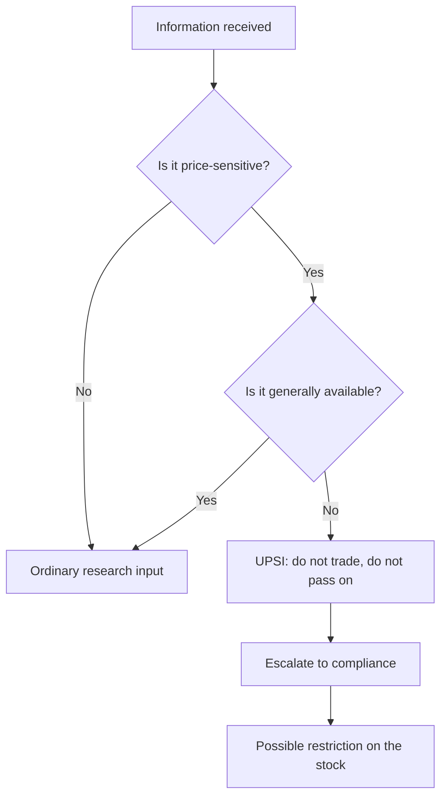

# Insider Trading Regulations and Reading Insider Transactions

## The Problem / Why this matters
An equity analyst operates continuously near material non-public information — in management meetings, in channel checks, in conversations with bankers and former employees. The line between diligent research and receiving unpublished price-sensitive information is not always obvious in the moment, and crossing it ends careers. Separately, the disclosures the regulations produce are themselves a research input: insider transactions are published, and they are among the more informative signals available for free.

## Core Idea
The regulations define **what you may not act on and what you must not pass on**, and the same regulations generate a public dataset of promoter and insider trading that an analyst should read routinely.

## Why it works this way
The prohibition attaches to information, not to people. Anyone in possession of unpublished price-sensitive information is restricted, whether they are an insider by designation or received it in a conversation — which is why the practical discipline for an analyst is about the *nature* of what is learned rather than about who said it.

## Full technical content

### The core concepts

| Concept | Meaning |
|---|---|
| **UPSI** — unpublished price-sensitive information | Information relating to a company or its securities, not generally available, which on becoming available is likely to materially affect the price |
| **Insider** | A connected person, or **anyone in possession of UPSI**, however obtained |
| **Generally available** | Information accessible to the public on a non-discriminatory basis |
| **Legitimate purpose** | The narrow basis on which UPSI may be shared, with the recipient then becoming an insider |
| **Trading window** | Period during which designated persons may trade; closed around results and other events |

Illustrative categories of UPSI include unpublished financial results, dividends, changes in capital structure, mergers and restructurings, changes in key management, and material contracts or regulatory outcomes.

### The analyst's practical boundaries

The rules that keep research on the right side of the line:

**In management meetings:**
- Ask about **strategy, industry structure, capital allocation, competitive dynamics and historical decisions**.
- Do not ask for **quarterly numbers before publication, forward guidance not publicly given, or specifics of pending transactions**.
- If management volunteers something that sounds like UPSI, **stop the conversation, do not act, and inform compliance immediately.** The obligation attaches on receipt, regardless of whether you sought it.
- Selective disclosure by the company is itself a regulatory breach on their part, and the company is required to disseminate promptly — a fact worth knowing, because it means the correct response protects you and forces publication.

**In channel checks and expert networks:**
- Structural and historical questions are legitimate: how the industry works, how distribution is organised, what changed over the last five years.
- **Do not seek current-period specifics** about the covered company from its employees, customers or suppliers — a distributor's current-month sell-through for one company is close to the line, and a company employee's account of the quarter to date is over it.
- Former employees should be asked about the period during which they worked and about structural matters, not about current confidential data they may still know.
- Where an expert network is used, its compliance framework matters, and the analyst is still responsible for the questions asked.

**In writing:**
- Research must rest on **published or independently developed** information.
- The mosaic principle — combining individually non-material public information into a material conclusion — is legitimate and is the foundation of differentiated research. **Keep the record of sources**, because the ability to demonstrate how a conclusion was reached is the practical defence.

### Codes of conduct and personal trading

Research firms maintain codes requiring pre-clearance of personal trades, minimum holding periods, restrictions on trading in covered stocks, and disclosure of holdings. The analyst-specific requirements — disclosing personal and family holdings in a covered company in the research note itself, and restrictions around report publication — are covered in the regulatory chapter for research analysts; the point of intersection here is that personal-trading rules and insider-trading rules apply simultaneously and independently.

**A restricted list** is maintained where the firm possesses UPSI, typically through its banking side, and analysts may be prevented from publishing on a stock without being told why. This is normal and is a control working as intended.

### Reading insider transactions as a signal

The regulations require designated persons and promoters to disclose trades above specified thresholds, and exchanges publish these. This is a genuine research input.

**What carries information:**
- **Open-market purchases with personal money** are the most informative — undiversified, costly, and publicly disclosed.
- **Cluster buying** by several insiders independently is stronger than a single transaction.
- **Purchases after a sharp decline** are more informative than purchases in a rising market.
- **Size relative to the individual's wealth or salary**, where inferable — a CFO buying an amount equal to several years of salary is a different signal from a token purchase.

**What carries much less:**
- **Sales** are weakly informative, because insiders sell for many reasons unrelated to the outlook — diversification, tax, personal liquidity, exercise-and-sell on options.
- **Option exercises followed immediately by sale** are compensation being realised, not a view.
- **Purchases just before a positive announcement** — these are a compliance concern rather than a signal, and the trading-window rules exist to prevent them.

**The trading-window mechanic is itself informative:** trading windows close ahead of results, so insider purchases occur in defined periods. An insider buying immediately after a window opens, having presumably known the results before the market did, is a stronger signal than the same purchase at a random time.

### Promoter transactions specifically

In the Indian context, promoter buying and selling is the most-watched form:
- **Creeping acquisition** by promoters, within the permitted annual limit, signals accumulation.
- **Promoter selling** requires an explanation, and its absence is informative — this connects directly to the shareholding-pattern analysis.
- **Encumbrance disclosures** — pledges and their release — are required, and a release of pledged shares is a positive development frequently overlooked because it generates no headline.

### When an analyst becomes an insider unintentionally

The most likely real-world scenario is not deliberate misconduct but accidental receipt. The correct sequence:
1. **Stop the conversation** and do not seek elaboration.
2. **Do not trade** personally, and do not publish anything that reflects the information.
3. **Report to compliance immediately** and in writing.
4. Expect the stock to be **restricted** until the information is public.
5. **Do not tell colleagues** what was learned — passing it on is a separate breach.

The failure mode to avoid is rationalisation: concluding that the information was probably not material, or was probably already known, and proceeding. Those judgements are not yours to make in the moment, and compliance exists to make them.

## Common mistakes
- Assuming the prohibition applies only to designated insiders, when it attaches to **anyone in possession** of UPSI.
- Asking management for **current-quarter specifics** before publication.
- Treating a former employee's knowledge of current confidential data as fair game.
- Failing to **document sources**, losing the ability to demonstrate a mosaic.
- Reading insider **sales** as a bearish signal with the same weight as purchases.
- Counting **option exercise-and-sell** as an insider sale.
- Ignoring the **trading-window timing** when assessing how informative a purchase is.
- Rationalising accidental receipt of UPSI rather than escalating.
- Overlooking **pledge-release** disclosures as a positive signal.

## Interview angle
"In a management meeting the CFO tells you the quarter is tracking well ahead of guidance, before results. What do you do?" The answer must be immediate and unambiguous: that is unpublished price-sensitive information, so you stop the conversation there, do not trade personally, do not publish anything reflecting it, do not discuss it with colleagues, and report it to compliance in writing straight away — expecting the stock to go on the restricted list until the company discloses. Add the point that shows understanding rather than rule-recitation: the obligation attaches on receipt regardless of whether you sought it, and the selective disclosure is a breach on the company's side that they are required to cure by disseminating publicly, so escalating is both the compliant response and the one that gets the information to the market. If asked what you *can* ask about, distinguish structural and historical questions — industry dynamics, capital allocation, past decisions — from current-period specifics, and note that combining individually immaterial public information into a material conclusion is the legitimate foundation of differentiated research, which is why keeping a source record matters.
