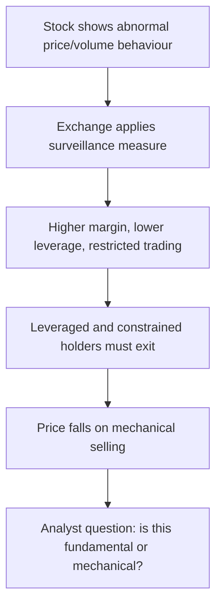

# Surveillance, Circuit Filters and Trading Restrictions

## The Problem / Why this matters
Indian exchanges operate an extensive surveillance apparatus — price bands, additional surveillance measures, graded surveillance, periodic call auctions, and derivative bans — that directly constrains whether a stock can be bought, sold, or held at size. A recommendation on a stock in a surveillance framework may be unimplementable, and a stock entering one can fall sharply for reasons that have nothing to do with its business. Analysts covering small and mid caps who do not track this will be repeatedly caught out.

## Core Idea
Surveillance measures change the **mechanics of trading**, not the value of the business — but because they impose margin requirements, remove leverage and restrict participation, they force selling by constrained holders and can produce large price moves with no fundamental content.

## Why it works this way
The measures are designed to dampen speculative excess by making a stock expensive and inconvenient to trade. That works — but it works by removing buyers, and removing buyers from a market where holders still want to sell produces a price decline that reflects the restriction rather than the company.

## Full technical content

### The main mechanisms

| Mechanism | Effect |
|---|---|
| **Price bands (circuit filters)** | Caps the daily move at a set percentage; the stock cannot trade beyond it |
| **Market-wide circuit breaker** | Index-level move triggers a market-wide halt for a defined period |
| **Additional Surveillance Measure (ASM)** | Higher margins, sometimes 100%, applied to stocks with abnormal price/volume activity |
| **Graded Surveillance Measure (GSM)** | Progressive stages, escalating to periodic call auction and trade-for-trade settlement |
| **Trade-for-trade segment** | No intraday netting; every trade must be settled by delivery |
| **Periodic call auction** | Trading collapsed into periodic auctions rather than continuous matching |
| **F&O ban period** | When open interest exceeds a market-wide limit, only position-reducing trades are permitted |

### Price bands and their effects

Individual stocks carry daily price bands; the tightest bands apply to the most speculative names, and stocks in the derivatives segment generally have wider or no fixed bands with dynamic limits instead.

**What a band does to the analyst's work:**
- **A stock locked at the upper or lower band has no meaningful price.** It has a last traded price and an order imbalance, which is not the same thing. Valuing a portfolio position, computing an upside to target, or claiming a stock "fell 20%" when it was band-locked for four consecutive days all misrepresent the situation.
- **Exit is impossible** while locked at the lower band with only sellers. This is the practical risk: a position that cannot be sold at any price for several sessions.
- Band-locked sequences are common in small caps after a governance event, and the cumulative decline over the unlock period is typically far larger than any single day suggests.

### ASM and GSM

**ASM** applies to stocks showing abnormal activity on defined criteria — price variation, volume, delivery percentage, concentration of participants. The main consequence is **greatly increased margin**, sometimes to 100%, which:
- Eliminates leveraged buying entirely.
- Forces existing leveraged holders to either fund fully or exit.
- Removes a substantial part of the buying interest in a speculative stock.

**GSM** is a graded framework for stocks with poor fundamentals combined with unusual price behaviour, escalating through stages that progressively restrict trading — periodic call auctions, higher margins, and price caps on upward movement.

**The analytical implications:**
- **Entry into ASM/GSM is a dated, disclosed event** that mechanically removes buyers. The subsequent decline is predictable in direction and has no fundamental content.
- **Exit from the framework** works in reverse and can produce a sharp recovery.
- **GSM inclusion is a signal about the company**, since the criteria include fundamental parameters — a stock in the higher GSM stages is one the exchange has assessed as having weak fundamentals alongside speculative price action, which is information worth taking seriously.
- Lists are published, so tracking coverage names against them is a routine, low-effort check.

### The F&O ban period

When market-wide open interest in a stock's derivatives exceeds the prescribed limit, the stock enters a ban period during which **only position-reducing trades are allowed**.

- New positions cannot be opened, which removes the marginal derivative buyer.
- Existing positions can only be closed, which biases flow toward unwinding.
- Stocks in ban frequently see elevated volatility and squeeze dynamics, since shorts cannot add and longs cannot add.
- Entry and exit from ban are published daily and are a routine part of the derivatives data discussed earlier.

**For a fundamental analyst**, the ban list is mainly useful as a crowding indicator: a stock repeatedly in ban has very heavy derivative positioning relative to its size, which is relevant to both sizing and the expected payoff of a correct call.

### Other restrictions worth tracking

- **Trade-for-trade settlement** removes intraday trading entirely and sharply reduces volume, widening spreads and raising impact cost.
- **Suspension** — for non-compliance with listing requirements, or in an insolvency process — can leave holders unable to exit for extended periods. **Compulsory delisting** in extreme cases leaves shareholders with an illiquid unlisted holding, which is close to a total loss in practical terms.
- **Upper-circuit-only stocks with negligible float** should be treated with extreme caution; a rising price on tiny volume is not evidence of anything.

### How this belongs in research

**In the recommendation:**
- **State the constraint.** A note recommending a stock in a periodic call auction with 100% margin should say so prominently, since it determines whether the recommendation is actionable at all.
- **Size for the exit, not the entry.** The liquidity analysis must assume the restricted state, not the normal one.

**In interpreting price moves:**
- Before attributing a decline to fundamentals, check whether the stock entered a surveillance measure. This is the same discipline as checking the index calendar and block-deal data — mechanical explanations should be eliminated first.

**As a signal about the company:**
- Repeated surveillance inclusion, particularly GSM, is a genuine negative indicator. The exchange's criteria combine fundamental weakness with speculative activity, which is a combination worth respecting rather than dismissing as bureaucratic.

**As an opportunity:**
- Where a fundamentally sound company is caught in a measure by mechanical criteria, the forced-selling decline can create an entry — but only for an investor whose horizon exceeds the restriction period and whose position size is compatible with the constrained liquidity. **Both conditions must hold; most institutional mandates fail the second.**

## Common mistakes
- Treating a **band-locked** last traded price as a market price.
- Computing upside to target from a price at which the stock cannot actually be bought.
- Attributing an ASM/GSM-driven decline to fundamentals.
- Ignoring **GSM inclusion** as a signal, when the criteria include fundamental weakness.
- Sizing a position on normal-state liquidity rather than restricted-state liquidity.
- Recommending a stock in periodic call auction without stating the constraint.
- Reading upper-circuit moves on negligible volume as price discovery.
- Overlooking the F&O ban list as a crowding indicator.

## Interview angle
"A small cap in your coverage has fallen 30% in a week with no company news. What do you check?" Work through mechanical explanations before fundamental ones: whether the stock entered ASM or GSM, which raises margins sharply and removes leveraged buyers entirely; whether it has been locked at the lower circuit, in which case the quoted prices are order imbalances rather than tradeable prices and the real decline may be larger still; whether a block deal or a lock-in expiry released supply; and whether an index or fund-level flow explains it. Then make the analytical distinction — a surveillance measure does not change what the business is worth, but it does force constrained holders out and removes the buyers who would normally absorb that, so the decline is mechanical. Add the caveat that separates a careful answer: GSM criteria include fundamental parameters, so inclusion is not purely mechanical and is itself a signal worth taking seriously. Finish on implementability — if the stock is in periodic call auction with 100% margin, any recommendation has to state that, because the position may not be exitable at the size a client would want.
