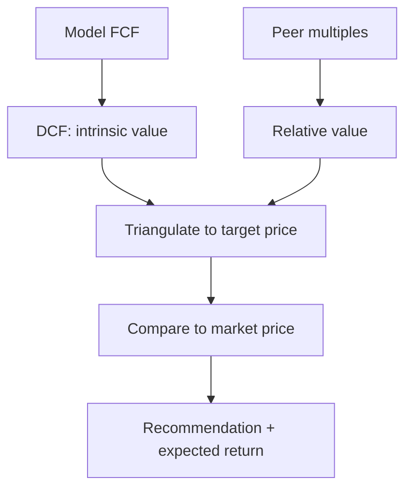

# Applied Equity Valuation

## The Problem / Why this matters
Research turns analysis into a **number** — an estimate of what a share is worth — so it can be compared to the market price. This chapter applies the valuation toolkit (covered deeply in the Valuation book) specifically to **equity research**: how analysts actually use DCF and multiples to set a target price and a recommendation. Interviewers test whether you can value a company end to end and defend the assumptions.

## Core Idea
Applied equity valuation triangulates **intrinsic value** (DCF) and **relative value** (multiples vs peers) into a target price. The gap between that target and the market price — plus catalysts — drives the buy/sell/hold recommendation and the expected return.

## Why it works this way
No single method is definitive: DCF is theoretically pure but assumption-sensitive; multiples reflect the market's current view but can be collectively wrong. Using both and cross-checking gives a value *range* you can defend, and forces you to understand *why* they differ.

## Full technical content

**DCF in research:**
- Project 5–10 years of **free cash flow** (FCFF) from the model.
- Discount at **WACC**; add a **terminal value** (Gordon growth or exit multiple).
- Sum to **enterprise value**; bridge to **equity value** (subtract net debt, minority interest; add associates); divide by diluted shares → **intrinsic price**.
- Run **sensitivity** on WACC and terminal growth (the two swing factors) and present a range.

**Relative valuation (multiples):**
- Pick the right multiple for the sector: **EV/EBITDA** (capital-structure neutral, most sectors), **P/E** (equity-level, mature/stable), **EV/Sales** (loss-making/high-growth), **P/B** (banks/financials), **PEG** (growth-adjusted).
- Apply the peer multiple to the company's metric → implied value.
- Adjust for differences in growth, margins, returns and risk vs peers.

**Setting the target price.** Weight the methods (e.g., 60% DCF, 40% comps), or use a football-field range and pick a point. The **12-month target price** implies an expected return vs the current price, which maps to the rating:
| Expected return | Typical rating |
|---|---|
| > +15% | Buy / Overweight |
| −10% to +15% | Hold / Neutral |
| < −10% | Sell / Underweight |

**Bank/financials valuation** uses P/B and ROE (excess-return / residual-income models), and DDM — since FCFF/EV multiples don't work for financials.

**High-growth/loss-makers** rely on revenue multiples, unit economics, and a path-to-profitability DCF with explicit scenarios.

**Sanity checks:** does the implied terminal multiple make sense? Is terminal growth below GDP? Does the target imply a reasonable forward P/E? Reconcile DCF and comps — a large gap needs an explanation.

## Worked examples

**Example 1 — DCF to target.** FCFF grows to ₹120 cr in year 5; WACC 11%, terminal growth 4%. Terminal value = 120 × 1.04 / (0.11 − 0.04) = ₹1,783 cr, discounted back; sum of PV of FCFs + PV of TV = enterprise value ₹1,400 cr. Less net debt ₹200 cr = equity value ₹1,200 cr; ÷ 100 mn shares = **₹120/share** intrinsic. Market price ₹100 → ~20% upside → **Buy**.

**Example 2 — comps cross-check.** Peers trade at 12× EV/EBITDA. The company's EBITDA is ₹130 cr → implied EV ₹1,560 cr; less net debt ₹200 cr = equity ₹1,360 cr ÷ 100 mn = **₹136/share**. The DCF said ₹120, comps say ₹136 — a defensible range of ₹120–136 vs a ₹100 price; the analyst sets a target around ₹128 and rates it Buy.

**Example 3 — why DCF and comps differ.** DCF (₹120) is below comps (₹136) because the analyst's forecast is more conservative than the growth the market is pricing into peers. Stating *why* they differ — and which you trust — is the analytical value-add. If you think the market's peer growth is too optimistic, lean on the DCF.

**Example 4 — a worked football-field range across methods.** An analyst triangulates a target price from four methods for the same company: DCF gives ₹115-135/share (a range from WACC/growth sensitivity), EV/EBITDA comps give ₹128-142/share (using the peer group's 25th-75th percentile multiple range, not a single point multiple), P/E comps give ₹120-138/share, and a dividend-discount-model cross-check (for this dividend-paying, mature name) gives ₹110-125/share. Plotting all four ranges as horizontal bars on one chart (the "football field") immediately shows where they overlap — roughly ₹120-135/share across all four methods — which is a far more defensible target range to present to an investment committee than any single method's point estimate, since the overlap itself is evidence that the conclusion isn't an artifact of one method's specific assumptions.

**Example 5 — choosing the right multiple when peers have different capital structures.** Two peer companies in the same sector look very different on P/E (Peer A trades at 18x, Peer B at 28x) but nearly identical on EV/EBITDA (both around 11x) — the P/E gap is explained almost entirely by Peer B carrying much less debt than Peer A, so more of its enterprise value sits in the equity layer (P/E), inflating the P/E multiple relative to A's more debt-financed structure without reflecting any genuine difference in operating quality. This is exactly why EV/EBITDA (Part 10's "capital-structure neutral" framing) is generally preferred over P/E for comparing companies with different leverage levels — an analyst who compares two differently-levered peers on P/E alone risks drawing a completely wrong conclusion about relative operating performance.

## How it is tested in interviews
- **"How would you value this company?"** — "DCF for intrinsic value — project FCFF, discount at WACC, add terminal value, bridge EV to equity, per share — cross-checked with peer multiples (EV/EBITDA, P/E), then triangulate to a target price and compare to the market."
- **"Which multiple would you use for a bank?"** — "P/B with ROE, or a residual-income/DDM model — EV/EBITDA and FCFF don't work for financials."
- **"Your DCF says 120, comps say 136 — what do you do?"** — "Present the range, explain the difference (my forecast is more conservative than the growth peers price in), and lean on the method whose assumptions I trust more."
- **"How does the target price map to a rating?"** — "The implied 12-month return vs the current price: strong upside → Buy, roughly fair → Hold, downside → Sell."

## Traps & common mistakes
- Relying on **one method** — always triangulate DCF and comps.
- Using the **wrong multiple** for the sector (EV/EBITDA on a bank).
- Terminal value assumptions that imply **absurd** growth or multiples.
- A target price with no **sensitivity** or range.
- Not explaining **why** DCF and comps differ.

## First-principles recap
- Applied valuation triangulates **DCF (intrinsic)** and **multiples (relative)** into a target price.
- Bridge DCF enterprise value to equity value to a per-share number.
- Pick the sector-appropriate multiple; financials use P/B/ROE and DDM.
- The target's implied return vs the price sets the **rating**.
- Explain and reconcile any gap between methods.

## Quick-reference
| Method | Use |
|---|---|
| DCF (FCFF/WACC/TV) | Intrinsic value |
| EV/EBITDA | Most sectors, capital-neutral |
| P/E | Mature/stable, equity-level |
| P/B + ROE / DDM | Banks & financials |
| EV/Sales | Loss-making/high-growth |
| Target → rating | Implied return vs price |
