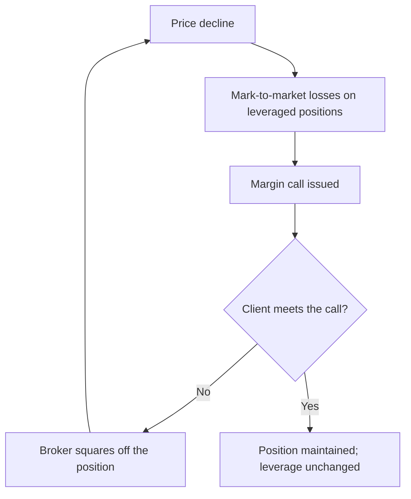

# Settlement Cycles, Margins and Their Market Effects

## The Problem / Why this matters
India has moved to among the shortest settlement cycles in the world, alongside upfront margin requirements and a pledge-based collateral system. These are usually treated as back-office matters, but they change how much leverage exists in the market, how quickly capital recycles, how foreign investors operate, and how forced selling propagates in a decline. An analyst who understands the plumbing can explain market behaviour that others attribute vaguely to sentiment.

## Core Idea
Settlement and margin rules determine **how much leverage the system carries and how fast it must be unwound** — which is the mechanism through which a moderate decline becomes a sharp one.

## Why it works this way
Leverage amplifies moves in both directions, but asymmetrically: margin calls force selling at low prices, and the selling lowers prices further, calling more margin. The speed and size of that loop is set by the margin rules, not by sentiment. Tighter upfront margin means less leverage in the system, which means smaller amplification — the trade-off being lower liquidity in normal conditions.

## Full technical content

### The settlement cycle

India has progressively shortened equity settlement, moving to a T+1 cycle across listed stocks and introducing an optional shorter cycle beyond that. The practical consequences:

| Effect | Explanation |
|---|---|
| **Faster capital recycling** | Sale proceeds are available sooner, so the same capital supports more turnover |
| **Lower counterparty risk** | Shorter exposure between trade and settlement reduces the risk the clearing corporation carries |
| **Operational pressure on foreign investors** | Custodial confirmation, FX arrangement and time-zone differences compress into a shorter window |
| **Currency-hedging friction** | A foreign investor must arrange rupees faster, which raises the cost of operating |

**The foreign-investor point is the analytically interesting one.** A shorter cycle is unambiguously good for domestic participants but adds operational cost for investors operating from other time zones who must pre-fund or arrange same-day currency. Where this affects behaviour, it shows up in flows rather than in any published metric, and it is one reason not to read every change in foreign participation as a view on Indian equities.

### The margin framework

The Indian market operates on **upfront margin collection** — margin must be collected before the trade rather than settled afterwards. The components:

- **VaR margin** — based on the stock's volatility, so more volatile stocks require more margin.
- **Extreme loss margin** — an additional buffer.
- **Mark-to-market margin** — collected on losses on open positions.
- **Additional surveillance margins** — imposed on stocks in the surveillance frameworks, sometimes to 100%.
- **Peak margin reporting** — margin obligations assessed at intraday snapshots rather than end-of-day, which constrains intraday leverage specifically.

**What the framework achieves:** it caps the leverage available to retail and smaller participants, which reduces the size of the forced-unwind loop in a decline. Market-wide crashes driven by cascading retail margin calls are structurally less likely than under a post-trade margin regime.

**What it costs:** lower leverage means lower turnover and slightly wider spreads in normal conditions, particularly in mid and small caps where the VaR margin is high because volatility is high.

### The margin pledge system

Securities held in a demat account can be pledged to a broker to fund margin requirements. The mechanics matter:

- Shares remain in the client's demat account with a pledge marked, rather than being transferred to the broker — a structural improvement over the earlier arrangement, which had allowed misuse of client securities.
- A **haircut** is applied to the pledged value, and the haircut is larger for more volatile stocks.
- **The reflexive risk:** in a falling market, the pledged collateral loses value at the same time as the position generates mark-to-market losses. Margin requirement rises while collateral value falls, and both push in the same direction. This is the same reflexivity described in the promoter-pledging chapter, operating at the level of ordinary market participants.

**For the analyst**, this explains a pattern worth recognising: declines in high-beta mid and small caps are frequently sharper than any fundamental development justifies, because collateral haircuts and VaR margins are both highest precisely in those stocks, so the forced-unwind loop is strongest there.

### Delivery-based versus speculative volume

Exchanges publish **delivery percentage** — the proportion of traded volume that resulted in actual delivery rather than intraday squaring-off.

- **High delivery percentage** indicates genuine investor participation rather than intraday trading.
- **A sudden fall in delivery percentage** alongside a price rise suggests the move is speculative and less likely to sustain.
- **A rise in delivery percentage during a decline** suggests investors are accumulating rather than traders selling.
- It is one of the criteria used in the surveillance frameworks, so tracking it also anticipates surveillance action.

This is a genuinely useful and under-used free data series for anyone covering small and mid caps.

### Securities lending and borrowing

The SLB mechanism allows shares to be lent and borrowed, which is what makes covered short selling possible in the cash segment.

- **Depth is limited** in India relative to developed markets, which is why the short case chapter treats borrow availability and cost as a live constraint rather than an assumption.
- **Borrow cost** is a direct carrying cost on a short position and, as noted earlier, is itself a crowding indicator.
- **Naked short selling is not permitted**, and institutional investors must disclose short positions upfront — a structural difference from markets where shorting is less constrained.

### Where this enters research

- **Explaining sharp declines.** Before attributing a mid-cap collapse to fundamentals, consider the margin-and-collateral loop, which is strongest exactly where volatility and haircuts are highest.
- **Assessing implementability.** Margin requirements determine what a leveraged client can hold; a stock at 100% margin is effectively cash-only.
- **Reading delivery data** as a quality-of-participation indicator alongside price and volume.
- **Short feasibility.** SLB availability and cost determine whether a negative view can be expressed at all.
- **Interpreting foreign flows** with awareness that operational friction, not sentiment, sometimes drives participation changes.

## Common mistakes
- Treating settlement and margin rules as back-office detail with no market consequence.
- Attributing a **margin-driven cascade** in small caps to fundamental news.
- Ignoring that **collateral haircuts and margin requirements rise together** in a decline.
- Overlooking **delivery percentage** as a quality-of-participation signal.
- Assuming short selling is freely available without checking **SLB depth and cost**.
- Reading every change in foreign participation as a view, ignoring operational friction.
- Recommending leveraged exposure to a stock carrying 100% margin.

## Interview angle
"Why do Indian small caps fall so much faster than large caps in a correction?" Beyond the obvious liquidity answer, the mechanical explanation is the margin-and-collateral loop: VaR margin is set by volatility, so small caps carry the highest margin requirements, and the haircut on pledged collateral is largest for exactly the same stocks. In a decline, the margin requirement on the position rises while the value of the pledged collateral backing it falls — both moving in the same direction at once — so leveraged holders are squared off, which pushes the price lower and repeats the loop. Add that the upfront-margin regime caps how much leverage builds up in the first place, so the amplification is smaller than it would otherwise be, and note the trade-off: less leverage means lower turnover and wider spreads in normal conditions. If you want to show a second layer, mention delivery percentage as the free series that tells you whether a move was driven by genuine investors taking delivery or by intraday speculation that will not sustain.
