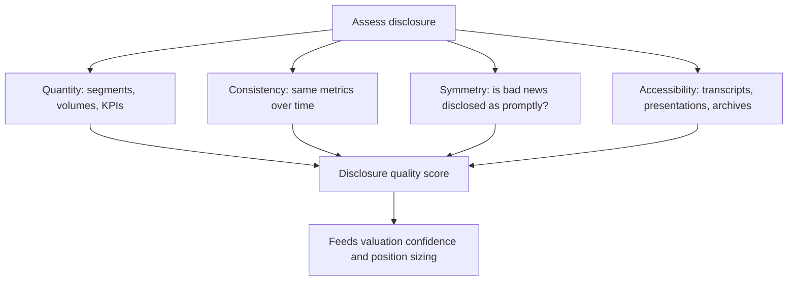

# Disclosure Quality and Investor Relations Assessment

## The Problem / Why this matters
Two companies with identical economics can be worth different amounts to an investor, because one lets you verify what is happening and the other does not. Disclosure quality determines how much of your valuation rests on evidence and how much on assumption — and the difference is a real risk that deserves an explicit place in the analysis rather than a vague sense that a company is "not very transparent."

## Core Idea
Disclosure quality is **assessable, comparable and predictive**. Companies that disclose more, more consistently, and including bad news, are systematically less likely to surprise negatively — and deterioration in disclosure is one of the earliest available warning signals.

## Why it works this way
Management chooses what to disclose beyond the mandatory minimum. Choosing to disclose segment detail, volume data, and metrics that will later show failure is costly — it removes future flexibility to present outcomes favourably. Companies willing to bear that cost are signalling confidence, and the signal is credible precisely because it is costly.

## Full technical content

### The dimensions to assess

**1. Granularity.**
- Are **segments** reported in a way that reflects how the business actually operates, or aggregated into one uninformative line?
- Are **volumes and realisations** given separately, allowing the decomposition that every analysis depends on?
- Are **capacity, utilisation and capex by project** disclosed?
- For financials, is the **book split by product, vintage and geography**?

A company reporting a single revenue line for a genuinely multi-business operation is preventing the most basic analytical step, and that is a choice.

**2. Consistency.**
- Are the **same metrics** reported every quarter, or does the set change?
- **Metrics that appear when favourable and disappear when not** are the clearest single disclosure red flag. A company that reported same-store sales growth for eleven quarters and stopped in the twelfth has communicated the number by omitting it.
- Have **definitions changed** without restatement? A redefinition of an operating metric, disclosed in a footnote and not applied to prior periods, breaks comparability and is occasionally deliberate.

**3. Symmetry.**
- Is **bad news disclosed as promptly and prominently** as good news?
- Does the company issue a press release for a large order win but bury a large order cancellation in a note?
- Does management **acknowledge missed targets** explicitly, or quietly stop referring to them?

Symmetry is the most informative single dimension, because it directly tests whether disclosure is communication or promotion.

**4. Accessibility.**
- Are **transcripts and presentations** published promptly and archived?
- Is there a functioning **investor-relations contact** who responds?
- Are **annual reports and older filings** available, or has the archive been pruned?
- Are calls held every quarter, or only after good ones?

**5. Forward-looking disclosure.**
- Does the company give **guidance**, and if so, what is its accuracy record? A company that guides and misses repeatedly is worse than one that does not guide.
- Are **capex plans, targets and timelines** specific enough to be checked later?
- **Specificity that creates accountability** is the marker of confidence; vague ambition is not disclosure.

### Assessing the investor-relations function

- **Responsiveness** to reasonable questions is the baseline.
- **Consistency of message** across the call, the annual report and one-on-one meetings. Divergence between what is said publicly and privately is both a governance concern and, where the private version contains material information, a regulatory one.
- **Access to operating management**, not only to the IR team, indicates confidence.
- **Willingness to discuss problems.** An IR function that only ever presents good news is a marketing function.
- **Site visits and plant tours** offered, which are costly to fake and disproportionately informative.

### Deterioration as a warning signal

This is the highest-value application, because it is early:

| Deterioration signal | Why it matters |
|---|---|
| A previously disclosed metric **stops being reported** | The number has gone the wrong way |
| **Segment reporting becomes more aggregated** | Something inside the aggregate is deteriorating |
| An earnings call is **cancelled or shortened** | Reduced willingness to take questions |
| Management **declines specific questions** they previously answered | The answer has changed |
| **Guidance is withdrawn** without a stated reason | Visibility has been lost or the target will be missed |
| The **IR contact changes repeatedly** | Instability, and sometimes disagreement |
| **Transcripts stop being published** | Reduced accountability for what was said |

**These changes typically precede the disclosure of the underlying problem by one to three quarters.** They are free to monitor, require no modelling, and are among the most reliable early warnings available — but they are only visible to an analyst who tracks disclosure over time rather than reading each quarter in isolation.

### Building it into the analysis

**In valuation:** where disclosure is poor, the forecast rests on more assumption and less evidence, and that uncertainty should be reflected in a wider valuation range, a discount to the multiple, or both — stated explicitly, with the reason given, rather than buried in a discount-rate adjustment.

**In position sizing:** lower confidence in the forecast argues for a smaller position, independent of the expected return.

**In monitoring:** disclosure changes belong on the monitorable list alongside operating metrics.

**In the note:** state what the company does *not* disclose, and what you have therefore had to assume. This is more useful to a reader than presenting an assumption as a finding, and it makes the analysis auditable.

### The comparative dimension

Disclosure quality is most informative **relative to sector peers**, because sector norms vary — some industries disclose volumes as standard, others do not.

- A company disclosing materially less than its direct peers has made a choice its competitors did not, and the reason is worth understanding.
- Conversely, a company disclosing materially more is bearing a cost, which is a positive signal about management's confidence and orientation toward shareholders.
- **Improvement in disclosure is a genuine positive catalyst**: it can drive a re-rating on its own by reducing the uncertainty discount, and it frequently accompanies a change in management or a shift toward institutional shareholders.

## Common mistakes
- Treating disclosure quality as a soft impression rather than an assessable dimension.
- Reading each quarter in isolation, so **discontinued metrics** go unnoticed.
- Missing a **definitional change** applied without restatement.
- Comparing disclosure across sectors with different norms.
- Presenting an assumption as a finding, rather than stating what is not disclosed.
- Burying the uncertainty in the discount rate instead of stating it.
- Ignoring **asymmetry** between how good and bad news are communicated.
- Overlooking disclosure improvement as a re-rating catalyst.

## Interview angle
"How do you evaluate a company's disclosure quality?" Give assessable dimensions rather than an impression: granularity — whether segments, volumes and realisations are broken out enough to decompose growth; consistency — whether the same metrics appear every quarter; symmetry — whether bad news is disclosed as promptly and prominently as good; and specificity in forward-looking statements, since targets precise enough to be checked later create accountability while vague ambition does not. Then give the application that matters most: track disclosure over time, because a metric that quietly stops being reported, a segment that becomes more aggregated, or guidance withdrawn without explanation typically precede the underlying problem becoming visible by one to three quarters. Finish by saying how it enters the output — a wider valuation range and a smaller position where disclosure is poor, stated explicitly with the reason, and an explicit list in the note of what the company does not disclose and what you have therefore assumed.
