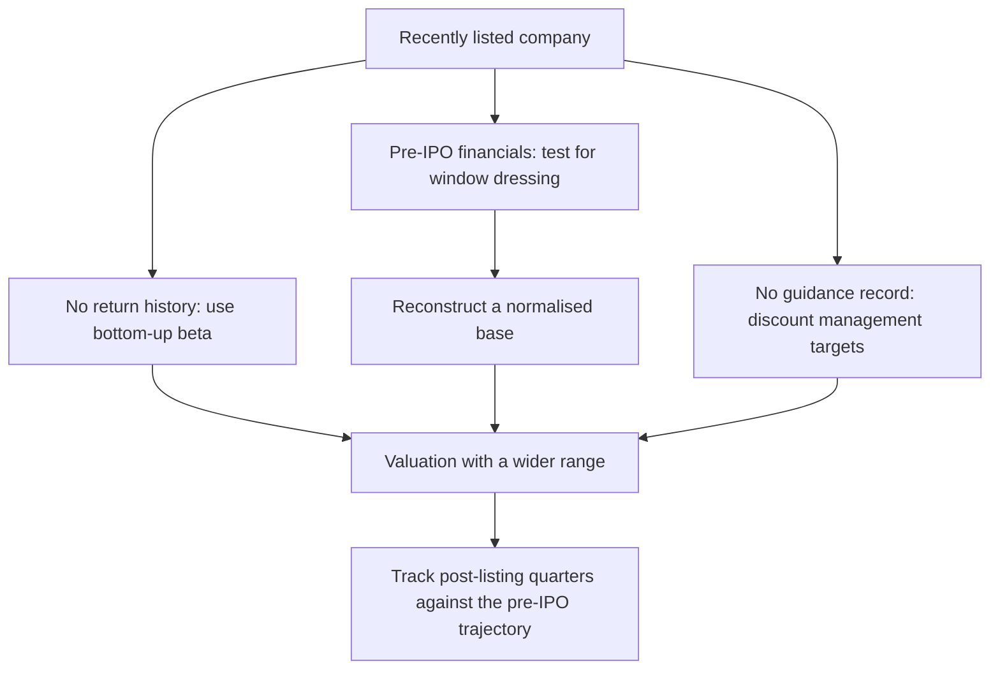

# Valuing a Recently Listed Company

## The Problem / Why this matters
A company that listed six months ago presents a specific analytical problem: there is no trading history to estimate beta from, no track record of meeting guidance, no observed behaviour through a downturn, and a set of pre-IPO financials prepared during the period when the company most wanted to look attractive. Yet these are exactly the companies most likely to be assigned to a junior analyst for initiation, and the ones where the market most needs independent work.

## Core Idea
With no history to lean on, the valuation must be built from **the peer set, the disclosed unit economics, and a sceptical reconstruction of the pre-IPO financials** — and the largest single risk is that the pre-listing trajectory does not continue.

## Why it works this way
The financials presented in an offer document cover a period in which management knew a listing was coming. That knowledge creates a legitimate incentive to time discretionary spending, working-capital decisions and one-off items favourably. Nothing improper need occur for the presented period to be unrepresentative — and the reversion afterwards is a well-documented pattern rather than an accusation.

## Full technical content

### Testing the pre-IPO financials

The single highest-value piece of work, and the one most often skipped because the offer document is long.

| Pattern to test | What it indicates |
|---|---|
| **Margin expanding sharply in the two years before listing** | Discretionary spend deferred — advertising, R&D, maintenance, hiring |
| **Working capital improving unusually** | Receivables pushed for collection, payables stretched; both reverse |
| **Revenue growth accelerating into the listing period** | Channel loading, aggressive recognition, or pulled-forward demand |
| **One-off items boosting the presented period** | Asset sales, write-backs, favourable tax items |
| **Related-party transactions restructured just before listing** | Cosmetic cleanup; check whether the economics changed |
| **Employee costs low relative to peers** | Under-investment in the organisation, or costs borne by a promoter entity |

**The reconstruction:** normalise each of these to a sustainable level and rebuild the base year. It is common for a normalised base to sit meaningfully below the reported one, and every forecast built on the reported base then inherits the error.

**The check that settles it:** compare the first three to four post-listing quarters against the pre-IPO trajectory. Deceleration immediately after listing is the pattern to look for, and by the time you are covering a company six months post-listing, one or two data points already exist.

### Estimating the cost of equity with no history

The beta problem is unavoidable — a regression needs returns that do not exist, and the few months available are dominated by post-listing volatility and lock-in-related flow.

**The solution is the bottom-up peer beta** described in the cost-of-equity chapter: unlever peers' betas, take the median, relever at the target's capital structure. This is not a compromise here; it is the correct method, and the absence of a company beta simply removes the temptation to use a bad one.

**Additions to consider, stated explicitly:**
- An **illiquidity premium** where free float is small and trading is thin.
- Where the business model is genuinely unproven, handle it in **scenario weighting** rather than in the discount rate — inflating the discount rate to reflect business risk is the unfalsifiable approach the valuation chapters warn against.

### The peer-set problem

Recently listed companies are often listed precisely because they are novel — a business model without a direct domestic comparable.

- **Use global peers** with the adjustments from the cross-market valuation chapter: growth, returns, accounting basis, tax and cost of equity.
- **Match the business model, not the label.**
- **Use maturity-stage analogues** for terminal assumptions: what does this business model earn at scale, in a market where it has matured? This is frequently the most valuable input available and is more defensible than extrapolating the company's own short history.
- Where the peer set is genuinely thin, **lean harder on DCF and unit economics** and less on multiples — but be explicit that the DCF's terminal value carries almost all the weight, and show the sensitivity.

### Unit economics as the anchor

With little consolidated history, the disclosed unit-level data is often the most reliable foundation:
- **Contribution margin per unit, store, branch, customer or plant.**
- **Cohort behaviour** where disclosed — retention, repeat rates, spend progression.
- **Payback period** on customer acquisition or on a new facility.
- **Capacity and utilisation**, which give a ceiling on near-term revenue that is independent of any growth narrative.

**Building the forecast from units upward** — number of units × economics per unit — is more defensible than a top-down growth rate, because each component can be checked against disclosure and against peers.

### The structural features of a recently listed stock

Beyond the fundamentals, several mechanical factors affect the price and belong in the note:

- **Lock-in expiries.** Pre-IPO investors and promoters face lock-in periods; expiry releases supply on a known date. **This is the most predictable overhang in the market and is routinely under-weighted.**
- **Anchor-investor exit behaviour** after the shortest lock-in expires.
- **Index inclusion** under fast-entry rules, which can bring passive flow shortly after listing.
- **Thin coverage** initially, with syndicate banks' research typically appearing first — and carrying an obvious conflict, since those banks underwrote the issue.
- **High price volatility** in the first year, reflecting genuine uncertainty and a shareholder base still forming.

### Assessing management with no track record as a listed company

- **Prior track record elsewhere** — what did this management team do at previous companies?
- **The first few quarters of guidance and delivery** are disproportionately informative, because they establish the pattern. A team that guides conservatively and beats is establishing something different from one that guides ambitiously and misses.
- **Behaviour at the first negative surprise** is the single most revealing episode — whether they disclose promptly and explain, or minimise and deflect, tells you more than any number of good quarters.
- **Use of IPO proceeds** against the stated objects in the offer document. Deviation is disclosable and is an early governance signal.

That last check is concrete, cheap and frequently skipped: the offer document states what the money is for, and subsequent filings show what it was used for.

### Writing the initiation

- **State the uncertainty honestly.** A wider valuation range is appropriate and is more credible than false precision.
- **Show the pre-IPO normalisation** explicitly — this is the differentiated work, and readers who have not done it will find it valuable.
- **Give the lock-in calendar** and any expected index events.
- **Specify what the first four quarters must show** for the thesis to hold, which is the falsification discipline applied to a company with no history to falsify against.
- **Be explicit about syndicate-research conflict** if the existing coverage is entirely from underwriting banks, since that shapes the consensus you are differentiating from.

## Common mistakes
- Building forecasts on **reported pre-IPO financials** without normalising.
- Attempting a **regression beta** on a few months of post-listing returns.
- Handling unproven business risk through an inflated **discount rate** rather than scenarios.
- Using a domestic peer set that does not match the business model.
- Ignoring **lock-in expiry** dates as a predictable overhang.
- Treating syndicate research as neutral consensus.
- Failing to check **use of IPO proceeds** against the stated objects.
- False precision in the target, given genuinely wide uncertainty.

## Interview angle
"How would you value a company that listed four months ago?" Lead with the pre-IPO financials, because that is where the differentiated work is: margins expanding sharply into the listing period, working capital improving unusually, and accelerating growth are all consistent with deferred discretionary spend and pulled-forward demand, so the base year needs normalising before any forecast is built on it — and the first post-listing quarters are the test of whether the trajectory was real. On the cost of equity, say plainly that a regression beta is unusable with a few months of data and that a bottom-up peer beta — unlevered, median, relevered at the target's structure — is the correct method rather than a compromise. Anchor the forecast in disclosed unit economics built upward rather than a top-down growth rate, and use maturity-stage global analogues for terminal assumptions where no domestic comparable exists. Then add the structural points: the lock-in expiry calendar is the most predictable overhang in the market, and existing coverage is often entirely from the underwriting syndicate, which shapes the consensus you are differentiating from.
