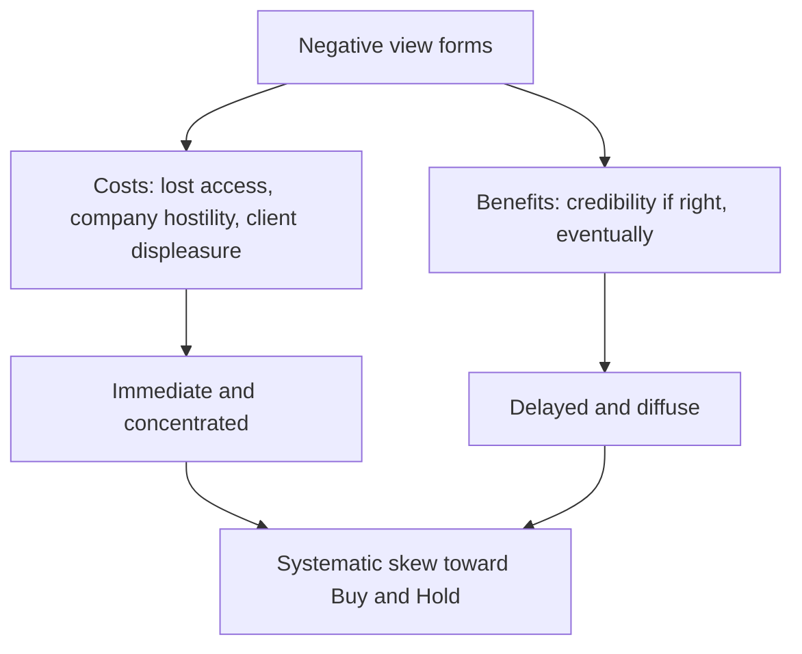

# Ratings, Target Prices and Analyst Incentives

## The Problem / Why this matters
The sell-side rating system is the interface between research and its users, and it is systematically distorted: ratings skew heavily positive, target prices cluster above market prices, and downgrades arrive late. Understanding *why* — the structural incentives that produce the distortion — is necessary both to read others' research correctly and to know which pressures will act on you. It is also a favourite interview topic, because the honest answer requires acknowledging uncomfortable things about the industry.

## Core Idea
Ratings are produced inside a system of incentives that is not neutral. Reading research well means **adjusting for the known skew**, and producing research well means knowing which pressures you are resisting and building process to resist them.

## Why it works this way
The analyst's compensation depends on client votes, corporate access, and institutional relationships — none of which reward a Sell rating. The cost of a negative rating is concentrated and immediate (lost access, an unhappy company, an unhappy holder); the benefit is diffuse and delayed. Rational responses to that asymmetry produce the observed distribution.

## Full technical content

### The observed distribution

Across markets, sell-side ratings skew heavily toward Buy, with Hold next and Sell a small minority — a distribution that cannot reflect reality, since roughly half of any universe must underperform its median.

**The practical consequences for reading research:**
- **"Hold" frequently means Sell.** An analyst unwilling to bear the cost of a Sell rating expresses the view through a Hold with a target below the market price, or through the tone of the text. **Read the target price and the text, not the rating label.**
- **A genuine Sell is a strong signal**, precisely because it is costly to publish. Rare events carry more information.
- **A downgrade from Buy to Hold is often a bigger signal than the label suggests**, since the analyst has borne a cost to make it.
- **Target prices below the market price with a Buy rating** are a stale-coverage signal — the analyst has not updated.

### The structural pressures

| Pressure | Mechanism |
|---|---|
| **Corporate access** | Companies grant meetings and management time to analysts who are constructive; a Sell can end access, which reduces the analyst's value to clients |
| **Banking relationships** | Regulatory separation exists and is enforced, but the institutional relationship is not invisible to anyone involved |
| **Client positioning** | Clients are predominantly long; a Sell on a widely held stock displeases the people who vote on research quality |
| **Herding** | Being wrong alone is far more career-damaging than being wrong with everyone |
| **Commission economics** | A Buy is actionable by every client; a Sell is actionable only by those able to short or already holding |

That last point is the most underappreciated: **a Sell rating has a structurally smaller addressable audience**, which reduces its commercial value regardless of its analytical merit.

### Target prices, and what they actually are

- A target is conventionally a **12-month** expectation, and the horizon should always be stated.
- The **method** should be stated. A target with no disclosed methodology is not a forecast; it is an assertion.
- **Target-price accuracy is poor across the industry**, and honest analysts acknowledge this. Targets are better read as a statement of *direction and magnitude of the disagreement with consensus* than as a prediction of where the price will be.
- **Persistent revision toward the market price** is the clearest evidence that a target is being fitted to the price rather than the price being assessed against a valuation. Watch for it in others' work and guard against it in your own — the honest alternative is to change the rating when the price reaches the target.

### The rating-band problem

Most firms define ratings by expected return bands relative to the market or in absolute terms. This creates mechanical effects worth understanding:

- **A rating can change because the price moved**, with no change in view. This is legitimate and should be stated as such, as the conviction chapter argues.
- **Bands defined relative to a benchmark** mean a Buy is a relative statement — a stock expected to fall less than the market can carry a positive relative rating. **Read whether the rating is absolute or relative before interpreting it**, since the two carry completely different meanings for a client with a cash alternative.
- **Sector-relative ratings** can produce Buys on the least-bad stock in a structurally impaired sector, which is analytically valid but easily misread.

### What good practice looks like

Individually, the counterweights are process rather than virtue:

- **Publish the falsification conditions** with the rating, so the position can be judged against something.
- **State the risk-reward explicitly** — target, bear case, and the ratio — so the rating is a conclusion from stated numbers rather than a label.
- **Change ratings promptly**, including on valuation alone, and say when the fundamental view is unchanged.
- **Keep a personal record of accuracy** and conduct post-mortems, which the learning chapter treats in full.
- **Be willing to publish a Sell**, and accept the access cost. Analysts known for genuine Sell ratings carry disproportionate credibility on their Buys, which is the compensating benefit.
- **Disclose conflicts** as required, and treat the disclosure as meaningful rather than boilerplate.

### On the buy side, the incentives differ

The buy-side analyst's incentives are cleaner in one respect and worse in another:
- **Cleaner:** compensation depends on the performance of the recommendations, so a correct negative view is directly rewarded, and there is no corporate-access commercial pressure of the same kind.
- **Worse:** exposure to the specific behavioural traps of holding a position — anchoring on entry price, commitment escalation, and reluctance to admit a loss — which the behavioural-bias chapter covers, and which are more acute when money is actually at stake.

Neither side is free of distortion; they are distorted in different directions, which is a useful thing to say when asked to compare them.

### Reading sell-side research as a buy-side user

A practical framework:
1. **Ignore the rating label**; read the target, the risk-reward and the tone.
2. **Look for the differentiated insight.** Most notes have none — they restate consensus with a rating attached. The minority that contain genuine primary work are worth the whole subscription.
3. **Check whether the numbers changed** or only the text.
4. **Note who the analyst is**, since individual track records vary enormously and firm reputation is a poor proxy.
5. **Read the risks section** — where the analyst is honest, this is where the real doubts appear.
6. **Treat syndicate research** on recently listed companies as structurally conflicted.
7. **Value the rare Sell** accordingly.

## Common mistakes
- Reading the **rating label** rather than the target and the text.
- Not checking whether ratings are **absolute or relative**, which changes their meaning entirely.
- Treating a Hold as neutral when it is frequently a disguised Sell.
- Ignoring persistent **target revision toward the price** as evidence of fitting.
- Assuming the sell side is uniquely conflicted, when the buy side has its own distortions.
- Publishing a target with **no stated method or horizon**.
- Maintaining a rating after the price has reached the target.
- Treating conflict disclosures as boilerplate.

## Interview angle
"Why are there so few Sell ratings?" Give the structural answer rather than a cynical one: the costs of a Sell are immediate and concentrated — lost corporate access, an unhappy company, displeasure from clients who are predominantly long — while the benefit is delayed and diffuse, and a Sell is actionable by a much smaller set of clients than a Buy, so it carries less commercial value regardless of its analytical merit. Then draw the reader's conclusions from that: a Hold frequently means Sell, so read the target price and the tone rather than the label; a genuine Sell is a strong signal precisely because it is costly to publish; and a target price drifting steadily toward the market price is evidence of fitting rather than forecasting. Finish with what you would do about it in your own work — publish falsification conditions and an explicit risk-reward so the rating follows from stated numbers, change ratings promptly including on valuation alone, keep a personal accuracy record, and accept that being willing to publish a Sell is what makes your Buys worth reading.
