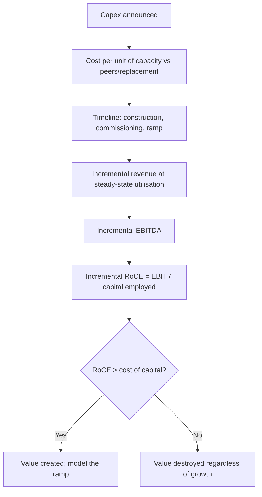

# Analysing Major Capex and Greenfield Expansion

## The Problem / Why this matters
A company announcing a capital expenditure equal to half its existing asset base is making the decision that will determine its returns for the next decade. These announcements are frequently greeted with enthusiasm — capacity growth is read as earnings growth — when the analytical question is entirely different: will the incremental capital earn more than it costs, and when? Large capex programmes are among the most common destroyers of shareholder value, and among the most predictable.

## Core Idea
Evaluate a capex programme on **incremental return on the incremental capital**, against the cost of that capital, with realistic timing — not on the capacity or revenue it will add.

## Why it works this way
Value is created only when returns exceed the cost of capital. Capacity that earns less than the cost of funding it destroys value even while growing revenue and, for a period, earnings — because the depreciation and interest arrive before the utilisation does, and the equity base has grown regardless.

## Full technical content

### The five questions

**1. What does the capacity cost, and is that credible?**
- Compare **cost per unit of capacity** to the company's own past projects, to peers' recent projects, and to replacement cost.
- A cost materially below peers requires an explanation — brownfield expansion at an existing site is genuinely cheaper, but an unexplained discount usually means the announced figure excludes something.
- **Cost overruns are the norm, not the exception**, in long-gestation projects. Build a contingency into your model even where management has not.

**2. How long until it earns?**
The timeline that matters has three stages, and analysts routinely model only the first:
- **Construction** — announced date to mechanical completion.
- **Commissioning and stabilisation** — running at design specification, which typically takes longer than stated.
- **Ramp to steady-state utilisation** — often two to four years, and the stage most often assumed away.

**Depreciation and interest begin at capitalisation, while revenue ramps over years.** This means reported earnings frequently *fall* in the first year or two of a major project even when the project is a good one, and understanding this prevents both misreading the dip and being surprised by it.

**3. What is the incremental return?**

The calculation, done at steady state:

| Line | Basis |
|---|---|
| Incremental capacity | As announced, adjusted for realistic utilisation |
| × Realisation per unit | At a **normalised** price, not the current one |
| = Incremental revenue | |
| × Incremental EBITDA margin | Frequently different from the company's blended margin |
| − Incremental depreciation | Capex ÷ asset life |
| = Incremental EBIT | |
| ÷ Capital employed (capex + working capital) | Working capital is routinely omitted and is material |
| = **Incremental RoCE** | Compare to WACC |

**The two errors that dominate:** using current-cycle prices for realisation, and omitting the incremental working capital the new capacity requires. Both flatter the return.

**4. Where does the demand come from?**
- Is the incremental capacity supported by **demand growth**, or is it a market-share bid?
- **What is everyone else building?** This is the question that separates good cyclical analysis from bad. If every producer is expanding simultaneously — which is what happens when returns are currently high — aggregate capacity will exceed demand and the returns that justified the investment will not exist when it commissions. **Industry-wide announced capacity is public information and is the single most valuable input into a capex assessment.**
- Are there **committed offtake agreements**, and on what terms?

**5. How is it funded?**
- **Internal accruals, debt or equity** — each has a different consequence for existing shareholders.
- **Debt-funded** capex raises financial risk exactly when operating risk is elevated by execution uncertainty; model the interest and check covenant headroom.
- **Equity-funded** capex dilutes, so the project must clear a return hurdle high enough to compensate.
- **Check the funding is actually secured**, not merely intended. Announced projects with unfunded balances are a recurring source of disappointment.

### The capital-allocation track record

The strongest predictor of whether a capex programme will work is **what happened to the last one**:
- Was the previous project delivered **on time and on budget**?
- Did it reach the **stated utilisation and return**?
- **Did the company disclose the outcome** at all, or quietly stop mentioning it? The disclosure chapter's point applies directly — a project target that stops being referenced has usually been missed.

**Build a table of past projects: announced cost, actual cost, announced timeline, actual timeline, target return, achieved return.** This is a few hours of work from annual reports and it is more predictive of the current project than any amount of analysis of the current project's merits.

### The cyclical trap

The most reliable value-destruction pattern in capital-intensive industries, and worth stating plainly:

1. Prices and margins are high; returns look excellent.
2. Every producer announces expansion, funded by the high current cash flows.
3. Capacity commissions two to four years later — simultaneously.
4. Supply exceeds demand; prices fall.
5. Returns on the new capacity are far below those that justified it.
6. Balance sheets carry the debt through the downturn.

**The analytical response is to evaluate the project at mid-cycle prices, not current prices, and to aggregate the industry's announced capacity before accepting any single company's demand assumption.** Both steps are straightforward and both are routinely skipped in the enthusiasm following an announcement.

### Modelling it properly

- **Separate the base business from the project** in the model, so each can be valued and stress-tested independently.
- **Delay the ramp** relative to guidance as a base case — a six-to-twelve-month slip is a reasonable default given typical outcomes.
- **Capitalise interest during construction** correctly, and note that this flatters reported earnings during the build.
- **Model the balance sheet through the build**, including peak debt, which is when covenant risk is highest.
- **Value the project explicitly**: NPV of the incremental cash flows, discounted at the cost of capital, so the note can state whether the project adds or subtracts value in rupees per share.

That last output is what a client wants and what most notes fail to provide. "The company is spending ₹4,200cr; on our assumptions this creates ₹1,900cr of NPV, or ₹31 per share" is a far more useful statement than a description of the capacity.

### Reading the announcement itself

- **Specificity signals confidence** — a company giving cost, timeline, target utilisation and expected returns is accepting accountability.
- **Vagueness is a warning.** An announcement giving capacity and cost but no expected return usually means the return is not attractive.
- **Check whether the project appears in capital commitments** in the notes, which tells you what is contracted versus what is aspiration.
- **Watch for repeated re-announcement** of the same project, which indicates it is not progressing.

## Common mistakes
- Treating capacity growth as **earnings growth**.
- Using **current-cycle prices** for incremental realisation.
- Omitting **incremental working capital** from capital employed.
- Modelling construction only, ignoring **commissioning and ramp**.
- Ignoring **industry-wide announced capacity** when assessing demand.
- Not building a table of the company's **past project outcomes**.
- Assuming announced funding is secured.
- Failing to state the project's **NPV per share**, which is what the client needs.
- Misreading the earnings dip during commissioning as deterioration.

## Interview angle
"A cement company announces capex equal to 50% of its current capacity. Good or bad?" Refuse to answer on the capacity number and go to incremental returns: take the capacity, apply a realistic steady-state utilisation, use a mid-cycle realisation rather than the current price, deduct the incremental cost structure and depreciation, and divide by capital employed *including* the incremental working capital — then compare that RoCE to the cost of capital, because a project earning below it destroys value while still growing revenue and eventually earnings. Then raise the question that matters most in a cyclical industry: what is everyone else building? Announced industry capacity is public, and if every producer is expanding into the same high-return environment, the capacity commissions together and the prices that justified it will not exist. Add the timeline realism — depreciation and interest start at capitalisation while revenue ramps over two to four years, so earnings often fall first — and the track-record check, which is to tabulate the company's past projects against their announced cost, timeline and target return, since that predicts this project better than anything else available.
