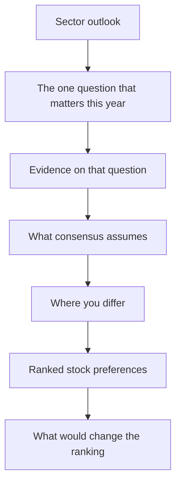

# The Sector Outlook and Annual Strategy Piece

## The Problem / Why this matters
Alongside stock-specific notes, analysts produce periodic sector outlooks and contribute to annual strategy documents. These are read far more widely than individual notes — by clients allocating between sectors, by internal teams, and by prospective employers assessing thinking. They are also where most analysts write worst: hedged, comprehensive, and conclusion-free, because a sector piece invites the temptation to cover everything rather than to argue something.

## Core Idea
A sector outlook must contain **a ranked view and a stated basis for it**. Comprehensiveness is not the product; a defensible ordering of the sector's stocks, with the reasoning that produced it, is.

## Why it works this way
A client reading a sector outlook is deciding what to own within that sector and how much of the sector to own. Both questions require a ranking. A document that describes every company in equal depth and concludes that the sector faces both opportunities and challenges has answered neither.

## Full technical content

### The structure that works

**1. The question.** Open by identifying the single issue that will determine sector returns over the horizon — margin recovery, a regulatory decision, a capacity cycle, a demand inflection. Every sector has one dominant question in any given year, and naming it immediately is what makes the piece worth reading.

**2. Where consensus sits on it.** Quantify it: what do consensus estimates embed, and what do current multiples imply? This is the reference point against which everything else is measured.

**3. Your view and the evidence.** State the disagreement and support it with primary or differentiated work. If you agree with consensus, say so plainly and explain why the sector is still worth owning or avoiding — agreement honestly stated is more useful than manufactured contrarianism.

**4. The ranking.** An explicit ordering of stocks with the basis stated — most preferred to least, with the reason each sits where it does.

**5. Falsification.** What would change the ranking, stated in advance.

**6. The data appendix.** Comparative tables, historical multiple ranges, capacity and demand data — but at the back, supporting the argument rather than substituting for it.

### The ranking is the product

Practical disciplines for making the ranking useful:

- **Differentiate the reasons.** If four stocks are ranked on the same argument, they are one position and the client should be told so.
- **Distinguish quality from opportunity.** The best company and the best stock are frequently different, and the ranking is about expected return from the current price, not about business quality.
- **Be explicit about the relative-versus-absolute distinction.** "Our top pick in a sector we would underweight" is a coherent and useful statement; a Buy rating that implicitly claims otherwise is not.
- **Include what you would avoid**, and say why. A ranking with no bottom is not a ranking.
- **Give position-size guidance** where liquidity constrains it, particularly for smaller names.

### The comparative tables that earn their space

| Table | Why it matters |
|---|---|
| **Valuation across the sector** — current multiple against 5- and 10-year ranges | Places the sector historically; the range matters more than the point |
| **Growth and return profile** — EPS CAGR, RoCE, leverage | The fundamental basis for multiple differences |
| **Estimate revision trends** | Direction of consensus travel, which is serially correlated |
| **Sector-specific operating metrics** | Utilisation, spreads, volumes — whatever drives this sector |
| **Ownership and positioning** | Identifies crowded and neglected names |

**Multiples against their own history are more informative than multiples against each other**, because they control for the structural differences that make cross-company comparison difficult. Show the range, not just the current figure.

### Common failures in sector writing

- **The balanced non-view.** Presenting opportunities and challenges in equal weight and concluding nothing. This is the dominant failure and it is usually a decision to avoid being wrong rather than an analytical judgement.
- **Extrapolating the recent past.** Sector outlooks written after a strong year are systematically optimistic and vice versa. **The most valuable sector calls are made when the recent past points the other way**, which is precisely when they are hardest to write.
- **Length as a proxy for effort.** A ninety-page document with no ranking is worth less than four pages with one.
- **Ignoring the top-down.** Sector returns depend on flows and macro as well as fundamentals; a sector fundamentally attractive but structurally under-owned by the marginal buyer may stay cheap.
- **Recycling last year's document** with numbers updated. Readers notice, and it destroys the credibility of everything else.

### The annual strategy contribution

Where the analyst contributes a sector view to a firm-wide strategy piece, the requirements tighten:

- **Brevity is mandatory** — often one page, sometimes one paragraph.
- **The call must be explicit** — overweight, neutral or underweight, with one sentence of reasoning.
- **One or two stock picks**, not five.
- **Consistency with published ratings.** An overweight sector view alongside Holds on every stock in it is incoherent, and someone will notice.
- **A stated key risk**, which is what makes the call accountable.

**The discipline of compressing a year's work into one paragraph is itself valuable** — an analyst who cannot state the sector view in two sentences has not resolved it.

### The year-ahead outlook and its honest limits

Annual outlooks are conventional and are worth writing carefully while acknowledging what they can and cannot do:

- **Twelve-month price forecasts are weakly predictive**, and pretending otherwise damages credibility when the year goes differently.
- **What is genuinely forecastable**: capacity commissioning schedules, contracted order books, regulatory decision timelines, demographic and penetration trends, and known events. Anchor the piece in these.
- **What is not**: commodity prices, currency, and market multiples. Where the view depends on these, say so and give scenarios rather than a point forecast.
- **Separating the two explicitly** is what distinguishes a professional outlook from a confident-sounding guess, and readers who have followed a few years of outlooks can tell the difference immediately.

### Reviewing last year's outlook

The practice that most improves sector writing and that almost nobody follows: **begin the new outlook by reviewing the previous one**. What was called correctly, what was wrong, and what has been learned. It costs a page, it is uncomfortable, and it establishes credibility that no amount of confident prose achieves — for the same reason that a genuine Sell rating makes the Buys worth reading.

## Common mistakes
- Writing a **balanced non-view** with no ranking.
- Ranking multiple stocks on the **same underlying argument** without saying so.
- Confusing the best **company** with the best **stock**.
- Omitting what you would **avoid**.
- **Extrapolating** the recent past, which is when outlooks are least useful.
- Treating **length** as evidence of work.
- Comparing multiples across companies without also showing them against their **own history**.
- Presenting commodity and currency forecasts as though they were forecastable.
- Never **reviewing** the previous year's outlook.

## Interview angle
"Write me a sector outlook in two minutes." Structure it rather than describing the sector: name the one question that will determine sector returns this year; state what consensus estimates and current multiples imply about it; state your view and the evidence; then give a ranked list of stocks with a different reason for each, including what you would avoid and why; and finish with what would change the ranking. If asked what makes a sector piece good, say the ranking is the product — a client is deciding what to own within the sector and how much of the sector to hold, and a document describing every company in equal depth with a balanced conclusion answers neither question. Add two disciplines that signal experience: distinguish the best company from the best stock, since the ranking is about expected return from the current price rather than business quality; and be explicit about what is genuinely forecastable — commissioning schedules, order books, regulatory timelines — versus what is not, such as commodity prices and market multiples, which belong in scenarios rather than in a point forecast.
