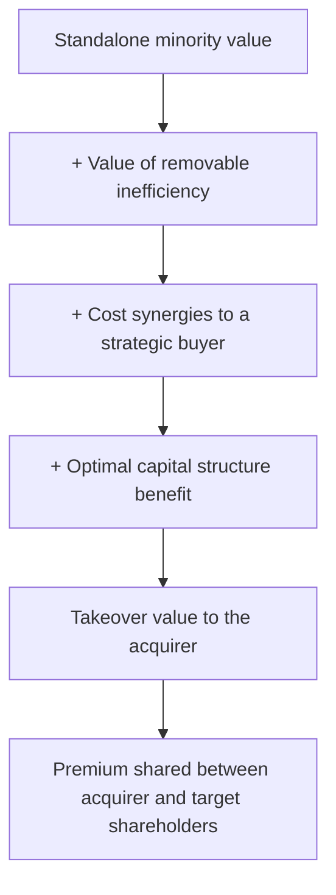

# Control Premiums and Takeover Value

## The Problem / Why this matters
Most equity valuation estimates what a minority stake in a business is worth on a continuing basis. A separate and sometimes higher number exists: what an acquirer would pay for the whole company. Where that number is materially above the market price, it establishes a floor of sorts — because a sufficiently large gap eventually attracts a bidder. Analysts who never compute it miss both a valuation cross-check and one of the more powerful catalysts available.

## Core Idea
Takeover value differs from standalone minority value because an acquirer gains **control, synergies and the ability to change the capital structure and management** — and is willing to pay for some of that. The premium is not arbitrary; it is the value of those specific changes.

## Why it works this way
A minority shareholder buys a claim on the business as currently run. An acquirer buys the right to run it differently — to remove duplicated costs, redeploy underused assets, replace management, or lever the balance sheet. Where those changes are worth something, the acquirer can pay more than the standalone value and still profit.

## Full technical content

### Decomposing the premium

The premium is not a single percentage to apply. It is a sum of identifiable components, and building it that way is what makes it defensible:

| Component | Source | Who can capture it |
|---|---|---|
| **Removable inefficiency** | Excess costs, underused assets, poor working-capital management | Any competent acquirer, including financial |
| **Cost synergies** | Overlapping functions, procurement scale, distribution consolidation | Strategic buyers in the same industry |
| **Revenue synergies** | Cross-selling, market access | Claimed often, realised rarely — haircut heavily |
| **Capital-structure change** | Under-levered balance sheet supporting more debt | Any acquirer, especially financial buyers |
| **Tax** | Structure-dependent | Varies |
| **Control itself** | The option to make all of the above changes | Any acquirer |

**The analytical use:** rather than applying a generic premium, estimate the components for the specific company. A company already running efficiently, optimally levered, with no obvious acquirer overlap, supports a small premium. One with bloated costs, an unlevered balance sheet and clear strategic overlap supports a large one — and that difference is analysis rather than convention.

### When takeover value is relevant

It is not relevant to every stock. The conditions that make it live:

- **Shareholding structure permits it.** This is the binding constraint in India: a promoter holding a large majority makes a hostile acquisition practically impossible, so takeover value is a theoretical number with no mechanism. **Check the promoter stake before doing any of this work.**
- **The gap is large.** A modest discount to takeover value attracts nobody; a large one does.
- **A plausible acquirer exists** — a domestic strategic with overlap, a global player seeking market entry, or a financial buyer where the structure permits.
- **The asset is attractive** for reasons beyond cheapness: a distribution network, a licence, a brand, a plant location, a customer base.
- **No regulatory barrier** — sectoral foreign-investment caps, competition-authority concerns, or licensing conditions that would block a change of control.

Where promoter holding is high, the realistic version of the question changes: not "will someone buy it" but "would the promoter sell, and at what price" — which turns on succession, group leverage, and whether the business fits the family's remaining plans. Those are qualitative judgements, and they are legitimately part of the analysis.

### Estimating takeover value

**Method 1 — Build-up from standalone value.** Value the business standalone, then add the quantified components above, each with a stated basis. Most defensible; most work.

**Method 2 — Precedent transactions.** Use multiples paid in comparable control transactions in the same sector. Practical cautions:
- Transaction multiples embed the specific synergies of that buyer and are not transferable.
- Deals done at cycle peaks carry peak multiples on peak earnings — a double distortion.
- The comparable set is usually small, so the median of four transactions is a weak statistic.
- Disclosure of deal financials is often partial, particularly for private targets.

**Method 3 — Replacement cost.** What would it cost to build this asset base, obtain the licences and reach this market position? Most useful for infrastructure, capacity-constrained manufacturing and regulated assets, and it sets a genuine floor where building is the alternative to buying.

**Method 4 — The regulatory floor.** As the takeover-code chapter sets out, an open offer is priced as the highest of prescribed benchmarks. Where a transaction is actually in prospect, this is computable rather than estimated.

### Using it in research

**As a cross-check.** If your DCF says ₹340 and a credible takeover analysis says ₹560, the difference is the value of changes the current management is not making. That is a finding worth writing about, whether or not a transaction occurs — it reframes the analysis around capital allocation and control rather than around forecasting.

**As a downside argument.** Where takeover or replacement value sits well below the current price, the bear case has a floor problem in reverse — there is no strategic support beneath the stock.

**As a catalyst.** Where the gap is large and the structure permits, corporate action is a genuine dated possibility. But apply the standing discipline: **an unexploited gap can persist indefinitely.** Recommending a stock on takeover potential alone, with no mechanism and no evidence of promoter willingness, is the same error as recommending a holding company on its sum-of-the-parts discount.

**In special situations.** Where a transaction is announced or rumoured, the takeover-value estimate is the reference for whether the offered price is fair — which connects directly to the swap-ratio and open-offer analysis.

### The minority-discount mirror

The same relationship viewed from the other side: a minority stake is worth less per share than a controlling stake, because the minority holder cannot force any of the changes above.

- In India, this appears most visibly in **holding-company discounts**, where a listed holdco trades far below the market value of its stakes — the holdco's shareholders cannot compel a distribution or a sale.
- It also appears in **unlisted-subsidiary valuations** within an SOTP, where the parent's stake in an unlisted entity should not be marked at a full control value unless control genuinely exists and is exercisable.
- **Do not apply both a minority discount and an illiquidity discount without checking for overlap** — they are related and stacking them mechanically double-counts.

### What the premium is not

- **Not a fixed percentage.** Conventional premium ranges quoted in textbooks are averages across heterogeneous deals and mean little for any specific company.
- **Not a reason to ignore the standalone valuation.** The takeover number is a scenario, and it should be presented with a probability rather than as a target.
- **Not available to minority holders in the absence of a transaction.** This is the point that keeps the analysis honest: value that requires a change of control to be realised is worth only its probability of occurring.

## Common mistakes
- Applying a **generic premium percentage** instead of building it from components.
- Ignoring the **promoter stake**, which determines whether a transaction is even possible.
- Using **precedent transaction multiples** from cycle peaks without normalising.
- Crediting **revenue synergies** at face value.
- Recommending a stock on takeover potential with **no mechanism** and no evidence of promoter willingness.
- Stacking minority and illiquidity discounts without checking overlap.
- Presenting takeover value as a target rather than as a probability-weighted scenario.
- Marking unlisted subsidiary stakes at control value inside an SOTP where control is not exercisable.

## Interview angle
"The stock trades well below what an acquirer would pay. Is that a buy?" The first question back is the shareholding structure: with a large promoter majority, a hostile acquisition is not possible, so takeover value is a theoretical number with no mechanism to realise it, and the realistic question becomes whether the promoter would sell — which turns on succession, group leverage and strategic fit rather than on valuation. If the structure does permit a transaction, build the premium from components rather than applying a convention: removable inefficiency, cost synergies available to a specific strategic buyer, the benefit of an optimal capital structure, with revenue synergies heavily discounted. Then present it honestly — as a probability-weighted scenario alongside the standalone valuation, not as a target — and note the cross-check value: a large gap between standalone and takeover value is itself a finding about capital allocation under current management, worth writing about whether or not a deal ever happens.
