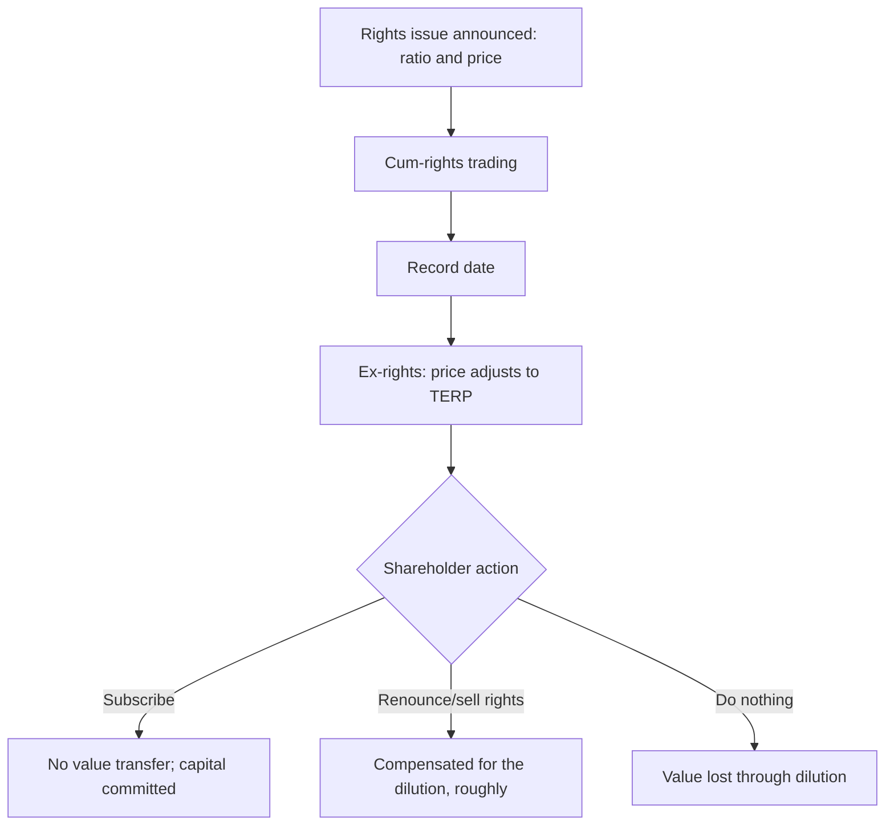

# Rights Issues, TERP and Renunciation

## The Problem / Why this matters
A rights issue produces one of the most misread price movements in equity markets: the share price falls sharply on the ex-rights date, and both retail investors and careless commentary treat this as a decline. It is arithmetic. Meanwhile the actual analytical questions — why the company needs the money, whether the terms are fair, and what happens to a shareholder who does not participate — go unexamined. The mechanics are simple enough to master completely, and doing so is a reliable way to look competent in an interview.

## Core Idea
A rights issue at a discount transfers no value to participating shareholders and **real value away from non-participating ones**. The ex-rights price adjustment is arithmetic, and the analysis is about the use of proceeds and the signal the issue sends.

## Why it works this way
Existing shareholders are offered new shares below the market price in proportion to their holding. If they take up their entitlement, they buy the discount they are being diluted by — a wash. If they do not, they are diluted by shares issued below market value, and the loss is real.

## Full technical content

### The TERP calculation

**Theoretical Ex-Rights Price** is the weighted average of the old shares at the cum-rights price and the new shares at the issue price:

**TERP = [(N × Cum-rights price) + (M × Issue price)] ÷ (N + M)**

where N is existing shares and M is new shares per the ratio.

**Worked example.** A 1:4 rights issue (one new share for every four held) at ₹200, with the cum-rights price at ₹350.

- For four existing shares at ₹350 = ₹1,400
- Plus one new share at ₹200 = ₹200
- Total ₹1,600 across five shares
- **TERP = ₹320**

So the share price "falls" from ₹350 to ₹320 on the ex-rights date. **Nothing has been lost.** A holder of four shares had ₹1,400; afterwards they hold five shares worth ₹1,600 having paid ₹200 — the same ₹1,400 of net wealth.

### The value of the right

The entitlement itself has value, because it allows purchase below TERP:

**Value of one right = TERP − Issue price** (per new share)

In the example: ₹320 − ₹200 = **₹120 per new share**, or ₹30 per existing share held (since one right accrues per four shares).

**This is why renunciation matters.** In India rights entitlements are credited to demat accounts and are **tradeable on the exchange** during a specified window. A shareholder who does not wish to subscribe can sell the entitlement and recover approximately its value, rather than simply being diluted.

**The critical practical point:** a shareholder who neither subscribes nor sells the entitlement **loses that value entirely** when the entitlement lapses. This is a real and common loss, particularly among retail holders who ignore the corporate action notice — and it is worth flagging explicitly in any note on a company conducting a rights issue.

### Adjusting historical data

Every historical per-share series must be restated for the bonus element embedded in a rights issue at a discount. Without adjustment, EPS growth, price charts and per-share book value all break at the ex-rights date.

**The adjustment factor = TERP ÷ Cum-rights price** — in the example, 320 ÷ 350 = 0.914. Historical per-share figures before the ex-date are multiplied by this factor to be comparable with post-issue figures.

Data providers usually apply this automatically, but **check it when working with company-supplied or manually assembled history**, because an unadjusted series produces nonsensical growth rates that then propagate into every derived metric.

### The analysis that actually matters

The arithmetic is the easy part. The judgement:

**1. Why is the money being raised?**

| Purpose | Reading |
|---|---|
| **Funding identified growth** with returns above the cost of capital | Potentially positive, if the project analysis holds |
| **Repaying debt** | Depends — deleveraging a stressed balance sheet is necessary but signals prior over-extension |
| **Funding losses** | Negative; the issue may not be the last |
| **Regulatory capital** (banks, NBFCs, insurers) | Routine and expected in a growing lender; assess against growth plans |
| **Acquisition** | Assess the acquisition on its own terms |
| **Unspecified "general corporate purposes"** | A poor disclosure; press for specifics |

**2. What does the timing signal?**
Companies generally issue equity when management considers the shares fairly valued or expensive, and prefer debt when they consider them cheap. A large discounted rights issue is therefore not, in itself, a vote of confidence in the share price — though the signal is weaker for rights issues than for placements, since existing holders are the buyers.

**3. Is the promoter subscribing?**
The most informative single question. **A promoter subscribing fully, and especially subscribing to the unsubscribed portion, is committing substantial personal capital and is a strong positive signal.** A promoter not subscribing, and allowing their stake to fall, is a strong negative one — and it is disclosed.

**4. Does the company have a history of repeated issues?**
Serial rights issues indicate a business that does not generate enough cash to fund itself. Each issue is dilutive to holders who cannot keep participating, and the pattern matters more than any single issue.

**5. What is the discount?**
A deep discount raises the probability of full subscription but also means larger dilution for non-participants. A very deep discount can indicate management's doubt about demand at a smaller one.

### Rights issues versus the alternatives

| Method | Who buys | Effect on existing holders |
|---|---|---|
| **Rights issue** | Existing shareholders, pro rata | No transfer if they participate; the fairest method |
| **Preferential allotment** | Named investors, often promoters | Dilutive; pricing versus the regulatory floor is the key check |
| **QIP** | Institutional investors | Dilutive to existing holders, but usually near market price |
| **Follow-on public offer** | Public | Dilutive at the issue price |

**The rights issue is the structurally fairest method** because it offers every holder the same opportunity in proportion to their stake. Where a company chooses a preferential allotment to a related party over a rights issue, the choice itself is a governance question worth asking.

### Modelling it

- **Add the shares** at the issue date and the **cash** to the balance sheet.
- **Model the use of proceeds** explicitly — debt repaid reduces interest; capex funded feeds the project model.
- **Recompute per-share metrics** on the enlarged base, and restate history with the adjustment factor.
- **Adjust the target price** — the target must be on the post-issue share count, and comparing a pre-issue target to a post-issue price is a straightforward error that occurs regularly.
- **Check the underwriting** and whether the promoter has committed to the unsubscribed portion, which determines whether the money will actually be raised.

## Common mistakes
- Reading the **ex-rights price adjustment** as a decline.
- Letting the entitlement **lapse** rather than subscribing or selling it — a real loss.
- Failing to **restate historical per-share data** with the adjustment factor.
- Comparing a **pre-issue target price** to a post-issue market price.
- Ignoring whether the **promoter is subscribing**, the most informative disclosure in the process.
- Accepting "general corporate purposes" without pressing for specifics.
- Missing a pattern of **repeated issues** in a cash-hungry business.
- Not modelling the **use of proceeds**, so the capital appears without its effect.

## Interview angle
"A company announces a 1:4 rights issue at ₹200 with the stock at ₹350. What happens to the price and to shareholders?" Do the TERP arithmetic out loud — four shares at ₹350 plus one at ₹200 gives ₹1,600 across five shares, so ₹320 — and state plainly that the apparent ₹30 fall is arithmetic and no value has been lost by a participating holder. Then cover the three positions a shareholder can take: subscribing is value-neutral but commits capital; selling the entitlement, which trades on the exchange, recovers roughly the ₹120-per-new-share value of the right; and doing nothing loses that value entirely when the entitlement lapses, which is a common and avoidable retail loss. Move to the judgement that matters — why the money is being raised, whether the promoter is subscribing in full, and whether this is one issue or the latest in a series — and finish with the modelling detail that trips people up: the target price must be restated onto the post-issue share count, and historical per-share data needs the TERP-over-cum-rights adjustment factor or every growth rate computed across the date is wrong.
