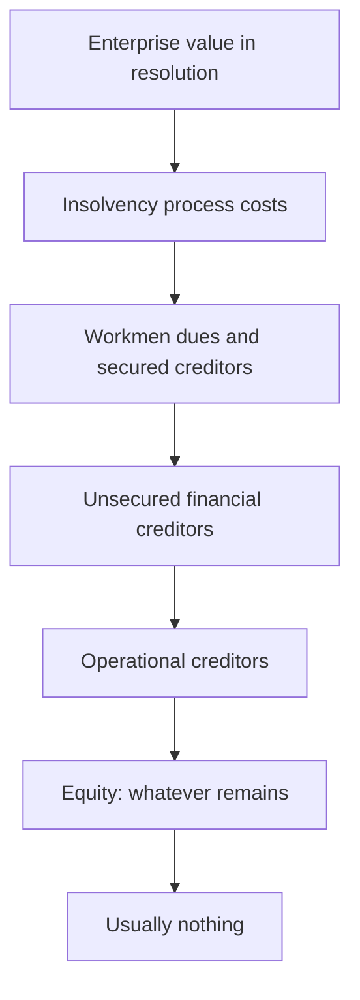

# Distress, Insolvency and Equity as an Option

## The Problem / Why this matters
When a company approaches insolvency, ordinary valuation methods stop working: a DCF on a business that may not exist in two years is meaningless, and multiples on negative earnings are undefined. Yet distressed equities attract enormous retail interest precisely because they are cheap in absolute terms, and Indian markets have repeatedly seen stocks of companies in insolvency proceedings trade actively while the equity was, on any analysis, worthless. Understanding the priority of claims is what separates a considered contrarian position from a lottery ticket.

## Core Idea
Equity in a distressed company is a **residual claim behind every other creditor** — economically a call option on enterprise value with a strike equal to total debt. If enterprise value is below the debt, the option is out of the money and the equity is worth close to nothing regardless of how low the price looks.

## Why it works this way
Insolvency law exists to enforce the priority of claims. Secured creditors, then unsecured creditors, then shareholders. In most resolutions, the enterprise value recovered does not cover the financial creditors in full — which means, by definition, nothing reaches equity.

## Full technical content

### Equity as a call option

The framing that makes distressed analysis tractable:

- **Underlying:** enterprise value.
- **Strike:** total debt.
- **Expiry:** whenever the claims are resolved.
- **Value:** positive only if enterprise value exceeds debt at resolution.

Consequences that follow directly:
- **Deeply out-of-the-money equity has small but non-zero value**, because a recovery in enterprise value before resolution could bring it back into the money. This is why distressed equities do not go to exactly zero while a process is pending — but the value is option value, not a claim on assets.
- **Volatility increases option value**, which is why distressed equities are violently volatile and why bad news sometimes fails to move them.
- **Time to resolution matters** — a longer process gives the underlying more time to recover, which is worth something to equity and is a cost to creditors.
- **Any new issuance at a low price destroys existing option value**, which is what makes resolution plans typically extinguish existing equity.

### The Indian insolvency framework

The Insolvency and Bankruptcy Code process, from an equity holder's perspective:

1. **Admission** — the tribunal admits an application; a moratorium takes effect and management passes to a resolution professional. **The board is displaced**, which means the promoter no longer controls the company.
2. **Committee of Creditors** — financial creditors form the committee that decides the outcome. **Equity holders have no vote.** This is the single most important structural fact.
3. **Resolution plans** — invited from applicants; the committee votes on them.
4. **Approval** — the tribunal approves a plan, or the company goes to liquidation.
5. **Implementation** — the plan typically involves a new investor acquiring the company, and **existing equity is usually extinguished or reduced to a nominal fraction**.

**The commercially important detail from the takeover chapter:** a resolution applicant acquiring control through an approved plan is exempt from the open-offer requirement, which removes a cost that would otherwise be borne — and further reduces any residual value flowing to existing shareholders.

**Liquidation** produces a waterfall in which equity ranks last and, in practice, receives nothing.

### The analytical process for a distressed name

1. **Establish total claims.** Financial debt, including off-balance-sheet items, guarantees invoked, statutory dues and operational creditors. This is the strike price, and it is usually larger than the reported borrowings figure once contingent items crystallise.
2. **Estimate resolution enterprise value.** What would a buyer pay for the business or the assets? Use replacement cost, comparable distressed transactions in the sector, and any bids already reported.
3. **Compare.** If estimated enterprise value is materially below total claims, **the equity is worth approximately zero**, and the current market price is option value plus retail speculation.
4. **Assess the probability distribution**, not a point estimate — the range of possible resolution outcomes is wide, and that width is the entire analysis.
5. **Check the process stage**, which determines both timing and the information available.
6. **Read the disclosed bids** where reported, since they are direct evidence on enterprise value.

### Turnarounds outside insolvency

Distinct, and where genuine equity opportunity is more often found:

| Requirement | Why |
|---|---|
| **Liquidity to survive** the turnaround period | Most turnarounds fail because time runs out, not because the plan was wrong |
| **A viable core business** underneath the problems | Fixing execution is possible; fixing a business with no economic rationale is not |
| **A credible agent of change** — new management, a new owner, creditor pressure | Turnarounds do not happen by themselves |
| **An identified cause** that is being addressed | "Things will improve" is not a thesis |

**The key distinction to draw explicitly:** an **operational** problem in a fundamentally sound business is fixable; a **structural** decline in the industry is not. Confusing the two is the most expensive error in turnaround investing, and it is the same cyclical-versus-structural judgement that the sector chapters treat as the hardest in the job.

**Signals worth weighting:**
- **Asset sales completing** at reasonable prices, which prove both liquidity and the asset values assumed.
- **Debt refinancing** achieved, which converts an immediate crisis into time.
- **Promoter infusing capital**, which is costly and undiversifiable.
- **New management with a relevant record** — not merely new management.
- **The first quarter of genuine operational improvement**, distinguished from an accounting improvement.

### Valuing a turnaround candidate

- **Scenario-weight explicitly.** Survival-and-recovery, muddle-through, and failure — with the equity worth approximately nothing in the last. A probability-weighted value is honest; a point target is not.
- **Value the normalised business**, not the current depressed one, but discount heavily for the probability of not reaching normalisation.
- **Model the balance sheet first.** In distress, the question is solvency and liquidity, not earnings — build the cash flow to the nearest debt maturity and see whether the company gets there.
- **Watch dilution.** Recovery frequently requires new equity at a low price, so existing holders may own much less of the recovered business than they expect. **A turnaround that succeeds after a 60% dilution may return far less to current holders than the enterprise recovery suggests.**

That final point is what most retail distressed investing misses entirely: being right about the business recovering is not the same as making money on the equity.

### Position sizing and honesty in the note

- **Size for total loss.** These positions have a genuine probability of going to zero, which is a different risk from ordinary volatility.
- **State the probability of total loss explicitly** in the note. Recommending a distressed equity without doing so is a failure of communication, not merely of conservatism.
- **Give the falsification conditions in balance-sheet terms** — a missed debt payment, a failed refinancing, a rejected resolution plan.
- **Do not present option value as intrinsic value.** A stock trading at ₹6 with a plausible resolution value of zero is not "cheap"; it has a small probability of a large payoff, which is an entirely different proposition and should be described as such.

## Common mistakes
- Valuing a distressed company with a **DCF** as though continuity were assured.
- Treating a low **absolute price** as cheapness.
- Ignoring that **equity has no vote** in the creditors' committee.
- Understating total claims by omitting **invoked guarantees and statutory dues**.
- Confusing an **operational** problem with a **structural** decline.
- Modelling recovery without modelling the **dilution** required to fund it.
- Presenting **option value** as intrinsic value.
- Sizing a distressed position like an ordinary one.
- Omitting the probability of total loss from the note.

## Interview angle
"A company is in insolvency proceedings and the stock still trades at ₹6. Is it worth buying?" Frame the equity as a call option on enterprise value with a strike equal to total claims, then do the comparison: estimate what a resolution applicant would pay for the business and set it against total claims including invoked guarantees and statutory dues, which are usually larger than reported borrowings. If enterprise value falls short of claims — as it does in most resolutions — the equity's economic value is approximately zero, and the ₹6 is option value plus speculation rather than a claim on anything. Add the structural facts that decide it: equity holders have no vote in the committee of creditors, resolution plans typically extinguish existing equity, and a resolution applicant is exempt from making an open offer. Then distinguish this from a turnaround outside insolvency, where genuine opportunity exists if the company has liquidity to survive, a viable core business and a credible agent of change — while noting that even a successful turnaround can return little to current holders once the dilution required to fund it is accounted for.
