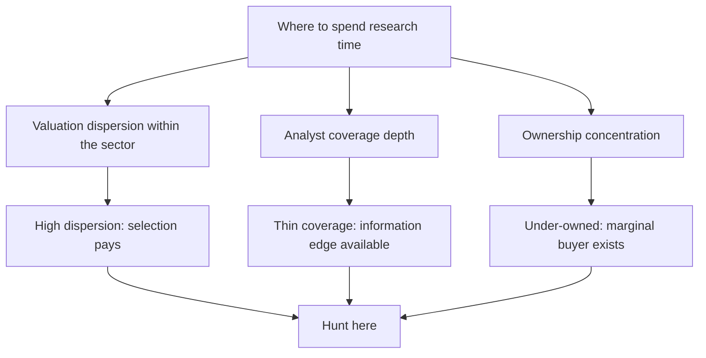

# Market Breadth, Dispersion and Where to Hunt

## The Problem / Why this matters
An analyst's scarcest resource is time, and where that time is spent determines the return on it more than how well it is spent. Working through a sector where every stock trades in a narrow band of similar multiples produces little, however rigorous the work — there is nothing to be right about. Working where valuations are widely dispersed and coverage is thin produces more, because the price of being right is higher. Market breadth and dispersion measures answer, cheaply, where the opportunity currently sits.

## Core Idea
**Dispersion is the raw material of stock selection.** When valuations within a sector or market are tightly clustered, stock picking earns little regardless of skill; when they are widely dispersed, the same skill earns much more.

## Why it works this way
An analyst's output is a relative judgement — this stock over that one. The payoff to a correct judgement is proportional to the gap between the two. If every stock in a sector trades at 19–22× earnings, even a perfect ranking produces small returns. If the range is 8–45×, the same ranking is worth a great deal.

## Full technical content

### Breadth measures and what they say

| Measure | Construction | Reading |
|---|---|---|
| **Advance-decline ratio** | Advancing stocks ÷ declining stocks | Narrow breadth with a rising index means a few names are carrying it |
| **Percentage above moving averages** | Share of the universe above their 200-day average | A broad participation measure |
| **Index versus equal-weight index** | Cap-weighted return minus equal-weighted | Persistent divergence indicates concentration in large names |
| **New highs versus new lows** | Counts across the universe | Deteriorating internals often precede index weakness |
| **Median stock return versus index return** | Direct comparison | The clearest statement of whether the typical stock is participating |

**The analytically useful reading is not predictive but diagnostic.** Narrow breadth does not reliably forecast a decline — that claim is made frequently and supported weakly. What it does tell you is that the index return is not representative of the typical stock, which matters for interpreting your own coverage's performance and for understanding what clients are actually experiencing in their portfolios.

### Valuation dispersion — the more useful measure

Compute the distribution of a valuation metric across a sector or the market: the interquartile range, the ratio of the 75th to the 25th percentile, or the standard deviation of multiples.

**How to read it:**
- **Low dispersion** — the market is treating the constituents as similar. Either they genuinely are, or differentiation is being ignored. If your work says the businesses differ materially and the market prices them identically, that is a directly actionable finding.
- **High dispersion** — the market is differentiating strongly, often between a favoured and an out-of-favour group. The question becomes whether the differentiation is justified or has overshot.
- **Dispersion changing** — compression means the market is losing interest in differentiating, expansion means it is differentiating more.

**The practical rule:** high and rising dispersion is when fundamental stock selection earns the most, and it is where an analyst with limited time should concentrate.

### Where the information edge is

Dispersion tells you where being right pays; these tell you where being right is achievable:

**Coverage depth.** Count the analysts covering each stock in your universe. A large company with twenty-five analysts covering it is efficiently priced with respect to public information; a mid cap with two is not. **The single most reliable structural edge available to a research analyst is covering things others do not.**

**Ownership.** Low institutional ownership means the marginal buyer has not arrived yet — but as the ownership chapter warns, first establish *why* institutions have declined, since sometimes there is a good reason.

**Recent structural change.** Companies emerging from a demerger, a recent listing, a change of management, or a shift in business mix are systematically under-analysed because the historical record no longer describes them. The market's models are stale, and rebuilding them from current facts is where genuine differentiation is easiest.

**Complexity.** Businesses that are genuinely hard to analyse — conglomerates, multi-segment financials, companies with complex accounting — are under-covered because the work is expensive. The reward for doing it is proportionate.

**Neglect after disappointment.** Companies that disappointed two or three years ago are frequently abandoned by analysts and investors and not revisited when the situation changes. Systematically re-examining names that were written off is a productive and unpopular habit.

### Constructing a hunting ground

Combining these into a practical allocation of research time:

1. **Rank sectors by valuation dispersion**, current and versus history.
2. **Within high-dispersion sectors**, identify stocks with thin coverage.
3. **Overlay ownership** to find under-owned names with an available marginal buyer.
4. **Flag recent structural change**, where stale models are likeliest.
5. **Apply the liquidity filter** early, per the small-cap discipline — deployability before analysis.
6. **Then do the fundamental work** on the resulting shortlist.

This is the screening logic from the idea-generation chapter applied one level up: rather than screening for cheap stocks, screening for *where research effort has the highest expected return*.

### The market-level version

The same reasoning at the index level, for strategy work:

- **Sector dispersion within the index** tells you whether allocation or selection is the more productive decision this year.
- **Large-cap versus mid-cap valuation gaps** relative to history indicate where the risk is concentrated. A mid-cap index trading at a premium to large caps, against a long history of discounts, is a specific and checkable observation rather than a general assertion.
- **Concentration** — the share of index market capitalisation in the top few names — determines how representative index returns are, and how much a benchmark-relative portfolio is forced to hold regardless of view.

### The honest limits

- **Dispersion is a where-to-look tool, not a signal.** It says nothing about direction, and using it as a timing indicator is unsupported.
- **Breadth measures are widely over-interpreted.** The predictive claims made for them in market commentary far exceed their evidential support, and repeating those claims uncritically damages credibility.
- **Thin coverage is not automatically opportunity** — some things are uncovered because they are uninvestable, and the liquidity filter exists to catch that.
- **These measures are noisy over short periods** and should be read over months, not days.

## Common mistakes
- Treating **narrow breadth** as a reliable predictor of decline.
- Spending research time in **low-dispersion** areas where even a correct ranking pays little.
- Assuming **thin coverage** means opportunity without checking investability.
- Ignoring **why** institutions have avoided an under-owned name.
- Missing companies with **stale models** after a structural change, where differentiation is easiest.
- Reading dispersion or breadth over **days** rather than months.
- Never revisiting names abandoned after a past disappointment.

## Interview angle
"How do you decide which stocks to spend your time on?" Answer with expected return on research effort rather than with a screen. Start with valuation dispersion within sectors, because dispersion is the raw material of stock selection — when every stock in a sector trades in a narrow multiple band, even a perfect ranking earns little, and when the range is wide the same judgement is worth a great deal. Then layer on where being right is achievable: coverage depth, since a mid cap followed by two analysts is not priced with respect to public information the way a large cap followed by twenty-five is; ownership, to find names where a marginal buyer still exists; and companies whose historical record no longer describes them — post-demerger entities, recent listings, businesses that have changed mix — because the market's models are stale and rebuilding them from current facts is where differentiation is easiest. Apply the liquidity filter before the fundamental work, not after. And be honest about the limits: breadth measures are diagnostic rather than predictive, and the forecasting claims commonly made for them are not well supported.
