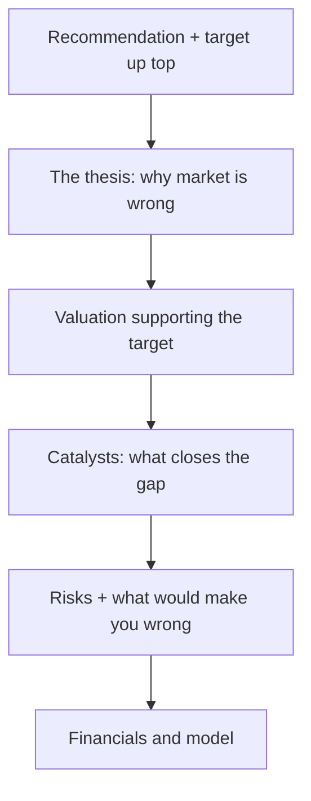

# The Research Note & Investment Thesis

## The Problem / Why this matters
Analysis is worthless if it isn't communicated persuasively. The **research note** is the analyst's product — the written argument that a stock is mispriced, structured so a busy portfolio manager can grasp the thesis, valuation, catalysts and risks in minutes. Writing a tight note and articulating a crisp thesis is exactly what an equity-research interview tests (often via a written case or "pitch me a stock"). This chapter is the writing/communication counterpart to the analysis.

## Core Idea
A research note communicates a **differentiated investment thesis** — why the market is wrong about this stock — supported by valuation, backed by catalysts, and honest about risks, ending in a clear **recommendation and target price**. Structure and clarity are as important as the analysis.

## Why it works this way
PMs read dozens of notes; they act on the ones that are clear, differentiated, and defensible. A note that buries the thesis, agrees with consensus, or hides the risks gets ignored. So the note leads with the conclusion, states the *variant view*, quantifies the value, and pre-empts objections.

## Full technical content

**Types of note:** **initiation** (full deep-dive launching coverage), **update/earnings note** (reaction to results or news), **thematic** (sector/idea). All share the core structure.

**Anatomy of a research note:**
1. **Recommendation & target** — rating (Buy/Hold/Sell), 12-month target price, and expected return — *at the top*.
2. **Investment thesis** — 3–5 crisp points on *why the market is wrong* and you're right (the variant view).
3. **Valuation** — the DCF and/or multiples supporting the target, with the key assumptions.
4. **Catalysts** — the specific events that will close the value gap and their timing.
5. **Risks** — the main downside risks and what would break the thesis.
6. **Business overview & financials** — the model, drivers, and key metrics.

**The investment thesis — the heart.** A great thesis is:
- **Differentiated** — different from consensus (a variant perception); if you agree with the price, there's no trade.
- **Specific & supported** — concrete drivers and numbers, not vague optimism.
- **Falsifiable** — you can state exactly what would prove you wrong.
- **Catalyst-driven** — a reason the market will come around.

**The "variant view" test.** Ask: *what do I believe that the market doesn't, and why am I right?* If you can't answer, you don't have a thesis — you have a description.

**Writing craft:** lead with the conclusion (BLUF — bottom line up front); be concise; use specific numbers; separate fact from opinion; make it skimmable (headers, bullets, a chart); and be intellectually honest about risks (it builds credibility).

**Position on consensus.** Note where you sit vs the Street (above/below consensus estimates and rating) — the value is in the *difference*, and being non-consensus and right is where alpha lives.

## Worked examples

**Example 1 — a crisp thesis (3 points).** *Buy, target ₹1,200 (+20%).* Thesis: (1) The market underrates margin expansion from premiumization — we model 300 bps vs consensus 100 bps. (2) Rural distribution moat is widening, driving volume share gains consensus misses. (3) Valuation at 22× forward P/E is below the 5-year average despite better growth. Catalysts: next two quarters of margin beats. Risks: rural slowdown; raw-material inflation. *Differentiated, specific, catalyst-driven, falsifiable.*

**Example 2 — description vs thesis.** Weak note: "Company X is a good business with strong brands and steady growth; we rate it Buy." That's a *description* — it says nothing the market doesn't know and gives no reason the stock is mispriced. Strong note: "We are 15% above consensus on FY26 EPS because the Street hasn't modelled the new plant's margin uplift; at the current price that's not in the stock." The second has a variant view.

**Example 3 — honest risk section building credibility.** A Buy note explicitly says: "If Q1 volume growth comes in below 8% (vs our 15%), our margin thesis breaks and we would downgrade." Stating the falsification point makes the whole note more credible — the PM trusts an analyst who knows what would prove them wrong.

**Example 4 — a worked update note reacting to a quarterly result, not a full re-initiation.** A company under Buy coverage reports revenue in line but EBITDA margin 80bps below the analyst's estimate, driven by a one-off input-cost spike management flags as temporary. A well-structured update note: states upfront whether the miss changes the rating (here, no — the miss is attributed to a flagged one-off, not a structural issue); quantifies the immediate estimate revision (FY26 EPS cut by 3%, mechanically flowing from the margin miss); explicitly re-confirms or revises the standing falsification criteria from the original thesis (Example 3's kind of statement) in light of the new data; and keeps the note short — a page, not a full re-initiation — since the core investment case is unchanged and a PM reading dozens of update notes that morning needs the delta, not the whole story repeated.

**Example 5 — a note that fails the variant-view test, rewritten.** Weak: "We reiterate our Buy rating following in-line results, reflecting the company's strong market position and consistent execution." This restates the rating without adding any new information — it doesn't tell a PM anything they didn't already know from the results themselves. Rewritten with an actual variant view: "Results were in line, but we flag that management's commentary on a new export order pipeline (barely mentioned on the call, not yet in consensus models) could add 4-5% to FY27 revenue if it converts — we're not yet baking this into our target given limited disclosure, but it's the specific data point we'll be tracking over the next two quarters and would be a source of upside surprise the Street currently isn't pricing." The rewrite gives the reader something concrete and forward-looking to act on or watch for, exactly the "why publish this note at all" test every update note should pass.

## How it is tested in interviews
- **"Pitch me a stock."** — Lead with the recommendation and target, then 2–3 thesis points (your variant view), the valuation, catalysts, and risks — in that order, concisely.
- **"What makes a good research note?"** — "Conclusion up top, a differentiated and falsifiable thesis, valuation that supports the target, specific catalysts, and honest risks."
- **"What's an investment thesis?"** — "A variant view — what you believe that the market doesn't, and why you're right — with catalysts to close the gap."
- **"How is your view different from consensus?"** — Interviewers want to hear you position vs the Street; the value is in the difference.

## Traps & common mistakes
- Writing a **description**, not a **thesis** (no variant view).
- Burying the **recommendation** instead of leading with it.
- Omitting **catalysts** (why does the gap close?) or **risks** (looks like cheerleading).
- Agreeing with **consensus/price** — no edge, no trade.
- Not stating what would **falsify** the thesis.

## First-principles recap
- The research note is the analyst's product — clarity and structure matter as much as analysis.
- Lead with **recommendation and target**; then thesis, valuation, catalysts, risks.
- A thesis must be **differentiated, specific, falsifiable, and catalyst-driven**.
- Value lives in the **difference from consensus** — the variant view.
- Honest risk disclosure builds credibility.

## Quick-reference
| Section | Content |
|---|---|
| Top | Rating + target + expected return |
| Thesis | Variant view (why market is wrong) |
| Valuation | DCF/multiples supporting target |
| Catalysts | Events that close the gap + timing |
| Risks | Downside + falsification point |
| Thesis test | What do I believe that the market doesn't? |
