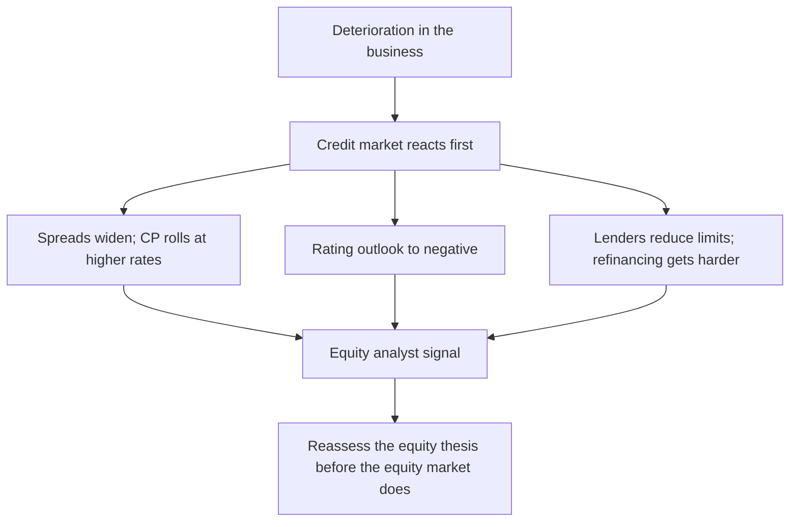

# Credit Market Signals for Equity Analysts

## The Problem / Why this matters
Credit markets frequently price deterioration before equity markets do. Bond spreads widen, commercial paper rolls at higher rates, rating agencies place issuers on watch, and lenders quietly reduce limits — often while the equity is still trading on an unchanged narrative. An equity analyst who monitors these signals gets an early warning that is available publicly and is largely ignored by other equity analysts, which is precisely what makes it valuable.

## Core Idea
Credit investors are **asymmetric and senior**: they gain little from upside and lose heavily from default, so they scrutinise solvency and liquidity harder than equity investors do. Their pricing is therefore a useful independent read on the risk of the outcomes that matter most to equity holders too.

## Why it works this way
An equity holder gains from growth and loses everything in default. A creditor gains a fixed coupon and loses principal in default. That payoff structure makes credit analysis focus almost entirely on downside and liquidity, which is exactly the blind spot in most equity work — where the narrative is usually about growth.

## Full technical content

### The signals worth monitoring

| Signal | Where to find it | What it means |
|---|---|---|
| **Bond yields and spreads** | Exchange-traded corporate bond data; wholesale debt segment | Widening spreads mean rising perceived default risk |
| **Credit rating actions** | Rating agency websites, published free | Downgrades, and especially outlook changes, are early |
| **Rating rationale documents** | Published by the agencies | Detailed, analytical, and read by very few equity analysts |
| **Commercial paper rates and rollovers** | Issuance data | Short-term funding stress appears here first |
| **Bank facility utilisation** | Annual report disclosures | Rising utilisation of working-capital limits signals cash strain |
| **Refinancing schedule** | Borrowings note | The maturity wall determines when stress becomes acute |

### Rating agency rationales — the most under-used free research

Rating agencies publish detailed rationale documents explaining their assessment, and they are freely available. For an equity analyst these are valuable because:

- They contain **analytical judgements about the business** — competitive position, management quality, sector outlook — not just financial ratios.
- They state **explicit triggers** for upgrade or downgrade, which are effectively falsification conditions written by an independent party.
- They cover **unlisted group entities**, which is otherwise hard to obtain and directly relevant to the group-structure analysis.
- They are updated on a schedule and after material events.

**The outlook change is the early signal.** A move from "stable" to "negative" outlook typically precedes an actual downgrade by months, and precedes equity-market recognition by longer. Where a covered company's rating outlook changes and the equity does not react, that gap is worth investigating rather than dismissing.

### What credit markets see that equity markets miss

- **Liquidity versus solvency.** Equity analysts model earnings; credit analysts model the ability to meet obligations as they fall due. A profitable company can fail on a refinancing, and the credit market prices that risk explicitly.
- **The maturity wall.** A large concentration of debt maturing in a single year is a specific, dated risk that appears clearly in the borrowings note and rarely in equity research.
- **Covenants.** Breach triggers accelerate debt and can force distress. Covenant headroom is a credit-analyst staple and an equity-analyst blind spot.
- **Group-level stress.** Credit markets assess the whole group, including the unlisted entities that the listed company may have guaranteed — connecting directly to the contingent-liability analysis.
- **Working-capital financing.** A company relying on short-term borrowing to fund a long-cycle business has a structural vulnerability that shows in facility utilisation before it shows in earnings.

### Applying it to the equity thesis

**As an early warning:**
1. **Track rating actions and outlooks** for every covered name and its group entities.
2. **Watch spread widening** where bond data is available, particularly relative to sector peers rather than in absolute terms.
3. **Monitor short-term funding** — a company that has been rolling commercial paper comfortably and suddenly cannot is in immediate trouble, and this is visible in issuance data.
4. **Read the borrowings note** for the maturity profile at every annual result, not only when concerned.

**As a valuation input:**
- **Implied default risk from credit spreads** can be compared to what the equity price implies. Where credit prices meaningful default risk and equity prices a normal continuing business, one of the two is wrong, and the historical record suggests it is more often the equity.
- **Cost of debt from actual market pricing** is a better WACC input than a historical average borrowing cost, particularly for a stressed issuer where the marginal cost of new debt is far above the average of existing debt.

**As a sector signal:**
- **Sector-wide spread widening** indicates the credit market has identified a sector problem, which often precedes equity de-rating.
- **NBFC funding costs** are a leading indicator for that sector specifically, since the business model depends directly on borrowing spreads — a widening in their funding cost compresses margins mechanically.

### The Indian market's specific features

- **Corporate bond market depth is limited** relative to developed markets, so continuous spread data is not available for most issuers. **Rating actions therefore carry proportionately more information here**, because they are often the only credit signal available.
- **Bank lending dominates**, and bank behaviour is less visible than bond pricing — which makes disclosures on facility utilisation, and any mention of lender consents or restructuring, more important.
- **Mutual fund debt-scheme holdings** are disclosed, and a scheme marking down an issuer's paper or a fund's exposure being flagged is publicly visible and is a strong signal.
- **Group-level contagion is a recurring pattern**: stress at one group entity affects lender appetite across the whole group, including healthy listed companies. Monitoring the group, not just the company, is essential in an Indian context.

### Building it into the process

A practical routine that costs little:
- **At initiation:** read every available rating rationale for the company and its material group entities, and record the stated upgrade/downgrade triggers as monitorables.
- **Quarterly:** check for rating actions and outlook changes; check facility utilisation and short-term borrowing movement.
- **At every annual report:** rebuild the debt maturity profile and check covenant disclosures.
- **On any stress signal:** reassess the equity thesis immediately rather than waiting for the operational numbers to confirm, because by then the equity will have moved.

## Common mistakes
- Ignoring **rating rationales**, which are free, detailed and rarely read by equity analysts.
- Treating a **rating outlook change** as administrative rather than as an early signal.
- Modelling earnings without modelling **refinancing** and the maturity wall.
- Ignoring **covenant headroom** entirely.
- Using a **historical average cost of debt** for a stressed issuer instead of the marginal market rate.
- Monitoring the listed company but not the **group** entities it is exposed to.
- Missing rising **working-capital facility utilisation** as a cash-strain signal.
- Assuming the equity market has already priced what the credit market is pricing.

## Interview angle
"What would make you re-examine a Buy before any bad numbers appear?" Credit signals are a strong answer. Explain the asymmetry first — creditors gain a fixed coupon and lose principal in default, so they scrutinise liquidity and solvency far harder than equity investors, who are usually focused on the growth narrative — which is why credit markets frequently price deterioration first. Then be specific about what you monitor: rating outlook changes, which typically precede an actual downgrade by months and equity recognition by longer; the rating agencies' published rationale documents, which state explicit downgrade triggers and cover unlisted group entities you cannot otherwise see; the debt maturity profile from the borrowings note, since a profitable company can still fail on a refinancing; covenant headroom; and rising utilisation of working-capital facilities as a cash-strain signal. Add the India-specific point that corporate bond depth is limited so continuous spread data often does not exist, which makes rating actions proportionately more informative here — and that group-level contagion means you monitor the whole group, not just the listed entity.
