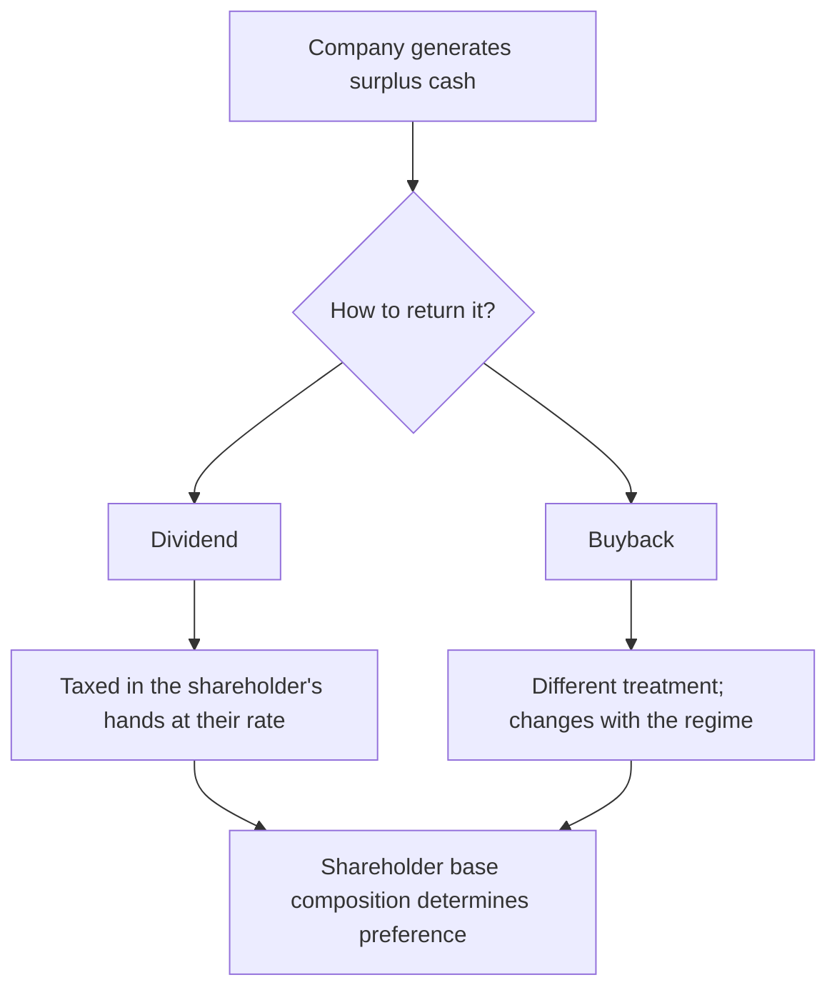

# Taxation and Its Effect on Equity Returns

## The Problem / Why this matters
Analysts produce pre-tax return expectations while clients earn post-tax returns, and the gap between the two is large enough to change decisions. Tax also affects corporate behaviour directly — how companies choose to return capital, how they structure transactions, and how different investor classes behave — which means it belongs in the analysis of a company and not only in the analysis of a portfolio. Tax regimes change, and the rules stated here are illustrative of the structure rather than a current statutory reference.

## Core Idea
Tax changes **the return an investor actually keeps and the behaviour of the companies and investors being analysed** — most visibly in the choice between dividends and buybacks, and in the different treatment of different holder classes.

## Why it works this way
A rational investor optimises after-tax return. Where two routes deliver the same pre-tax outcome with different tax treatments, capital flows to the cheaper one, and companies respond by choosing the structure their shareholder base prefers. Tax differences therefore show up as behaviour, not just as arithmetic.

## Full technical content

### The main heads relevant to equity

| Item | Structural point |
|---|---|
| **Short-term capital gains** | Gains on holdings below the specified threshold period, taxed at a higher rate |
| **Long-term capital gains** | Gains beyond the threshold period, taxed at a lower rate, historically with an exemption up to a specified annual amount |
| **Dividend** | Taxed in the shareholder's hands at their applicable rate since the shift away from a company-level distribution tax |
| **Buyback** | Treatment has shifted between company-level and shareholder-level taxation across regimes — always check the current position before comparing routes |
| **Securities transaction tax** | Levied on transactions; a direct drag on high-turnover strategies |
| **Grandfathering** | Where a new regime is introduced, gains accrued before a cut-off date have sometimes been protected, which affects effective cost basis |

**The single most important discipline is to check the current position rather than rely on memory**, because these rules have changed repeatedly and confidently stating a superseded rule is a visible error.

### Why the dividend-versus-buyback question is a tax question

The capital-return chapter treats this as a capital-allocation decision. The tax layer explains much of the observed behaviour:

- When dividends are taxed in shareholders' hands at their marginal rate, **high-tax-bracket shareholders prefer buybacks** and low-tax or tax-exempt shareholders are relatively indifferent.
- When buybacks carry a company-level tax, the arithmetic flips and dividends can become the cheaper route.
- **The shareholder base determines the preference**: a company with a large domestic institutional or promoter shareholding faces different effective rates from one held largely by high-bracket individuals or by tax-exempt entities.
- **A shift from dividends to buybacks, or the reverse, following a tax change is not a capital-allocation signal** — it is a tax response, and reading it as a change in management's philosophy is a straightforward error.

### The different investor classes

Effective tax treatment varies enormously across holder types, which affects behaviour and therefore flows:

- **Domestic individuals** — taxed on gains and dividends at rates depending on holding period and bracket.
- **Domestic mutual funds** — taxed differently at fund and investor level, and the investor's holding period in the fund matters rather than the fund's holding period in the stock.
- **Insurance and pension pools** — long horizons and distinct treatment, which contributes to their low turnover.
- **Foreign portfolio investors** — subject to Indian tax and to treaty positions depending on jurisdiction; treaty renegotiations have historically caused observable shifts in flows and in the jurisdictions through which capital is routed.

**The analytical use:** where a tax change alters the relative attractiveness for one class, flows shift, and flows move prices. A change affecting foreign investors specifically can produce sustained selling entirely unrelated to fundamentals — which is exactly the kind of mechanical explanation the flow chapters insist on checking before attributing a move to the business.

### Corporate tax and its effect on valuation

At the company level:
- **The effective tax rate** matters more than the statutory rate. Check the tax reconciliation in the notes, which explains why they differ — exemptions, unit-specific benefits, prior-period items, unrecognised losses.
- **Expiring tax benefits** are a modelling trap. A company enjoying a concessional rate under a scheme that expires will see post-tax earnings fall mechanically, and forecasts that hold the current effective rate constant miss it entirely. **Read the tax note for the expiry schedule.**
- **Deferred tax assets** from accumulated losses shield future income, and their recognition depends on management's assessment of future profitability — which is itself a signal about what management expects.
- **Regime changes** — a general reduction in corporate tax rates raises post-tax earnings across the board, but the *valuation* effect is smaller than the earnings effect if the market anticipated it or if competitive dynamics cause the benefit to be passed through to customers over time. **In competitive industries, a broad tax cut is partly competed away.**
- **Cross-market comparison** requires care, since different tax regimes mean the same pre-tax earnings produce different post-tax earnings — which is why EV/EBITDA is the more robust cross-border multiple.

### Turnover, transaction costs and net returns

- **Securities transaction tax and brokerage** are proportional to turnover, so a strategy requiring frequent rebalancing carries a permanent drag.
- **Short-term versus long-term treatment** creates a genuine incentive to hold beyond the threshold, and can distort selling behaviour near the boundary — occasionally producing observable flow patterns.
- **The analyst's recommendation horizon interacts with this**: a 12-month target implies a holding period that determines the applicable treatment, and where a recommendation is explicitly short-horizon, the after-tax return is materially lower than the headline upside.

**A useful discipline for client-facing work:** where a recommendation's upside is modest and the horizon short, state that the pre-tax figure overstates what the client keeps. Few analysts do this, and it is a mark of taking the client's actual outcome seriously.

### What to keep out of the analysis

- **Do not give tax advice.** Individual circumstances vary and it is not the analyst's role; the correct framing is to note where tax is material to the comparison and recommend the client consider their own position.
- **Do not build a thesis on an anticipated tax change.** Policy forecasting is unreliable, and theses depending on it have a poor record.
- **Do not ignore it entirely either.** Where a known change takes effect on a known date, it is a dated, forecastable event of exactly the kind worth having on the calendar.

## Common mistakes
- Stating **superseded** tax rules confidently instead of checking the current position.
- Reading a shift between dividends and buybacks as a **capital-allocation signal** when it is a tax response.
- Holding the **effective tax rate constant** when a concessional benefit is scheduled to expire.
- Ignoring the **tax reconciliation** note, which explains the gap to the statutory rate.
- Assuming a broad corporate tax cut flows fully to shareholders in a competitive industry.
- Comparing **P/E across tax regimes** rather than using EV/EBITDA.
- Presenting pre-tax upside on a short-horizon recommendation without noting the gap.
- Building a thesis on an anticipated policy change.

## Interview angle
"Does tax affect how you analyse a company?" Say yes and be specific in two directions. At the company level, the effective tax rate is what matters rather than the statutory one, so read the tax reconciliation note — and check for concessional benefits with an expiry date, because a model holding the current effective rate constant will miss a mechanical fall in post-tax earnings. At the market level, tax explains behaviour: the choice between dividends and buybacks is largely a tax question determined by the shareholder base, so a company switching between them after a rule change is responding to tax rather than signalling a new capital-allocation philosophy, and reading it as the latter is a common error. Add that different holder classes face very different effective rates, so a change affecting foreign investors specifically can produce sustained selling with no fundamental content — another mechanical explanation to eliminate before attributing a move to the business. And note the honest boundary: you flag where tax is material to a comparison, but you do not give tax advice or build theses on anticipated policy changes.
