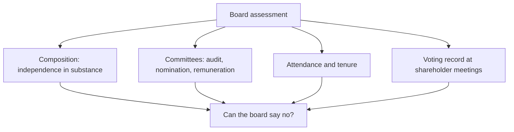

# Boards, Independent Directors and Proxy Voting

## The Problem / Why this matters
The board is the only structural mechanism standing between a controlling shareholder and the minority. Where it functions, related-party transactions get challenged, remuneration is constrained and succession is planned. Where it does not, every governance protection is nominal. Board composition and behaviour are extensively disclosed, and the shareholder-meeting record — resolutions, voting outcomes, dissent — is public, published and almost entirely unread by equity analysts.

## Core Idea
Assess the board on **whether it can and does say no** — which is a function of who the directors are, how they were selected, how long they have served, and what the voting record shows.

## Why it works this way
Independence is a structural condition, not a designation. A director designated independent who was appointed by the promoter, has served for fifteen years, sits on several other group boards and derives meaningful income from the relationship is unlikely to challenge the person who appointed them — whatever the label says.

## Full technical content

### Composition — independence in substance

Listing regulations prescribe minimum proportions of independent directors and requirements around board committees. Compliance is necessary but tells you little; the substantive assessment:

| Factor | What to look for |
|---|---|
| **Genuine independence** | Prior business or professional relationships with the promoter, other group directorships, family connections |
| **Tenure** | Very long service erodes independence in practice; regulations limit terms for this reason |
| **Relevant expertise** | Sector knowledge, financial literacy, and specifically whether anyone on the audit committee can genuinely challenge the CFO |
| **Number of other directorships** | Directors on many boards cannot devote adequate time to any |
| **Selection process** | Whether the nomination committee functions independently or ratifies the promoter's choices |
| **Diversity of background** | Boards drawn from one professional network reason alike |

**The audit committee is the most important**, since it approves related-party transactions, oversees the auditor and reviews financial reporting. **An audit committee with no member capable of challenging the CFO on accounting judgement is a structural weakness regardless of its formal composition.**

### Behavioural signals

More informative than composition, and available from disclosure:

- **Attendance records** are disclosed. A director attending a minority of meetings is not exercising oversight.
- **Resignations**, particularly by independent directors mid-term. **The stated reason matters, and vague reasons are informative in themselves** — the same logic as an auditor resignation, and SEBI requires disclosure of the reasons.
- **Frequency of turnover.** Repeated changes indicate friction or a board being reconstituted for compliance rather than function.
- **Dissent recorded** in the minutes or reported — extremely rare, and therefore highly informative when it occurs.
- **A director appointed to a group entity shortly after leaving another** suggests the relationship, not the role, was the basis.

### The shareholder-meeting record

The most under-used governance dataset available. Companies publish resolutions, explanatory statements and voting results.

**What to extract:**
- **Resolution content.** Related-party approvals, remuneration, director appointments, capital-raising authorisations, and scheme approvals — the explanatory statement frequently contains detail available nowhere else.
- **Voting outcomes by category.** Results are published split between promoter and public, and institutional and retail. **A resolution passed with a large proportion of institutional votes against is a strong signal**, both about the specific matter and about how the company treats institutional concerns.
- **Resolutions withdrawn before a vote** — a company withdrawing a related-party or remuneration resolution in the face of opposition tells you both that the attempt was made and that pressure worked.
- **Trend over years.** Rising institutional opposition across successive meetings indicates a deteriorating relationship with the shareholder base.

**Proxy advisory firms** publish recommendations on contentious resolutions, and their analysis is often detailed and specific. Reading these is cheap and gives an independent governance assessment that most equity analysts do not consult.

### Remuneration

- **Compare to peers** of similar size and sector, not in absolute terms.
- **Check the link to performance** — and specifically whether remuneration falls in weak years. Compensation that only ratchets upward is extraction, as the related-party chapter notes.
- **Promoter-director remuneration** deserves particular scrutiny, since it is a route for extraction distinct from dividends and is not shared with minorities.
- **Commission as a percentage of profit** structures can create incentives to report profit rather than to generate cash.
- **Shareholder approval requirements** apply above thresholds, and the voting record on remuneration resolutions is a direct measure of institutional comfort.

### Succession and key-person risk

- **Is there a stated succession plan** for the promoter-CEO? In promoter-led companies this is frequently unaddressed and is a material risk.
- **Family succession** raises the question of whether the next generation is involved, competent and aligned — and family disputes have destroyed substantial value in Indian listed companies.
- **Depth of professional management** below the promoter determines whether the business functions without them.
- **The board's role in succession** is the test of whether it is a functioning board or an advisory group.

### Related governance mechanisms

- **Minimum public shareholding** requirements ensure a float that gives institutions a voice.
- **Related-party approval by disinterested shareholders** — where promoters cannot vote, minorities have a genuine veto, and the outcome of such votes is the clearest available measure of minority sentiment.
- **Class-action and representative mechanisms** exist but are used rarely in practice.
- **Institutional stewardship expectations** have raised engagement and voting activity, which is why voting data has become more informative over time.

### How it enters the analysis

- **Governance is a precondition, not a scoring factor.** Where the board cannot constrain the controlling shareholder and history shows extraction, the analysis of the business is secondary. This is the same conclusion the related-party chapter reaches, arrived at from the structural side.
- **Where governance is strong, say so.** It supports a higher multiple legitimately, and a company that has demonstrably improved its governance can re-rate on that alone.
- **Track changes.** Board strengthening, an independent chair, or the appointment of directors with genuine sector expertise are real positives; the reverse is a warning.
- **Include voting outcomes as monitorables**, since they are periodic, published and directly relevant.

## Common mistakes
- Treating the **independent-director designation** as evidence of independence.
- Ignoring **tenure** and cross-directorships within the group.
- Not checking whether the **audit committee** contains anyone able to challenge the CFO.
- Overlooking **attendance records**, which are disclosed.
- Accepting a vague explanation for an **independent director's resignation**.
- Never reading **shareholder meeting resolutions and voting outcomes**.
- Ignoring **proxy advisory** analysis, which is free and specific.
- Comparing remuneration in absolute terms rather than against peers and performance.
- Leaving **succession** unexamined in a promoter-led company.

## Interview angle
"How would you assess whether a board is effective?" Say that the designation tells you nothing and go to substance: whether the independent directors have prior business relationships with the promoter or sit on other group boards, how long they have served, how many other directorships they hold, and — most importantly — whether anyone on the audit committee is capable of challenging the CFO on an accounting judgement, since that committee approves related-party transactions and oversees the auditor. Then move to behaviour, which is more informative than composition: attendance records are disclosed, and an independent director resigning mid-term with a vague stated reason is a serious signal for the same reason an auditor resignation is. Finish with the dataset almost no equity analyst reads — shareholder meeting resolutions and their voting outcomes, published split by category, where a large institutional vote against a passed resolution tells you both about that matter and about how the company handles institutional concerns, and where a resolution quietly withdrawn before a vote tells you the attempt was made.
