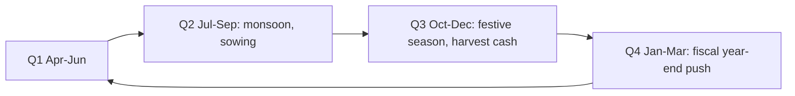

# Seasonality in Indian Corporate Earnings

## The Problem / Why this matters
A large share of quarterly "surprises" in Indian equities are not surprises at all — they are seasonal patterns that the analyst failed to model. Comparing a monsoon quarter to a festive quarter, or reading a March-quarter surge as an inflection, produces confident conclusions that are simply wrong. Getting seasonality right is one of the cheapest improvements available to a forecast, and getting it wrong is one of the more embarrassing errors to make in front of a client.

## Core Idea
Model in **year-on-year terms as the default**, use sequential comparison only where the seasonal pattern is understood and adjusted for, and know each sector's specific calendar.

## Why it works this way
Indian demand and corporate activity follow a pronounced annual calendar — monsoon, harvest, festivals, the fiscal year-end — and the pattern repeats. A comparison that does not control for it is comparing two different points in a cycle and attributing the difference to performance.

## Full technical content

### The Indian calendar

| Quarter | Characteristics |
|---|---|
| **Q1 (Apr–Jun)** | Pre-monsoon; summer demand for cooling products and beverages; construction activity before the rains |
| **Q2 (Jul–Sep)** | Monsoon; construction and mining slow; agricultural sowing; typically the weakest quarter for many industrials |
| **Q3 (Oct–Dec)** | Festive season — the strongest quarter for consumer discretionary, autos, jewellery and retail; harvest cash supports rural demand |
| **Q4 (Jan–Mar)** | Fiscal year-end; government spending push; corporate order closure; rabi harvest |

### Sector-specific patterns

| Sector | Pattern |
|---|---|
| **Cement, construction, capital goods** | Q2 weak on the monsoon; Q4 strongest on the year-end push |
| **Autos** | Q3 festive-led; watch dispatches versus retails, since dispatches are pushed ahead of the festive period and inventory correction follows |
| **Consumer discretionary and retail** | Q3 dominant; a weak festive quarter is disproportionately damaging to the full year |
| **FMCG** | Less pronounced, but rural demand tracks the monsoon and harvest with a lag |
| **Agri inputs, fertilisers, tractors** | Directly monsoon-linked; kharif and rabi seasons drive the pattern |
| **IT services** | Furloughs in the December quarter reduce billable days — a well-known pattern that is still misread each year |
| **Banks and NBFCs** | Q4 typically strong on year-end disbursement targets; asset-quality recognition often concentrated at year-end |
| **Government-linked (defence, railways, PSU capex)** | Heavily Q4-weighted on budget-year completion |
| **Hotels and travel** | Q3 and Q4 strong on the leisure and wedding seasons; Q1 and Q2 weaker |
| **Air conditioning, beverages** | Q1 dominant on summer demand; a delayed summer is a genuine miss |

### The modelling disciplines

**1. Year-on-year is the default comparison.** It controls for seasonality automatically. Sequential comparison is informative only when the seasonal pattern is explicitly adjusted for.

**2. Build quarterly models on historical quarterly shares.** Rather than dividing an annual forecast by four, distribute it using the average share each quarter has taken over the past three to five years. This is straightforward and eliminates most seasonal error.

**3. Distinguish weather variation from seasonality.** Seasonality is the expected pattern; a deficient monsoon or a delayed summer is a *deviation* from it and is genuine news. Confusing the two produces both false alarms and missed signals.

**4. Watch for shifting festival dates.** Festival timing moves between quarters across years, which can shift a material share of demand from one quarter to another with no change in the underlying business. **This is one of the most common causes of a spurious "miss" or "beat"**, and checking the festival calendar before writing a results note is a two-minute task that prevents an embarrassing conclusion.

**5. Use trailing twelve months for trend.** TTM smooths seasonality entirely and is the cleanest way to see whether the underlying trend is improving.

**6. Check for changes in the pattern.** A structural shift — e-commerce changing festive concentration, air conditioning becoming less summer-dependent as penetration rises — means the historical seasonal profile is stale. Patterns are not permanent.

### Where seasonality creates analytical traps

- **Extrapolating a strong quarter.** Annualising a festive quarter produces an absurd full-year number, and the mistake is made surprisingly often in quick notes.
- **Reading a weak monsoon quarter as deterioration** in a construction-linked business.
- **Working capital seasonality.** Receivables and inventory swing with the cycle, so a year-end balance-sheet snapshot may not represent the average position. **Compare year-end to year-end, never year-end to a mid-year figure**, and be aware that year-end figures are also the ones most susceptible to window dressing.
- **Sequential margin comparison** without adjusting for operating leverage — a low-volume quarter has worse fixed-cost absorption by construction, and the margin decline is arithmetic rather than a deterioration in pricing or costs.
- **Cash flow seasonality.** Operating cash flow is lumpy across quarters; **annual cash flow is the meaningful figure**, and quarterly cash flow commentary is usually noise.

### Seasonality in prices, and the honest position

Calendar effects in market returns are widely discussed and worth treating carefully:

- Patterns such as month-of-year effects have been documented in many markets, but **many weakened after publication**, which is what one expects of a behavioural anomaly rather than a risk premium.
- **Data mining is a serious problem** here: with enough calendar slices, patterns appear by chance.
- **Flow-driven effects have a clearer mechanism** — fiscal-year-end institutional behaviour, tax-related selling, and index rebalancing dates are structural rather than statistical.
- **For a fundamental analyst, the earnings seasonality above is real and useful; price seasonality is not something to build a recommendation on.** Being clear about that distinction is the professionally honest position, and asserting calendar effects confidently is a fast way to lose credibility with a sophisticated audience.

### Using it well

- **State the seasonal expectation before results.** A preview note saying "we expect a sequential decline of 12–15% on the monsoon quarter, consistent with the five-year average" is genuinely useful and prevents clients misreading the print.
- **Adjust the narrative, not just the numbers.** When management attributes weakness to seasonality, check whether the deviation from the normal seasonal pattern is larger than they imply — that residual is the actual information.
- **Isolate the deviation.** The analytically valuable quantity is not the sequential change but the difference between the sequential change and the normal seasonal change. That residual is the news.

## Common mistakes
- Comparing quarters **sequentially** without seasonal adjustment.
- **Annualising** a festive or year-end quarter.
- Failing to check **festival date shifts** between quarters before writing a results note.
- Confusing **seasonality** with weather deviation — the latter is news, the former is not.
- Comparing a **year-end balance sheet to a mid-year** one.
- Reading seasonal fixed-cost absorption as a **pricing or cost** problem.
- Drawing conclusions from **quarterly cash flow**, which is inherently lumpy.
- Assuming historical seasonal patterns are permanent.
- Presenting **price** calendar effects with the same confidence as earnings seasonality.

## Interview angle
"A company's revenue fell 18% sequentially. Is that bad?" The answer is that the question cannot be answered without the seasonal reference: if it is a construction-linked business reporting the monsoon quarter, an 18% sequential decline may be better than the five-year average of 22%, in which case the print is a beat rather than a miss. Explain the method — build quarterly forecasts on each quarter's historical share of the year rather than dividing an annual number by four, default to year-on-year comparison because it controls for seasonality automatically, and isolate the *deviation* from the normal seasonal pattern, since that residual is the only part carrying information. Mention the practical traps: festival dates shifting between quarters produce spurious beats and misses, year-end balance sheets should only be compared to other year-ends, and low-volume quarters have worse fixed-cost absorption by construction so the margin decline is arithmetic. If calendar effects in prices come up, be honest that earnings seasonality is real and modellable while price seasonality is largely data-mined and not something to build a recommendation on.
