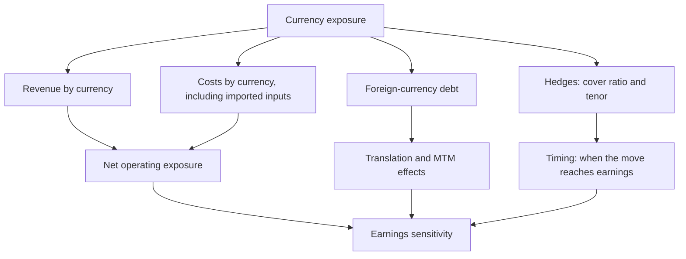

# Currency Exposure and Hedging Disclosures

## The Problem / Why this matters
"The rupee weakened, so exporters benefit" is the level at which currency is usually handled in equity research, and it is wrong often enough to be dangerous. A company's true currency exposure depends on the currency of its revenue, its costs, its debt and its competitors' costs — and on a hedging policy disclosed in the notes that most analysts never read. Companies with apparently identical export exposure can have opposite sensitivities once the full picture is assembled.

## Core Idea
Build the exposure **net and by currency**, across revenue, costs, debt and hedges — then translate a currency move into an earnings effect with a stated lag, rather than asserting a direction.

## Why it works this way
Currency affects a company at several points simultaneously, and the effects partly offset. An exporter with dollar revenue and dollar-linked raw material costs has a much smaller net exposure than its revenue suggests. One with dollar revenue and dollar debt has a translation effect on the balance sheet working against the operating benefit.

## Full technical content

### Building the exposure map

**Step 1 — Revenue by currency.** Not by geography. A company selling to the Middle East may invoice in dollars, and a company selling domestically may price against an import-parity benchmark that moves with the currency. **Import-parity pricing is the exposure most often missed**: a domestic producer competing against imports has currency exposure without a single foreign-currency invoice.

**Step 2 — Costs by currency.** Imported raw materials, imported components, foreign-currency royalties, overseas employee costs. Also the indirect exposure where a domestic input is priced off a global benchmark — most commodities are.

**Step 3 — Net operating exposure.** Revenue in a currency minus costs in that currency. This is the figure that matters, and it is frequently a fraction of gross revenue exposure.

**Step 4 — Balance sheet exposure.** Foreign-currency borrowings, receivables and payables. Movements produce translation gains and losses that hit reported earnings and can swamp the operating effect in a single quarter.

**Step 5 — Hedges.** From the derivatives note: notional outstanding, tenor, and the proportion of expected exposure covered.

**Step 6 — Competitive exposure.** The subtlest and most important for exporters: if your competitors are in another country whose currency has moved differently, your relative cost position has changed regardless of your own currency's move against the dollar. **Cross-rates matter, not just the rupee-dollar rate.**

### Reading the hedging disclosure

Companies disclose forward and option contracts outstanding, along with unhedged exposure. What to extract:

| Item | Analytical use |
|---|---|
| **Cover ratio** — hedged as a proportion of expected exposure | How much of a move reaches earnings and how soon |
| **Tenor** — how far forward hedges extend | Determines the lag before spot rates affect realisations |
| **Average hedge rate** versus spot | Whether the company is realising better or worse than spot today |
| **Hedge accounting designation** | Determines whether MTM moves hit the P&L or reserves |
| **Instrument type** | Forwards give certainty; options preserve upside at a premium; exotic structures are a risk in themselves |

**The lag is the practical point.** A company hedged twelve months forward at an average rate set a year ago does not benefit from today's depreciation for a year. Analysts who model an immediate benefit on a currency move consistently mistime the earnings effect — and clients notice, because the quarter comes and goes without the expected improvement.

**A caution on exotic structures.** Companies that use structured currency products rather than plain forwards have, in past episodes, taken losses far exceeding their underlying exposure. Where the derivatives note shows anything beyond simple forwards and vanilla options, read it carefully and ask about it.

### Translating a move into earnings

The disciplined method:

1. **State the exposure** — net operating exposure by currency, in absolute terms.
2. **Apply the cover ratio** to determine the unhedged portion exposed to spot.
3. **Apply the move** to the unhedged portion for the relevant period.
4. **Add the balance-sheet translation effect** separately, flagging it as non-operating and typically non-recurring.
5. **State the lag** explicitly, based on the hedge tenor.
6. **Present as a sensitivity** — "every ₹1 move in USD/INR changes FY27 EPS by approximately X%" — which is what clients actually want and can apply to their own currency view.

That sensitivity statement is the single most useful output, because it lets a reader with a different currency view adjust your numbers without rebuilding your model.

### Sector patterns

| Sector | Typical exposure |
|---|---|
| **IT services** | Large dollar revenue, mostly rupee costs — high net exposure; but cross-currency (EUR, GBP, AUD) matters and is often ignored |
| **Pharma (formulations exporters)** | Dollar revenue, partly imported inputs; emerging-market exposure adds cross-currency risk |
| **Auto components** | Both exporters and importers; net position varies enormously by company |
| **Oil marketing and refiners** | Import-parity pricing throughout; large currency and commodity exposure combined |
| **Metals** | Global pricing means domestic realisations move with the currency even for domestic sales |
| **Capital goods** | Imported components against domestic revenue — negatively exposed to depreciation |
| **Airlines** | Fuel and lease payments in dollars, revenue largely in rupees — strongly negatively exposed |
| **Companies with foreign-currency debt** | Translation losses on depreciation, regardless of operating exposure |

**Airlines and capital goods are the useful counterexamples** to the "depreciation is good for India Inc" generalisation, and mentioning them signals that the exposure has actually been built rather than assumed.

### Common analytical errors

- **Confusing geography with currency.** Revenue from a region is not necessarily in that region's currency.
- **Ignoring import-parity pricing** for domestically sold, globally priced products.
- **Using gross rather than net** exposure.
- **Ignoring cross-currency moves** — an IT company with meaningful European revenue is exposed to EUR/USD as well as USD/INR.
- **Mixing translation and operating effects**, which have completely different persistence.
- **Assuming the current hedge rate persists** when hedges roll at prevailing rates.
- **Modelling an immediate effect** when hedges create a multi-quarter lag.

### The portfolio and macro layer

- **Index-level currency exposure** is the net of exporters and importers, and is smaller than commentary implies.
- **Foreign investors' returns** include the currency move, so sustained depreciation reduces dollar returns and can drive selling — a mechanical flow effect, as the flow chapter describes.
- **The reflexive loop:** FPI selling pressures the rupee, which reduces dollar returns, which prompts more selling.
- **Do not build a thesis on a currency forecast.** Currency forecasting has a poor record, and where a view depends on it, present scenarios rather than a point estimate — the same discipline as commodity prices.

## Common mistakes
- Asserting a direction from **geography** rather than building the exposure by currency.
- Missing **import-parity pricing** exposure in domestic sales.
- Using **gross revenue** exposure instead of net.
- Ignoring **cross-currency** exposure beyond USD/INR.
- Not reading the **hedging disclosure**, so the cover ratio and tenor are unknown.
- Modelling an **immediate** earnings effect despite a hedge lag.
- Conflating **translation** gains/losses with operating impact.
- Overlooking **exotic derivative structures** in the notes.
- Building a thesis on a currency forecast.

## Interview angle
"The rupee has depreciated 6%. Which of your stocks benefit?" Resist the reflexive exporter answer and describe how you would build it: revenue by currency rather than by geography, since invoicing currency and selling region differ; costs by currency including imported inputs and anything priced off a global benchmark; the net of those two, which is usually far smaller than gross revenue exposure; foreign-currency debt, which produces translation effects that can swamp the operating benefit in a quarter; and the hedging disclosure, which gives the cover ratio and tenor. Make the timing point that most answers miss — a company hedged twelve months forward does not see today's spot rate in its realisations for a year, so modelling an immediate benefit mistimes the effect. Give counterexamples to show the exposure was built rather than assumed: airlines pay fuel and leases in dollars against rupee revenue, and capital goods companies importing components against domestic sales are hurt by depreciation. Finish by offering the output a client actually uses — an EPS sensitivity per rupee of currency move, so they can apply their own view.
