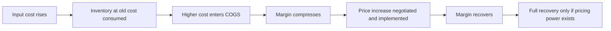

# Input Costs, Pass-Through and Pricing Power

## The Problem / Why this matters
When a key raw material moves 30%, the analyst's task is to determine what happens to margins — and the answer depends almost entirely on how much of the move the company can pass to customers, and how quickly. Pass-through is the mechanism through which commodity cycles reach equity earnings, and it is the clearest observable evidence of pricing power, which is otherwise a qualitative assertion. Getting the lag right is frequently the difference between a correct and an incorrect quarterly forecast.

## Core Idea
**Pass-through ability and pass-through speed are separate questions**, and both are measurable from history. A company that eventually recovers cost inflation but takes three quarters to do so will show a margin trough that is entirely predictable — and is frequently mistaken for structural deterioration.

## Why it works this way
Prices to customers are set by contracts, competitive dynamics and negotiation cycles, none of which move at the speed of a commodity price. The mismatch between input costs repricing continuously and output prices repricing periodically creates a margin cycle that has nothing to do with the company's competitive position.

## Full technical content

### Measuring pass-through from history

The most reliable method, and it requires only public data:

1. **Identify the key input** and a public price series for it.
2. **Plot gross margin against the input price** over several years, ideally through at least one full cycle in both directions.
3. **Measure the lag** — how many quarters between the input move and the margin trough, and between the trough and recovery.
4. **Measure the completeness** — does gross margin return to the prior level, or settle lower? Incomplete recovery indicates limited pricing power.
5. **Check asymmetry** — many companies pass increases through slowly and retain the benefit of decreases for longer, which is itself evidence of pricing power and is visible in the data.

**The output is a rule you can apply forward**: "a 10% move in this input compresses gross margin by approximately 180bp over two quarters, with full recovery by the fourth quarter." That statement is worth more than any qualitative discussion of pricing power, and few analysts do the work to produce it.

### The determinants of pass-through ability

| Factor | Effect on pass-through |
|---|---|
| **Brand strength** | Strong brands can raise prices with limited volume loss |
| **Industry structure** | Consolidated industries pass through more easily; fragmented ones compete margin away |
| **Contract structure** | Formula-linked contracts pass through automatically; fixed-price contracts do not until renewal |
| **Customer concentration** | A few large customers negotiate harder |
| **Input share of cost** | A large input share makes increases visible and easier to justify to customers |
| **Product criticality** | A critical, low-cost component in a customer's product passes through easily |
| **Import competition** | Imports at unchanged prices cap domestic price increases |
| **Regulatory pricing** | Where prices are administered, pass-through depends on regulatory action and timing |

### The mechanics that create the lag

- **Inventory accounting.** Higher-cost material enters COGS only as inventory turns, so a company with 90 days of inventory sees the cost increase a quarter later than the spot move. **Inventory days determine the lag mechanically**, and are disclosed.
- **Contract renewal cycles.** Annual contracts mean a full year before repricing; quarterly contracts mean a quarter.
- **Price increase implementation** takes time to negotiate, announce and reach the shelf or the invoice.
- **Trade inventory.** Where distributors hold stock at old prices, the increase reaches the consumer with a further delay — and distributors buy ahead of an announced increase, producing a temporary volume surge that reverses.

**That last effect is a classic misreading:** a volume spike ahead of a price increase is channel filling, and the subsequent quarter's weakness is its reversal, not a demand problem.

### Reading the evidence in disclosures

- **Gross margin trend against the input price series** — the primary evidence.
- **Realisation per unit**, where disclosed, shows whether prices actually rose.
- **Volume growth alongside price increases** — the crucial test. Raising prices while holding volume demonstrates pricing power; raising prices and losing volume demonstrates the opposite, and reporting only value growth conceals which happened. **Insist on the volume-versus-value split**, as the consumer chapter does.
- **Management commentary on price increases taken** — quantified statements are checkable later.
- **Competitor behaviour.** If competitors did not follow a price increase, it will be rolled back.

### The margin cycle and its misreading

The predictable sequence in a rising-cost environment:

1. **Costs rise**; margins hold initially on cheap inventory.
2. **Margins compress** as higher-cost inventory flows through — this is the phase where analysts downgrade.
3. **Price increases implemented**; margins begin recovering.
4. **Full recovery** if pricing power exists; partial if not.

**The analytical opportunity is in phase 2**, when reported margins look worst and the recovery is mechanically likely for a company with demonstrated pass-through. Conversely, the trap is assuming recovery for a company whose history shows incomplete pass-through.

**The reverse cycle matters too:** when input costs fall, margins expand temporarily before competition forces prices down. **Extrapolating peak margins achieved during a falling-cost period is one of the most common valuation errors**, and it connects directly to the cyclical-earnings trap that recurs throughout these chapters.

### Distinguishing pricing power from price increases

An important distinction that interviews probe:
- **Raising prices in an inflationary environment where everyone does** is not pricing power; it is passing through industry-wide cost inflation.
- **Pricing power is the ability to raise real prices** — above input cost inflation — without losing volume, sustained over time.
- The test: **gross margin expanding over a multi-year period**, not merely holding, alongside stable or growing volumes.

Companies that genuinely have this are rare and command premium multiples for good reason.

### Hedging inputs

Some companies hedge input costs, which changes the timing exactly as currency hedges do:
- **Check the hedging disclosure** for commodity contracts, cover ratio and tenor.
- **Hedged companies show a lagged response** to input moves, in both directions.
- **A hedge is not a competitive advantage** — it is a timing choice, and a company hedged at high prices while competitors buy at spot is disadvantaged.
- **Model the hedge roll**: benefits or costs from favourable hedges expire.

## Common mistakes
- Assuming a cost increase flows to margins **immediately**, ignoring inventory days.
- Treating a margin trough in the pass-through lag as **structural deterioration**.
- Extrapolating **peak margins** earned during a falling-cost period.
- Confusing **passing through inflation** with genuine pricing power.
- Reading a pre-increase **volume spike** as demand strength.
- Accepting value growth without the **volume split**.
- Assuming full pass-through where history shows it is incomplete.
- Treating input **hedging** as a competitive advantage rather than a timing choice.

## Interview angle
"A key raw material is up 30%. What happens to the company's margins?" Answer with the measurement rather than an opinion: plot gross margin against the input price series over past cycles to establish two separate things — whether the company recovers cost inflation at all, and how many quarters it takes. Explain the mechanics behind the lag, principally inventory days, which are disclosed and determine when the higher cost even enters COGS, plus contract renewal cycles and the time to negotiate and implement price increases. Then give the shape: margins hold, then compress as costly inventory flows through, then recover if pricing power exists — so the trough is predictable and is frequently misread as structural deterioration. Add the test that separates real pricing power from passing through industry-wide inflation: gross margin expanding over multiple years alongside stable volumes, not merely holding, which is why the volume-versus-value split matters and why value growth alone conceals the answer. Finish with the reverse-cycle warning — margins earned while input costs were falling are competed away, and valuing a company on those peak margins is a standard error.
