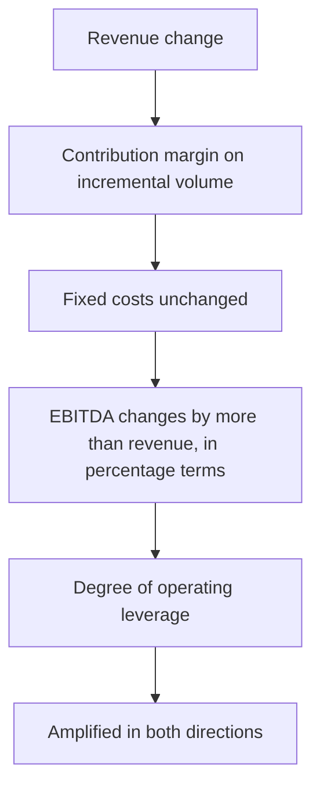

# Capacity Utilisation and Operating Leverage

## The Problem / Why this matters
Operating leverage is why earnings forecasts go wrong by much more than revenue forecasts do. A 5% revenue miss in a high-fixed-cost business can produce a 20% earnings miss, and analysts who model margins as a percentage of revenue rather than building the cost structure will be surprised repeatedly in both directions. Understanding a company's fixed-versus-variable cost split, and where it sits on its capacity curve, is what makes an earnings forecast robust.

## Core Idea
**Model costs as fixed and variable, not as a percentage of revenue.** Margin is an output of the cost structure and the volume, not an input to be assumed — and treating it as an input is the single most common structural weakness in analyst models.

## Why it works this way
Fixed costs do not change with volume, so every incremental unit contributes its full contribution margin to profit. This means profit grows faster than revenue on the way up and falls faster on the way down. The degree of that amplification is a measurable property of the business, not a matter of judgement.

## Full technical content

### Measuring operating leverage

**Degree of operating leverage (DOL) = % change in EBIT ÷ % change in revenue**

Compute it from history across several periods, ideally including both up and down years, since the measured DOL can differ between them where costs are semi-fixed.

**Deriving the cost structure:** regress total operating cost against revenue across several periods. The intercept approximates fixed cost, the slope approximates the variable cost ratio. This is crude but far better than assuming a margin, and it can be refined using the disclosed expense lines — employee cost and depreciation are largely fixed, raw material is largely variable, power and fuel is mixed, other expenses require judgement.

**The contribution margin** — revenue minus variable cost, per unit or as a percentage — is the key number. Once you have it and the fixed-cost base, the whole P&L can be built from a volume forecast:

**EBITDA = (Volume × Contribution per unit) − Fixed costs**

This structure makes the model respond correctly to volume changes automatically, which a percentage-margin assumption never does.

### The break-even analysis

**Break-even volume = Fixed costs ÷ Contribution per unit**

What it tells you:
- **Distance to break-even** is a direct measure of downside risk. A company operating 15% above break-even is far riskier than one operating 60% above it, at the same margin.
- **Break-even utilisation** — the utilisation rate at which the company covers its costs — is the most useful form for capacity-based industries, and is directly comparable across the sector.
- **Cash break-even**, excluding depreciation, is the relevant measure for survival, since a company can operate below accounting break-even for a considerable period if it covers cash costs.

**The distinction between accounting and cash break-even matters in a downturn**, and mixing them produces wrong conclusions about which companies fail.

### Capacity utilisation as a forecasting input

For manufacturing, capacity-constrained services and infrastructure:

- **Current utilisation** sets the ceiling on near-term volume growth without capex. A company at 92% utilisation cannot grow 20% next year regardless of demand, and this is a hard constraint that overrides any growth narrative.
- **The gap to full utilisation** is the cheapest growth available, since incremental volume arrives at contribution margin with no incremental fixed cost. **This is the highest-return growth a company can have**, and companies with substantial idle capacity in a recovering market are structurally attractive.
- **Effective versus nameplate capacity** — nameplate is a design figure, and practical maximum utilisation is lower after maintenance and product-mix constraints. Using nameplate overstates headroom.
- **Utilisation and pricing move together** in commodity industries: as industry utilisation rises past a threshold, pricing power returns sharply. This is why the sector chapters treat industry utilisation as the key variable in cement and similar industries.

### Where operating leverage is highest

| Business type | Character |
|---|---|
| **Cement, steel, paper, chemicals** | Very high fixed cost; enormous leverage in both directions |
| **Hotels, airlines, cinemas** | Perishable inventory and high fixed cost — extreme leverage |
| **Telecom, utilities, infrastructure** | Very high fixed cost, but often regulated or contracted revenue that dampens it |
| **Software and platforms** | Near-zero marginal cost; the highest leverage of all once scale is reached |
| **IT services** | Employee cost is the largest item and is semi-variable — leverage is moderate |
| **Trading and distribution** | Low fixed cost; minimal leverage, and margins are stable through cycles |

### Modelling implications

- **Forecast volume and price separately**, then apply the cost structure. Never forecast revenue and apply a margin.
- **Hold fixed costs fixed** in the forecast, growing them with inflation and step changes rather than with revenue. The commonest modelling error is growing every cost line with revenue, which eliminates operating leverage from the model entirely and guarantees the forecast will miss in both directions.
- **Model step changes.** Fixed costs are fixed within a range and jump when capacity is added or a new facility opens — which is why a capex programme temporarily depresses margins.
- **Build the downside case on volume**, not on margin. The margin outcome should fall out of the volume assumption; assuming a margin in the bear case double-counts or under-counts the leverage.
- **Semi-variable costs** — power, some employee costs, maintenance — need a split rather than an all-or-nothing treatment.

### Operating leverage and valuation

- **High operating leverage justifies a lower multiple** at a given growth rate, because earnings are more volatile and the downside is deeper. Analysts frequently apply peer multiples across companies with very different cost structures, which is a category error.
- **At a cyclical trough**, a high-leverage company's earnings are depressed and its P/E looks high or is undefined — the standard situation where P/E is the wrong tool and EV/replacement value, EV/tonne or price-to-book are more informative.
- **The recovery is non-linear.** From a trough, a modest volume recovery produces a large earnings recovery, which is why high-leverage cyclicals produce the largest returns off the bottom and why identifying the turn matters more than precision about the level.

### Financial leverage on top

Operating and financial leverage compound:

**Combined leverage = Operating leverage × Financial leverage**

A company with high fixed operating costs *and* substantial debt has severely amplified equity earnings. This combination is the most common cause of equity wipeouts in cyclical industries — a modest volume decline becomes a large EBITDA decline becomes a covenant breach. **Always assess the two together**, because either alone can look manageable while the combination is not.

## Common mistakes
- Forecasting revenue and applying an **assumed margin**.
- Growing **every cost line with revenue**, which removes operating leverage from the model.
- Using **nameplate capacity** as the practical ceiling.
- Ignoring the **volume ceiling** at high utilisation when forecasting growth.
- Confusing **accounting and cash break-even** in a downturn.
- Applying **peer multiples** across companies with very different cost structures.
- Using P/E at a cyclical trough for a high-leverage business.
- Assessing operating and financial leverage **separately** rather than combined.
- Missing **step changes** in fixed costs when capacity is added.

## Interview angle
"Revenue comes in 5% below your forecast. What happens to EPS?" The answer is that it depends entirely on the cost structure, and you should be able to say how you would know: derive the fixed-versus-variable split from historical cost behaviour, compute the contribution margin, and then a 5% volume shortfall removes 5% of volume times the contribution margin from EBITDA while fixed costs stay put — which in a high-fixed-cost business like cement or hotels can mean a 20% EBITDA miss, and more at the EPS line if there is debt. Make the modelling point explicitly: this is why costs must be modelled as fixed and variable rather than as a percentage of revenue, since growing every cost line with revenue eliminates operating leverage from the model and guarantees misses in both directions. Add the two extensions that show depth — break-even utilisation as a direct measure of downside risk, distinguishing accounting from cash break-even in a downturn; and the fact that operating and financial leverage compound, which is how a modest volume decline in a levered cyclical becomes a covenant breach.
