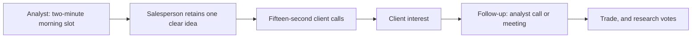

# The Morning Meeting and the Sales Desk

## The Problem / Why this matters
Research reaches clients through the sales desk, and the sales desk decides what to push based on how well an analyst communicates in a two-minute morning meeting slot. An analyst who writes excellent notes but cannot deliver a clear verbal call will find their work under-distributed and their client votes lower than the quality of the work justifies. This is an unglamorous, entirely learnable skill that has a disproportionate effect on a research career.

## Core Idea
The morning meeting is a **distribution mechanism, not a presentation**. The salesperson needs one actionable idea they can repeat accurately to twenty clients in fifteen-second calls — so the output must be compressed to what survives that transmission.

## Why it works this way
A salesperson covers many sectors and speaks to many clients under time pressure. What they can transmit is what they retained, and what they retained is whatever was stated first, most clearly and most concretely. Nuance delivered at length is not transmitted; it is discarded.

## Full technical content

### The structure of a morning-meeting call

Two minutes, in this order:

1. **The call, in one sentence.** "Upgrading X to Buy, target ₹840, 27% upside."
2. **Why now.** The reason this is being said today — a result, a data point, a price move, a change of view.
3. **The differentiated point, in one sentence.** What you know or think that consensus does not, quantified.
4. **The catalyst.** When the market is likely to agree.
5. **The risk.** One sentence, honestly stated.

Everything else — the model, the methodology, the sector context — belongs in the note and in the follow-up call, not here.

**The most common failure is inversion**: building up through context, background and analysis toward a conclusion that arrives at the ninety-second mark, by which time attention has gone. **State the conclusion first.** This is the same discipline as the research note's executive summary, applied verbally and with less room.

### What the sales desk actually needs

- **Actionability.** A view they can act on. "It's interesting" is not distributable.
- **Repeatability.** Something they can say accurately without the note in front of them.
- **A number.** Target price and upside, because clients ask immediately.
- **Differentiation.** Why this is not what the client already heard from three other brokers.
- **Confidence calibration.** Whether this is a high-conviction call or a marginal one — and analysts who signal this honestly are trusted more, because the desk learns which calls to push hard.

**What they do not need:** methodology, model detail, hedged formulations, or a list of considerations without a conclusion.

### The relationship with sales

The desk is an amplifier, and the relationship is worth building deliberately:

- **Be available.** A salesperson with a client on the line who cannot reach the analyst will move on to another idea.
- **Respond fast** during market hours. Speed matters more than polish in a live conversation.
- **Give the desk warning** of upcoming changes where compliance permits, so they can prepare — never the substance of an unpublished rating change to be acted on, which is a compliance breach, but the fact that a review is underway.
- **Explain what went wrong** when a call fails. Salespeople have to face clients who acted on it, and an analyst who goes quiet in a bad period damages the relationship permanently.
- **Learn what each salesperson's clients care about** — some cover long-only funds, others hedge funds with completely different needs on shorts, catalysts and timing.

### Different audiences, different emphasis

| Audience | What they want |
|---|---|
| **Long-only domestic funds** | Fundamental thesis, 1–3 year horizon, position-size feasibility |
| **Hedge funds** | Catalysts, timing, both sides of the trade, borrow availability |
| **Foreign investors** | Country and sector context, currency, liquidity, governance |
| **Retail-facing distribution** | Simplicity, clear risk statements, and no assumed jargon |
| **Internal trading desk** | Short-horizon relevance, flow and positioning |

**The same analysis, differently emphasised.** This is not spin — the underlying view must be identical for every audience, and a view that changes with the listener is a serious problem. What varies legitimately is which parts of the same analysis are foregrounded.

### The follow-up conversation

When a client engages, the format changes completely:

- **Answer the question asked**, not the one you prepared for.
- **Know your numbers cold.** Being unable to state the target's underlying assumptions in a live call is the fastest way to lose credibility.
- **Say "I don't know" when you do not**, and follow up with the answer. Fabrication in a client call is discovered and remembered.
- **Ask what they hold and what they think.** The client's positioning shapes what is useful to them, and their view is information — buy-side clients often know things you do not, and a research relationship that only runs one way is under-exploiting the access.
- **Take the pushback seriously.** A client arguing the other side is doing free work on your thesis, and the strongest objections should end up in the risk section.

### Written distribution alongside the verbal

- **The first line of the email is what most people read.** Treat it as the entire message.
- **Subject lines should carry the call** — "Upgrade to Buy, TP ₹840" rather than "Company X: Q3 update."
- **Length is inversely related to readership**, and a short note that is read beats a long one that is not.
- **Consistency between verbal and written** is a compliance matter as well as a credibility one; the published note is the record.

### Compliance boundaries

Worth stating explicitly, since this is where the commercial and regulatory pressures meet:
- **Do not preview a rating change** to sales or any client before publication. Selective disclosure of a forthcoming recommendation is a serious breach.
- **Do not shade the verbal view** away from the published one to please a large holder. The note is the record, and a divergence between what is said and what is published is indefensible.
- **Restricted-list constraints** apply to verbal communication exactly as they do to written.
- **Keep the record** of what was said in client calls where required by the firm's policy.

## Common mistakes
- **Building up to the conclusion** instead of leading with it.
- Delivering **methodology** in a two-minute slot.
- Hedged formulations that leave the desk with nothing to say.
- Failing to signal **conviction level**, so the desk cannot prioritise.
- Being **unavailable** during market hours.
- Going quiet when a call is going badly.
- Giving different **substantive views** to different audiences.
- Previewing an unpublished rating change to sales or clients.
- Long emails whose first line does not contain the call.

## Interview angle
"Pitch me your best idea in ninety seconds." The structure is the test: name the stock, the rating, the target and the upside in the first sentence; say why now; state in one quantified sentence what you believe that consensus does not; give the dated catalyst that will force the market to agree; and state one honest risk. Then stop. If asked about morning meetings specifically, explain that it is a distribution mechanism rather than a presentation — the salesperson needs one idea they can repeat accurately to twenty clients in fifteen-second calls, so anything not repeatable is discarded, and building up to a conclusion that arrives at ninety seconds means nothing gets transmitted. Add the detail that shows you understand the relationship: signalling conviction level honestly, so the desk knows which calls to push hard, is what makes them trust the ones you do push — and being available during market hours, and explaining yourself when a call goes wrong, matters more to that relationship than the quality of any single note.
