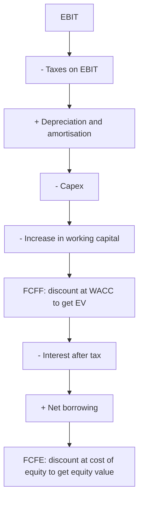

# Free Cash Flow — Definitions and Reconciliation

## The Problem / Why this matters
"Free cash flow" is used to mean at least four different things, and comparisons between companies, between analysts, and between a company's presentation and a research model are frequently comparing different quantities. Because FCF is the input to a DCF and the basis of yield-based valuation, a definitional inconsistency propagates directly into the fair value. The fix is mechanical — define it, reconcile it, and use the same definition everywhere — but it requires knowing that the ambiguity exists.

## Core Idea
Free cash flow to the **firm** and free cash flow to **equity** are different quantities discounted at different rates, and mixing them is a serious valuation error. Beyond that, every "adjusted" FCF presented by a company should be reconciled to reported cash flow before use.

## Why it works this way
FCFF is the cash available to all capital providers and must be discounted at WACC to give enterprise value. FCFE is what remains for shareholders after debt service and must be discounted at the cost of equity to give equity value directly. Discounting FCFE at WACC, or FCFF at the cost of equity, produces a number that means nothing.

## Full technical content

### The definitions

**Free cash flow to the firm (FCFF):**
FCFF = EBIT × (1 − tax rate) + D&A − Capex − Δ Working capital

Cash available to all providers of capital, before financing. Discount at WACC → enterprise value → subtract net debt → equity value.

**Free cash flow to equity (FCFE):**
FCFE = FCFF − Interest × (1 − tax rate) + Net borrowing

Cash available to shareholders after debt service and net new borrowing. Discount at cost of equity → equity value directly.

**Simple / operating free cash flow:**
CFO − Capex, taken straight from the cash flow statement. Convenient, widely used, and adequate for many purposes — but note that CFO is already after interest paid under most presentations, which makes it closer to an equity measure than to FCFF. **Do not treat CFO − Capex as FCFF and discount it at WACC.**

**Levered / unlevered:** "unlevered free cash flow" generally means FCFF; "levered" generally means FCFE. Terminology varies by firm, which is exactly why the definition should be stated in the note rather than assumed.

### The reconciliation discipline

Before using any FCF figure:

1. **Start from reported CFO** in the cash flow statement.
2. **Identify what is included** — interest paid, interest received, dividends received, tax paid, and the classification of each, which varies.
3. **Deduct capex**, distinguishing maintenance from growth where possible.
4. **State the definition used**, explicitly, in the note.
5. **Reconcile to any company-presented figure** and explain every difference.

**Company-presented "adjusted free cash flow" almost always excludes something.** Common exclusions: acquisition-related outflows, restructuring costs, lease payments, and "one-off" working-capital movements that recur annually. Each exclusion should be examined and, in most cases, reversed.

### The maintenance-versus-growth capex problem

The most judgement-dependent input, and it matters because valuing a company on FCF after growth capex undervalues a business that is investing profitably.

- **Companies rarely disclose the split**, so it must be estimated.
- **A common approximation** is that maintenance capex approximates depreciation — reasonable for a stable business, poor for one growing quickly or with an old asset base in an inflationary environment, where replacement cost exceeds historical depreciation.
- **Better where possible:** use the company's own project disclosures to identify expansion capex, and treat the residual as maintenance.
- **A cross-check:** in a business with flat volumes, total capex approximates maintenance capex.

**Be explicit about the assumption**, because the choice can change the valuation substantially and a reader deserves to be able to substitute their own.

### Working capital treatment

- **Use the change in operating working capital**, excluding cash and debt.
- **Seasonality distorts single-period figures** — as the seasonality chapter notes, year-end balances may not represent the average, so use annual changes and be alert to year-end window dressing.
- **Growth consumes working capital**, so a fast-growing company legitimately shows weak FCF. The question is whether the working-capital intensity is stable or deteriorating: rising working capital *days* is a warning; rising working capital *rupees* on stable days is just growth.
- **For lenders and financial companies, standard FCF is not meaningful.** Loan growth consumes cash by construction, which is why the financial-sector chapters use dividend discount and residual income approaches instead.

### Where FCF beats earnings, and where it does not

**FCF is more informative when:**
- Accounting judgement is heavy — long-cycle revenue recognition, capitalisation decisions, provisioning.
- Working capital is changing materially.
- Assessing the ability to service debt or fund distributions.
- Comparing companies with different accounting policies.

**Earnings are more useful when:**
- Capex is lumpy, so single-year FCF is meaningless — a company building a plant shows negative FCF in a good year.
- The business is early in its growth phase, where negative FCF is expected and correct.
- Comparing across periods where working-capital timing dominates.

**The resolution: use multi-year cumulative FCF.** Cumulative FCF over five years smooths capex lumpiness and working-capital timing, and comparing it to cumulative net income over the same period is the integrity check that recurs throughout these chapters — the single most efficient forensic test available.

### FCF-based valuation

- **FCF yield** (FCF ÷ market cap) is a useful cross-check on multiples, and is more robust than earnings yield for companies with heavy non-cash charges.
- **Compare FCF yield to the cost of equity** — a company yielding above its cost of equity with stable cash flows is fundamentally attractive, and the comparison is more meaningful than a raw yield figure.
- **Be careful at cyclical peaks**, where FCF yield looks high precisely when capex is about to rise or earnings are about to fall — the same trap as peak-cycle P/E.
- **Terminal value** in a DCF should be built on a normalised FCF where capex equals a sustainable maintenance level, not on a year with unusually low or high investment. **Terminal capex below depreciation implies a shrinking asset base and is a common, indefensible assumption.**

## Common mistakes
- **Discounting FCFE at WACC** or FCFF at the cost of equity.
- Treating **CFO − Capex as FCFF**, when CFO is typically after interest.
- Accepting a company's **"adjusted FCF"** without reconciling to reported cash flow.
- Assuming **maintenance capex equals depreciation** for a fast-growing or old-asset-base business without saying so.
- Judging FCF on a **single year** when capex is lumpy.
- Applying standard FCF analysis to **lenders**.
- Confusing rising working-capital **rupees** with rising working-capital **days**.
- Setting **terminal capex below depreciation**.
- Reading a high FCF yield at a cyclical peak as cheapness.

## Interview angle
"How do you define free cash flow?" Ask which one, and then show you know why it matters: FCFF is EBIT after tax plus D&A less capex and the working-capital change, it is cash available to all capital providers, and it must be discounted at WACC to give enterprise value; FCFE subtracts after-tax interest and adds net borrowing, is discounted at the cost of equity, and gives equity value directly — and mixing the two is a valuation error that invalidates the whole exercise. Add the practical trap that CFO minus capex, the version most commonly used, is already after interest paid under typical presentations, so it is closer to an equity measure and should not be discounted at WACC. Then cover the judgement: the maintenance-versus-growth capex split is rarely disclosed, approximating maintenance with depreciation is reasonable for a stable business and poor for a fast-growing one or one with old assets in an inflationary environment, and whichever you assume should be stated so a reader can substitute their own. Finish with the check you actually run — cumulative FCF against cumulative net income over five years, which smooths capex lumpiness and is the most efficient integrity test available.
