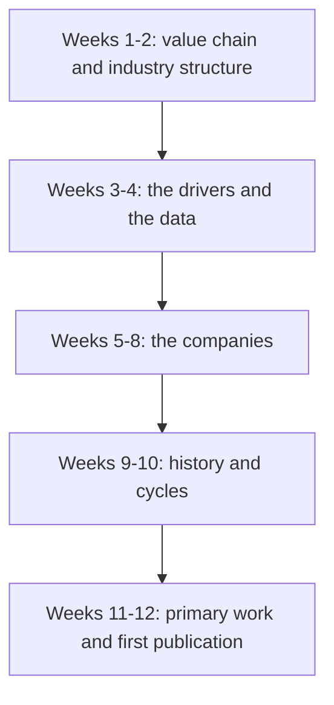

# The First Ninety Days on a New Sector

## The Problem / Why this matters
Analysts change sectors — on promotion, on a colleague's departure, or on joining a new firm — and are expected to publish credibly within a few months. The instinct is to start reading annual reports of the largest company and work down, which produces a great deal of detail and no framework. There is a better order, and knowing it is directly useful both in the job and as an answer to the interview question about how you would approach an unfamiliar sector.

## Core Idea
Learn the **industry structure and the value chain before any individual company**, because company analysis without structural context produces description rather than judgement.

## Why it works this way
A company's returns are largely determined by the industry it operates in and its position within it. Reading a company's financials without knowing whether the industry earns above its cost of capital, who holds the pricing power along the chain, and how supply responds to demand, means the numbers cannot be interpreted — only reported.

## Full technical content

### Weeks 1–2: the value chain

Map the industry from raw input to end customer:
- **Who are the participants** at each stage, and how concentrated is each?
- **Where does the margin sit** along the chain, and why? This is the single most important structural question — margin accrues where the scarcity is.
- **Who holds pricing power** over whom?
- **What are the barriers** at each stage — capital, regulation, brand, distribution, technology?
- **Where does India sit** in the global version of this chain?

**Best sources for this stage:** industry association reports, rating agency sector reports (which are free, analytical and unusually good for structure), the sector sections of the largest companies' annual reports, and — most efficiently — the initiation notes of competing analysts, which typically open with exactly this material.

### Weeks 3–4: the drivers and the data

- **What determines demand?** Population, income, penetration, replacement cycles, government spending, exports.
- **What determines supply?** Capacity additions, lead times, import competition, regulatory approvals.
- **What are the two or three variables** that actually move earnings? Every sector has a small number — spreads for lenders, utilisation and realisation for cement, billing rates and utilisation for IT services, ASP and volume for autos.
- **Where is the data published?** Industry bodies, government statistics, exchange filings, port and customs data, regulatory disclosures. **Build the data-tracking routine now**, because it compounds for years.
- **What is the sector-specific vocabulary?** Learning it is a prerequisite for credible management conversations, and misusing a term marks you as new immediately.

### Weeks 5–8: the companies

Now, with the structure understood:
- **Build a comparison table** across the sector on operating metrics, not just financials — capacity, utilisation, market share, realisation, cost position.
- **Read the largest three companies' annual reports** in full, including the notes.
- **Read three to five years of transcripts** for each major company. **This is the highest-yield activity in the entire process:** it gives management's own framing, what they were asked, what they promised, and — comparing across years — what they delivered.
- **Identify the differences** between companies: why does one earn a higher RoCE? Integration, scale, mix, geography, cost position?
- **Build a first model** for the largest company, and reuse its structure for the others.

### Weeks 9–10: history and cycles

- **How has this sector performed over the last two decades?** Where were the cycles, what caused them, how long did they last?
- **What has the valuation range been**, and what drove multiples to their highs and lows? This is where the sector chapter's insistence on comparing multiples to their own history becomes usable.
- **What went wrong historically** — which companies failed, and why? Failure analysis is more instructive than success analysis, and it is neglected.
- **What has changed structurally** since the last cycle, so that the history is a partial guide rather than a template?

**Talk to the previous analyst** if possible, and to experienced investors in the sector. A one-hour conversation with someone who has watched two cycles is worth weeks of reading, and the main obstacle is reluctance to ask.

### Weeks 11–12: primary work and publication

- **Meet managements** across the sector, not only the largest companies — the smaller ones often speak more freely about industry conditions.
- **Channel checks** — distributors, suppliers, customers — within the compliance boundaries.
- **Site visits** where feasible, which are disproportionately informative early on.
- **Publish a sector primer first**, before stock calls. It establishes credibility, forces the structure to be articulated, and is the piece most read by clients when a new analyst appears.
- **Then initiate on stocks**, with the sector framework already public and referenceable.

### What to avoid in the first months

- **Publishing a stock call before understanding the sector.** The most common and most damaging early mistake.
- **Accepting the previous analyst's framework wholesale.** Read their work, but rebuild the conclusions — inheriting a view without rebuilding it means inheriting its errors without knowing they are there.
- **Over-relying on management.** Early on, managements are the easiest source and the most self-interested one. Balance with competitors, customers and suppliers from the start.
- **Assuming the consensus framework is correct.** Sector orthodoxies persist long after they stop describing reality, and a new analyst has a brief window of genuinely fresh eyes. **Write down what seems odd in the first month**, before the sector's conventions become invisible — those notes are frequently where the differentiated calls come from a year later.

That last point is the most valuable and most perishable advantage a new analyst has, and almost nobody exploits it deliberately.

### The ongoing routine, established early

- **Daily:** sector news, price moves, relevant commodity and macro data.
- **Weekly:** industry data releases; update the tracking sheet.
- **Monthly:** volume and production data; competitor commentary.
- **Quarterly:** results, transcripts, model updates, thesis review against falsification conditions.
- **Annually:** annual reports in full, sector outlook, and a review of the previous year's calls.

### Transferring frameworks between sectors

An underrated advantage of having covered several sectors:
- **Structural analogies** — a consolidating industry behaves similarly regardless of what it makes.
- **Accounting patterns** — percentage-of-completion issues look the same in EPC, real estate and capital goods.
- **Cycle shapes** — capacity-cycle industries share a common pattern of high returns attracting supply that destroys them.
- **Forensic checks** are entirely portable.

The generalising habits from the synthesis chapter — decompose, check cash against profit, benchmark correctly, establish what the market believes, state what would prove you wrong — are what make an analyst effective in an unfamiliar sector quickly. **The frameworks are sector-specific; the habits are not.**

## Common mistakes
- Starting with **company financials** before industry structure.
- Publishing a **stock call** before a sector framework exists.
- Inheriting the previous analyst's **conclusions** without rebuilding them.
- Relying primarily on **management** as a source in the early months.
- Not reading **multiple years of transcripts**, the highest-yield available activity.
- Failing to record **what seems odd** before sector conventions become invisible.
- Skipping the **failure history** of the sector.
- Not establishing the **data-tracking routine** early, when it compounds most.

## Interview angle
"You're given a sector you've never covered. What do you do in the first month?" Give the order, and justify it: value chain and industry structure first — who the participants are at each stage, where the margin sits along the chain and why, what the barriers are — because company financials cannot be interpreted without knowing whether the industry earns above its cost of capital and who holds the pricing power. Then the demand and supply drivers and the two or three variables that actually move earnings in this sector, plus where the data is published, since building that tracking routine early compounds. Only then the companies, where reading three to five years of transcripts is the highest-yield activity available because it shows what management promised and what they delivered. Add the two things experienced analysts say and beginners miss: talk to someone who has watched two cycles in the sector, which is worth weeks of reading; and write down everything that seems odd in the first month, before the sector's conventions become invisible to you, because that brief window of fresh eyes is where differentiated calls come from a year later.
