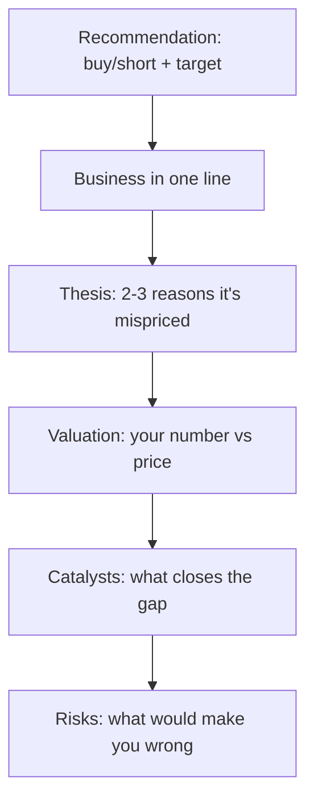

# The Stock Pitch

## The Problem / Why this matters
"Pitch me a stock" is the single most common question in equity research, buy-side, and markets interviews — and often the deciding one. It tests everything at once: whether you understand a business, can value it, have a differentiated view, know the catalysts and risks, and can communicate all of it in two minutes. A strong, structured pitch is a skill you can prepare and deliver on demand.

## Core Idea
A stock pitch is a **concise, structured argument** for a specific action (buy or short) on a specific stock, delivered in a repeatable format: recommendation → business → thesis → valuation → catalysts → risks. It's the verbal version of the research note, compressed for a live conversation.

## Why it works this way
The listener (interviewer or PM) wants to know quickly: *what's the trade, why is it mispriced, what's it worth, what makes it move, and what could go wrong.* Leading with the recommendation and following a clear skeleton signals that you think like an analyst and lets you cover everything without rambling.

## Full technical content

**The pitch skeleton (in order):**
1. **Recommendation** — "I'd buy [X] with a 12-month target of ₹[Y], about [Z]% upside." (Or short.) Lead with it.
2. **Business** — one or two sentences: what the company does and how it makes money.
3. **Thesis** — 2–3 crisp reasons the market is mispricing it (your variant view). This is the core.
4. **Valuation** — your intrinsic value/target and how you got there (DCF and/or a multiple), vs the current price.
5. **Catalysts** — the specific events that will make the market recognize the value, with rough timing.
6. **Risks** — the main risks and what would prove you wrong (and ideally why the risk/reward is still favourable).

**Delivery principles:**
- **Lead with the conclusion**; don't build up to it.
- Be **specific** — real numbers (target, upside, key metric), not vague adjectives.
- Have a **differentiated view** — say how you differ from consensus.
- Keep it **~2 minutes**; then handle follow-up questions.
- Show **balance** — acknowledging risks makes you credible.

**Long vs short pitches.** A **long** pitch argues undervaluation + positive catalysts. A **short** pitch argues overvaluation, deteriorating fundamentals, or a specific negative catalyst (accounting red flags, structural decline) — and must address the asymmetry (shorts have unlimited downside, borrow cost, and squeeze risk).

**Preparation.** Have **2–3 pitches ready** (ideally one long, one short), including at least one you genuinely follow. Know the numbers cold (valuation, key drivers) because the follow-ups probe them. Be ready for: "What's the market missing?", "What would make you wrong?", "What's it worth and why?", "What's the catalyst?"

**Common follow-ups and how to handle them:**
| Follow-up | What they're testing |
|---|---|
| "Why is it mispriced?" | Your variant view / edge |
| "What's your target and how?" | Valuation rigour |
| "What's the catalyst?" | Actionability |
| "What could go wrong?" | Intellectual honesty |
| "Why hasn't the market seen this?" | Depth of edge |

## The written initiation-of-coverage note — full structure
A pitch is the spoken compression of a much longer document: the **initiation of coverage (IoC)** note, typically 15-40 pages, that a sell-side analyst publishes when first taking up formal coverage of a stock. Knowing its structure cold is expected of anyone claiming equity-research experience.
1. **Cover page / summary box** — rating, target price, current price, upside/downside %, market cap, key financial snapshot (revenue, EBITDA margin, EPS, P/E) for the forecast years at a glance.
2. **Investment summary** (1 page) — the thesis compressed to 3-5 bullet points, written to be read standalone by a portfolio manager with 30 seconds.
3. **Business overview** — segments, revenue mix, geographic mix, competitive positioning, moat.
4. **Industry overview** — market size, growth drivers, competitive structure (Porter's Five Forces), regulatory backdrop.
5. **Financial analysis** — historical trend analysis (revenue, margins, returns on capital), quality-of-earnings checks (cash conversion, working-capital trends, one-off items flagged and excluded).
6. **Forecast and assumptions** — the driver-based model's key assumptions stated explicitly and defended (this is where a reader checks whether the analyst's numbers are grounded or arbitrary).
7. **Valuation** — DCF (with WACC/terminal-growth sensitivity table) and relative valuation (peer comp table), reconciled to a target price.
8. **Catalysts and risks** — a dedicated section, not an afterthought; risks should be specific and, where possible, quantified (e.g. "each 1% of rupee appreciation compresses EPS by ~0.6%").
9. **Appendix** — detailed model outputs, historical financial statements, management background, ESG considerations if material.

**Sensitivity table (a near-universal request)**: a DCF target price is never presented as a single number without a sensitivity grid — typically WACC (rows) × terminal growth rate (columns), showing how the target moves across a realistic range of each assumption (e.g. WACC 10.5%-12.5% in 50bp steps, terminal growth 4%-6% in 50bp steps) — this single table is often the first thing a skeptical PM asks to see, since it reveals how much of the "buy" case depends on optimistic assumptions at the edges of the grid versus holding up across the whole range.

## Worked examples

**Example 1 — a two-minute long pitch.** "I'd buy [FMCG co], target ₹1,200, ~20% upside. It's a branded consumer-staples leader with a rural distribution moat. Thesis: the market underrates margin expansion from premiumization — I model 300 bps versus consensus 100 — and volume share gains from distribution the Street isn't crediting; at 22× forward it's below its historical average despite better growth. On a DCF and comps I get ₹1,200 versus ₹1,000 today. Catalysts: the next two quarters of margin beats. Risks: a rural slowdown or raw-material inflation — but at this valuation, I think the risk/reward is favourable." *Every element, two minutes.*

**Example 2 — a short pitch.** "I'd short [X], target 30% downside. It's a lender growing loans 40% a year while under-provisioning; my thesis is that credit costs are being deferred, not avoided — restated for realistic provisions, earnings are ~40% lower than reported. Valuation at 4× book assumes durable high ROE that I think is illusory. Catalyst: rising NPAs over the next two quarters and a likely provisioning reset. Risks: it can stay expensive and squeeze shorts, so I'd size it carefully and use a stop." *Addresses the short's asymmetry.*

**Example 3 — handling "what would make you wrong?"** For the FMCG long: "If the next two quarters show margin *contraction* instead of the expansion I expect — say raw-material inflation the company can't pass through — my core thesis breaks and I'd exit." A crisp falsification point signals a real analyst.

**Example 4 — a banking-sector long pitch.** "I'd buy [private bank], target ₹950, ~18% upside. It's a private-sector bank with a strong deposit franchise — CASA ratio above 45%, well ahead of peers. Thesis: the market is discounting it for near-term NIM compression from deposit re-pricing, but I think that's already 80% priced in at 2.3x book versus a 5-year average of 2.8x, and the market is underrating the credit-cost normalization as legacy stressed-asset provisions roll off over the next four quarters. On a Gordon-growth-based P/B framework (ROE 16%, cost of equity 13%, growth 12% → implied P/B ~2.8x) applied to next year's book value, I get ₹950. Catalysts: NIM bottoming and credit-cost guidance in the next two quarters' results. Risks: a systemic deposit-cost shock if rate cuts don't materialise as expected, and asset-quality slippage in the unsecured retail book — a segment I'm watching closely given sector-wide unsecured-lending stress." *Shows sector-specific valuation framework (P/B via ROE-CoE-growth, not DCF, which is standard for banks given the difficulty of forecasting bank free cash flow directly) and a sector-specific risk (unsecured retail asset quality).*

**Example 5 — a technology-sector short pitch.** "I'd short [mid-cap SaaS co], target 25% downside. It trades at 12x forward revenue on the strength of a headline 130% net-revenue-retention figure, but digging into the cohort disclosures, that NRR is concentrated in a handful of large accounts renewing at expanded contract value, while the broader customer base shows flat-to-declining logo retention — a classic 'blended metric hides a worsening core' pattern. My thesis: as the large-account expansion cycle normalises over the next 2-3 quarters, blended NRR converges toward the weaker underlying logo-retention trend, and the multiple re-rates toward peer SaaS names growing similarly but without this concentration risk (6-8x forward revenue). Catalyst: the next NRR print by customer-cohort-size disclosure (if the company provides it) or a deceleration in the headline number itself. Risks: SaaS multiples can stay elevated on momentum regardless of fundamentals for longer than a short position can be held comfortably, and a single large new logo win could reverse the narrative — sizing and stop-discipline matter more here than in the long book." *Demonstrates disaggregating a headline metric — the specific analytical move interviewers look for in a "find the flaw in this metric" style question.*

## Sector-specific valuation frameworks — a quick reference
Interviewers routinely ask "how would you value a bank / an insurer / a commodity company differently from a normal company" — a DCF built on standard free cash flow to firm breaks down or requires heavy adaptation for several sectors:
- **Banks/NBFCs**: valued primarily on **P/B (price-to-book) linked to ROE**, not DCF — a bank's "free cash flow" is not economically meaningful the way it is for an industrial company, since debt (deposits) is the raw material of the business, not just a financing choice. The Gordon-growth P/B framework (Example 4 above) is the standard tool.
- **Insurance**: **Embedded Value (EV)** and **Value of New Business (VNB) multiples** are sector-specific metrics — EV captures the discounted value of in-force policies plus net worth, and the market typically prices life insurers on P/EV rather than P/E or P/B.
- **Commodity/cyclical companies** (metals, cement, oil & gas): valued through-the-cycle, often on **normalised EV/EBITDA** (using a mid-cycle commodity-price assumption, not the current spot price, to avoid over/under-valuing at cycle extremes) rather than a single-year DCF that's hostage to where the commodity price happens to sit today.
- **Real estate**: **Net Asset Value (NAV)** — summing the discounted value of each project/land parcel individually — is the standard framework, since a blended company-wide DCF obscures project-level economics that actually drive value.
- **Early-stage/pre-profit tech**: revenue multiples (EV/Revenue) or, for genuinely forecastable unit economics, a DCF built on a longer explicit forecast period with explicit path-to-profitability assumptions, always paired with a clear statement of how sensitive the valuation is to the terminal-margin assumption specifically.

## How it is tested in interviews
- **"Pitch me a stock."** — Deliver the skeleton: recommendation + target → business → 2–3 thesis points → valuation → catalysts → risks, in ~2 minutes.
- **"What's the market missing?"** — Your variant view — the single most important thing; have it sharp.
- **"What's it worth and how did you get there?"** — Give a target with a one-line valuation method; know the numbers.
- **"What would make you wrong?"** — A specific falsification point, delivered confidently.
- **"Long or short something you follow"** — Always have real pitches ready, not textbook examples.

## Traps & common mistakes
- **Burying the recommendation** — lead with it.
- No **variant view** — just describing a "good company."
- **Vague** — no target, no numbers.
- Ignoring **risks** — sounds naive; acknowledging them builds credibility.
- Not knowing your own numbers when **probed**.
- For shorts, ignoring **borrow cost, squeeze, and unlimited downside**.

## First-principles recap
- A pitch = recommendation → business → thesis → valuation → catalysts → risks, in ~2 minutes.
- **Lead with the conclusion**; be specific with numbers.
- The thesis is a **variant view** — what the market is missing.
- Name **catalysts** (actionability) and **risks/falsification** (credibility).
- Prepare 2–3 real pitches and know the numbers cold.

## Quick-reference
| Element | One line |
|---|---|
| Recommendation | Buy/short + target + upside |
| Business | What it does, how it earns |
| Thesis | 2–3 reasons it's mispriced (variant view) |
| Valuation | Your number vs price + method |
| Catalysts | What closes the gap + when |
| Risks | Downside + what proves you wrong |
