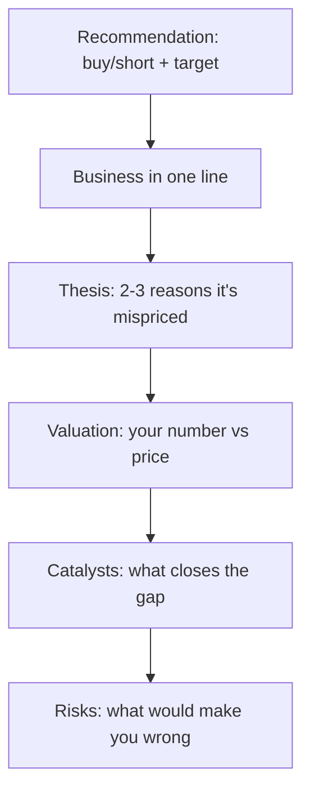

# The Stock Pitch

## The Problem / Why this matters
"Pitch me a stock" is the single most common question in equity research, buy-side, and markets interviews — and often the deciding one. It tests everything at once: whether you understand a business, can value it, have a differentiated view, know the catalysts and risks, and can communicate all of it in two minutes. A strong, structured pitch is a skill you can prepare and deliver on demand.

## Core Idea
A stock pitch is a **concise, structured argument** for a specific action (buy or short) on a specific stock, delivered in a repeatable format: recommendation → business → thesis → valuation → catalysts → risks. It's the verbal version of the research note, compressed for a live conversation.

## Why it works this way
The listener (interviewer or PM) wants to know quickly: *what's the trade, why is it mispriced, what's it worth, what makes it move, and what could go wrong.* Leading with the recommendation and following a clear skeleton signals that you think like an analyst and lets you cover everything without rambling.

## Full technical content

**The pitch skeleton (in order):**
1. **Recommendation** — "I'd buy [X] with a 12-month target of ₹[Y], about [Z]% upside." (Or short.) Lead with it.
2. **Business** — one or two sentences: what the company does and how it makes money.
3. **Thesis** — 2–3 crisp reasons the market is mispricing it (your variant view). This is the core.
4. **Valuation** — your intrinsic value/target and how you got there (DCF and/or a multiple), vs the current price.
5. **Catalysts** — the specific events that will make the market recognize the value, with rough timing.
6. **Risks** — the main risks and what would prove you wrong (and ideally why the risk/reward is still favourable).

**Delivery principles:**
- **Lead with the conclusion**; don't build up to it.
- Be **specific** — real numbers (target, upside, key metric), not vague adjectives.
- Have a **differentiated view** — say how you differ from consensus.
- Keep it **~2 minutes**; then handle follow-up questions.
- Show **balance** — acknowledging risks makes you credible.

**Long vs short pitches.** A **long** pitch argues undervaluation + positive catalysts. A **short** pitch argues overvaluation, deteriorating fundamentals, or a specific negative catalyst (accounting red flags, structural decline) — and must address the asymmetry (shorts have unlimited downside, borrow cost, and squeeze risk).

**Preparation.** Have **2–3 pitches ready** (ideally one long, one short), including at least one you genuinely follow. Know the numbers cold (valuation, key drivers) because the follow-ups probe them. Be ready for: "What's the market missing?", "What would make you wrong?", "What's it worth and why?", "What's the catalyst?"

**Common follow-ups and how to handle them:**
| Follow-up | What they're testing |
|---|---|
| "Why is it mispriced?" | Your variant view / edge |
| "What's your target and how?" | Valuation rigour |
| "What's the catalyst?" | Actionability |
| "What could go wrong?" | Intellectual honesty |
| "Why hasn't the market seen this?" | Depth of edge |

## Worked examples

**Example 1 — a two-minute long pitch.** "I'd buy [FMCG co], target ₹1,200, ~20% upside. It's a branded consumer-staples leader with a rural distribution moat. Thesis: the market underrates margin expansion from premiumization — I model 300 bps versus consensus 100 — and volume share gains from distribution the Street isn't crediting; at 22× forward it's below its historical average despite better growth. On a DCF and comps I get ₹1,200 versus ₹1,000 today. Catalysts: the next two quarters of margin beats. Risks: a rural slowdown or raw-material inflation — but at this valuation, I think the risk/reward is favourable." *Every element, two minutes.*

**Example 2 — a short pitch.** "I'd short [X], target 30% downside. It's a lender growing loans 40% a year while under-provisioning; my thesis is that credit costs are being deferred, not avoided — restated for realistic provisions, earnings are ~40% lower than reported. Valuation at 4× book assumes durable high ROE that I think is illusory. Catalyst: rising NPAs over the next two quarters and a likely provisioning reset. Risks: it can stay expensive and squeeze shorts, so I'd size it carefully and use a stop." *Addresses the short's asymmetry.*

**Example 3 — handling "what would make you wrong?"** For the FMCG long: "If the next two quarters show margin *contraction* instead of the expansion I expect — say raw-material inflation the company can't pass through — my core thesis breaks and I'd exit." A crisp falsification point signals a real analyst.

## How it is tested in interviews
- **"Pitch me a stock."** — Deliver the skeleton: recommendation + target → business → 2–3 thesis points → valuation → catalysts → risks, in ~2 minutes.
- **"What's the market missing?"** — Your variant view — the single most important thing; have it sharp.
- **"What's it worth and how did you get there?"** — Give a target with a one-line valuation method; know the numbers.
- **"What would make you wrong?"** — A specific falsification point, delivered confidently.
- **"Long or short something you follow"** — Always have real pitches ready, not textbook examples.

## Traps & common mistakes
- **Burying the recommendation** — lead with it.
- No **variant view** — just describing a "good company."
- **Vague** — no target, no numbers.
- Ignoring **risks** — sounds naive; acknowledging them builds credibility.
- Not knowing your own numbers when **probed**.
- For shorts, ignoring **borrow cost, squeeze, and unlimited downside**.

## First-principles recap
- A pitch = recommendation → business → thesis → valuation → catalysts → risks, in ~2 minutes.
- **Lead with the conclusion**; be specific with numbers.
- The thesis is a **variant view** — what the market is missing.
- Name **catalysts** (actionability) and **risks/falsification** (credibility).
- Prepare 2–3 real pitches and know the numbers cold.

## Quick-reference
| Element | One line |
|---|---|
| Recommendation | Buy/short + target + upside |
| Business | What it does, how it earns |
| Thesis | 2–3 reasons it's mispriced (variant view) |
| Valuation | Your number vs price + method |
| Catalysts | What closes the gap + when |
| Risks | Downside + what proves you wrong |
