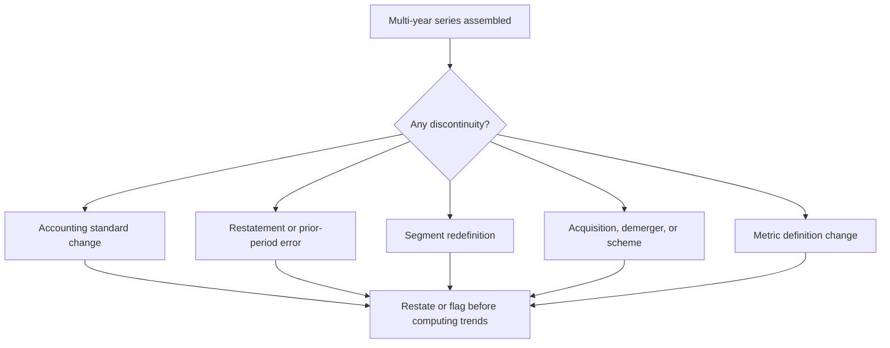

# Restatements, Prior-Period Adjustments and Data Integrity

## The Problem / Why this matters
Analysts build models on historical data and forecasts on historical patterns, and both assume the history is stable and comparable. It frequently is not. Companies restate prior periods, change accounting policies, reclassify segments, redefine operating metrics, and adjust for acquisitions and demergers. Each of these breaks comparability, and a growth rate computed across the break is simply wrong — while looking entirely normal in a spreadsheet.

## Core Idea
Historical data is **not a fixed record**. Before computing any multi-year trend, establish whether the series is comparable across the whole period — and where it is not, either restate it yourself or state the break.

## Why it works this way
Accounting is a system of judgements applied under evolving standards. When a standard changes, an error is found, or a business is reorganised, prior figures are revised or reclassified. The revision is legitimate; the analytical failure is computing rates of change across the discontinuity as though nothing happened.

## Full technical content

### The types of discontinuity

| Type | Typical cause | Effect |
|---|---|---|
| **Accounting standard transition** | Adoption of a new standard on leases, revenue or financial instruments | Changes EBITDA, debt, revenue recognition; prior years may not be restated |
| **Restatement for error** | Discovery of a misstatement | Prior figures revised; the reason is disclosed and is important |
| **Change in accounting policy** | Voluntary change, e.g. depreciation method or inventory valuation | Requires disclosure; retrospective application varies |
| **Segment redefinition** | Reorganisation of reporting segments | Segment histories break; sometimes restated, often not |
| **Business combination** | Acquisition | Consolidated history includes the target only from acquisition date |
| **Demerger** | Scheme of arrangement | Prior consolidated figures include businesses no longer present |
| **Metric redefinition** | Company changes how it computes an operating KPI | Frequently disclosed only in a footnote |
| **Consolidation scope change** | A subsidiary consolidated or deconsolidated | Can be large and easy to miss |

### Where to find them

- **The notes** — significant accounting policies, and any note on changes in policy or restatement.
- **The auditor's report** — an Emphasis of Matter on a restatement, or a KAM relating to a change.
- **Comparative figures marked "restated"** in the financial statements. **This label is a prompt to investigate, not a formality.**
- **The segment note**, which usually states whether prior periods have been restated for a segment change.
- **The management discussion**, which sometimes explains changes not obvious from the statements.
- **Quarterly results filings**, where reclassifications between quarters appear.

### The disciplines

**1. Check for restatement before building the history.** Cheaper than discovering it after the model is built and a conclusion drawn.

**2. Use restated figures consistently.** Mixing originally reported and restated figures across a series is the specific error that produces spurious growth rates.

**3. Rebuild the series where restatement is not provided.** Where a company changes a segment definition without restating, either rebuild the history from disclosed sub-components or start the series at the break and say so.

**4. Read the reason for a restatement.** A restatement for a clerical error is different from one following a regulatory intervention or a change in revenue recognition. **The reason is disclosed and is more informative than the numbers.**

**5. Flag breaks in charts and tables.** A chart spanning a discontinuity without a marker misleads the reader, however accurate the underlying numbers.

**6. Watch the acquisition distortion.** Consolidated growth after an acquisition includes the acquired revenue, which is not organic growth. **Separate organic from inorganic explicitly** — this is among the most common ways growth is overstated, and companies rarely volunteer the split unless asked.

### Data-provider issues

Analysts increasingly work from database extracts rather than filings, which introduces its own failure modes:

- **Standardisation.** Providers map company line items into a common template, and the mapping involves judgement that occasionally misclassifies items — particularly other income, exceptional items and lease-related lines.
- **Restatement handling** varies: some providers overwrite history with restated figures, others retain as-reported. **Know which your source does**, because it determines whether your "historical" figures match what the market saw at the time.
- **Adjusted versus reported earnings.** Consensus figures are often on an adjusted basis with an undefined definition, so comparing your reported-basis forecast to a consensus adjusted figure is not a like-for-like comparison — a frequent cause of spurious "beats" and "misses."
- **Per-share data** must be adjusted for splits, bonuses and rights issues, and providers usually do this but not always correctly for complex cases.
- **Survivorship** in historical universes, which distorts backtests as the factor chapter notes.

**The standing rule: verify anything important against the primary filing.** Database extracts are fine for screening and for building a first picture; they are not adequate for the specific numbers that carry a recommendation.

### Building an auditable model

Practices that make discontinuities visible rather than hidden:

- **Keep a source note** for every historical input — which filing, which page.
- **Maintain an assumptions log** with dates and reasons for each change, which the conviction chapter also requires.
- **Colour-code** inputs, formulas and links, so a reader can see what is assumption and what is derived.
- **Include a comparability row** in the historical block, flagging years affected by a standard change, acquisition or demerger.
- **Reconcile** to the reported statements at least annually — a model that has drifted from the filings is worse than no model.
- **Version the model** at each publication, so the numbers behind a published note can be reproduced. This matters for compliance as well as for post-mortems.

### When a restatement is a red flag

Most restatements are routine. The ones that are not:
- **Restatement following auditor or regulator intervention** rather than voluntary correction.
- **Restatement of revenue**, the most sensitive line.
- **Repeated restatements**, indicating weak financial controls.
- **Restatement accompanied by a CFO departure** — a combination that has preceded serious problems.
- **Restatement that conveniently changes the trend** in a favourable direction.
- **An adverse opinion on internal financial controls** in the same year, which the auditor's report discloses.

**Treat these as governance events**, not accounting technicalities, and reassess the reliability of everything else the company reports.

## Common mistakes
- Computing growth rates **across a discontinuity**.
- Mixing **as-reported and restated** figures in one series.
- Not reading the **reason** for a restatement.
- Presenting consolidated post-acquisition growth as **organic**.
- Comparing a reported-basis forecast to a consensus **adjusted** figure.
- Assuming the **data provider's** standardisation is correct for unusual items.
- Charting across a break without **flagging** it.
- Treating a restatement after regulatory intervention as routine.
- Publishing numbers that cannot be **reproduced** from a versioned model.

## Interview angle
"You notice this year's annual report shows different figures for last year than last year's report did. What do you do?" Treat it as a substantive question rather than a data problem: find the disclosure explaining it — in the notes on accounting policy, in a restatement note, or in the auditor's report — and read the *reason*, because a clerical correction, a change in revenue recognition policy, and a restatement following regulatory intervention have completely different implications. Then fix the analysis: use restated figures consistently across the whole series rather than mixing them with as-reported ones, and flag the break in any chart or table so a reader is not misled. Add the related discipline on comparability generally — separating organic from acquisition-driven growth, since consolidated growth after a deal is routinely presented as if it were organic — and the data-source caution that consensus figures are usually on an undefined adjusted basis, so comparing your reported-basis forecast to them manufactures beats and misses that are not real. Finish with what makes a restatement a red flag rather than routine: regulatory intervention, revenue being the restated line, repetition, or a simultaneous CFO departure.
