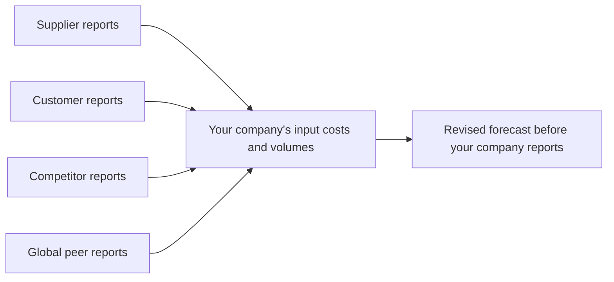

# Read-Across — Forecasting from Other Companies' Results

## The Problem / Why this matters
Results season is sequential. By the time a company you cover reports, its suppliers, customers, competitors and global peers may already have reported — each disclosing information about the same end markets. An analyst who systematically extracts that information forecasts better and earlier than one who waits. Read-across is among the cheapest genuine edges available, requires no special access, and is used far less than it should be because it requires organisation rather than insight.

## Core Idea
Every company's disclosure contains information about **other companies' end markets**. Mapping who reports when, and what each one reveals about whom, converts the results calendar from a sequence of events into a forecasting sequence.

## Why it works this way
Companies share end markets, supply chains and cost inputs. A supplier's volumes are a customer's purchases; a competitor's price commentary describes the market you both sell into; a global peer's demand observation covers the same industry. The information is public and specific — it is simply reported by a different company.

## Full technical content

### The relationships to map

| Relationship | What it reveals |
|---|---|
| **Supplier → customer** | Supplier volume growth indicates customer production; supplier pricing indicates customer input costs |
| **Customer → supplier** | Customer capex or production plans indicate supplier order flow |
| **Direct competitor** | Industry demand, pricing environment, market-share shifts |
| **Global peer** | End-market demand in shared markets; technology and pricing trends |
| **Adjacent category** | Shared consumer or shared distribution channel |
| **Common input** | Companies exposed to the same commodity |

### Building the read-across map

A one-off exercise that pays for years:

1. **For each covered company, list** its major suppliers, customers, competitors and global peers that are publicly listed anywhere.
2. **Record their reporting dates**, including fiscal-year differences — many global peers report on calendar quarters, which frequently means they report *before* Indian companies covering the same period.
3. **Note what each disclosed metric implies** for your company specifically, with the direction and an approximate magnitude.
4. **Build a results-season calendar** ordered by date, so each report is read for what it says about companies yet to report.

**The fiscal-calendar point is the most exploitable:** global peers reporting on a different cycle routinely describe end-market conditions weeks before the Indian company covering the same period reports. That gap is a genuine, legal information advantage available to anyone who reads the filings.

### Worked examples of the logic

- **A global semiconductor company reports weak automotive demand** → read across to Indian auto component exporters and to auto OEMs' production plans.
- **A large cement producer reports a realisation decline in a region** → read across to other producers with capacity in that region, since cement markets are regional as the sector chapter establishes.
- **An FMCG company reports rural volume recovery** → read across to other rural-exposed categories: two-wheelers, tractors, agri inputs, rural-focused lenders.
- **A tyre company reports strong replacement demand** → read across to commercial vehicle usage, freight activity and logistics.
- **A large IT services company reports discretionary spending weakness** → read across to peers, but check whether it is client-mix specific before generalising.
- **A bank reports deterioration in a specific unsecured segment** → read across to NBFCs in the same segment, which is exactly the peer-divergence evidence used in the worked short case.

### The disciplines that make it reliable

**1. Establish the relationship is real before relying on it.** Verify from disclosures that the companies genuinely share the end market — assumed relationships produce confident wrong conclusions.

**2. Check the timing alignment.** Different fiscal quarters cover different periods, and a global peer's "Q3" may cover months that only partly overlap your company's quarter.

**3. Adjust for mix.** A global peer with a different geographic or product mix may be reporting something specific to its own portfolio. **Ask whether the observation is about the market or about that company** — this is the discipline that separates useful read-across from noise.

**4. Distinguish market-level from share-level.** If a competitor reports strong growth, the question is whether the market grew or whether they took share from your company. **These have opposite implications**, and getting it backwards is the most damaging read-across error.

**5. Weight by relevance.** A supplier deriving 40% of revenue from your company is highly informative; one deriving 3% is not.

**6. Look for divergence, not just confirmation.** When several peers report deterioration and one reports improvement, the divergence is the finding. Either that company is genuinely outperforming or its recognition differs — both are testable, and the peer-divergence check is among the strongest forms of evidence in negative research.

### Beyond results — other read-across sources

- **Management commentary at conferences** between results.
- **Global peers' investor days**, which often contain detailed end-market analysis of markets including India.
- **Rating agency sector reports**, which aggregate across issuers including unlisted ones.
- **Trade and industry association data**, which precedes company reporting.
- **Customs, port and freight data**, which leads reported exports.
- **Unlisted peers' filings** — private companies file annual accounts, and competitor financials are frequently obtainable this way. **This is materially under-used and can be the only view of an important unlisted competitor.**

### Turning it into a routine

- **Before results season**, prepare the calendar and the map.
- **After each relevant report**, record the read-across implications for yet-to-report companies in a running note.
- **Update forecasts** where the evidence is strong enough, and publish the revision — a pre-result note revising a forecast on read-across evidence is genuinely differentiated and is noticed by clients.
- **After the results**, check whether the read-across was correct, which calibrates how much weight to give each relationship in future.

That last step is what converts read-across from an intuition into a tested method: over a few seasons you learn which relationships actually predict and which do not.

### Where it fails

- **Assumed relationships** that do not exist in the disclosures.
- **Company-specific factors** mistaken for market-level ones.
- **Lags** — a supplier's order book may lead the customer's revenue by several quarters, so simultaneous read-across is wrong.
- **Inventory in the chain**, which decouples sell-in from sell-out for extended periods and is the single most common reason a read-across fails.
- **Over-extrapolating one data point** into a sector conclusion.

## Common mistakes
- Assuming a supply or customer relationship without **verifying** it from disclosures.
- Reading a competitor's strong growth as **market growth** when it was share gain from your company.
- Ignoring **fiscal calendar** differences when aligning periods.
- Ignoring **inventory in the channel**, which decouples the chain.
- Treating a global peer's **mix-specific** observation as a market signal.
- Weighting all relationships equally regardless of revenue significance.
- Never checking afterwards whether the read-across was **correct**.
- Overlooking **unlisted competitors' filings** as a source.

## Interview angle
"A global peer just reported weak demand. What does that mean for the company you cover?" Show the reasoning chain rather than the conclusion: first verify from disclosures that they genuinely share the end market, then align the periods, since global peers often report on calendar quarters that only partly overlap the Indian fiscal quarter — which is exactly why this is useful, because they frequently describe the same conditions weeks earlier. Then ask the question that determines everything: is the observation about the market or about that company's specific mix, and if a competitor reported strong growth, did the market grow or did they take share from the company I cover, because those have opposite implications. Add the failure mode that catches most people — inventory in the channel decouples sell-in from sell-out for quarters at a time, so a simultaneous read-across is often simply mistimed. Finish with the routine: map suppliers, customers, competitors and global peers to a results calendar before the season, record implications after each report, and check afterwards which relationships actually predicted, which is what turns it from intuition into a calibrated method.
