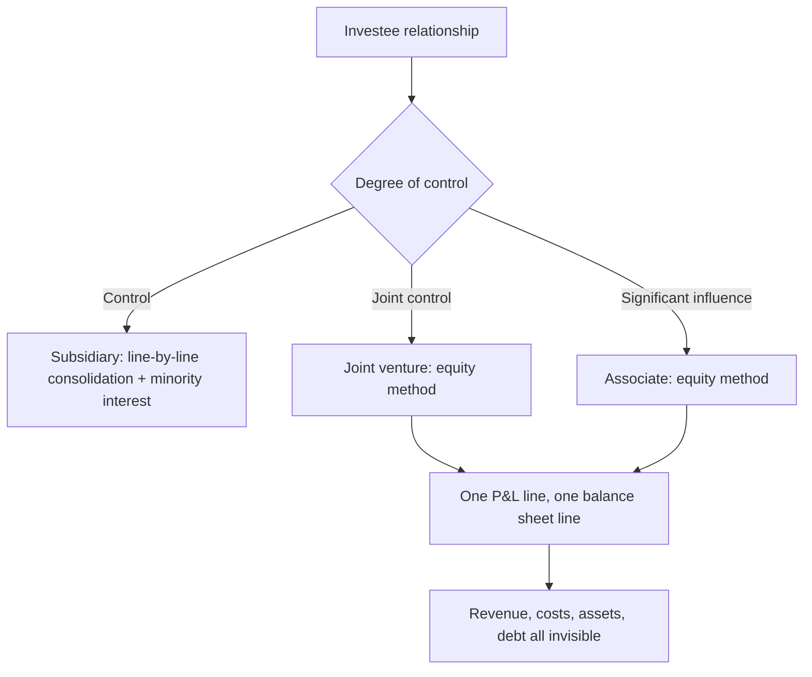

# Joint Ventures, Associates and the Equity Method

## The Problem / Why this matters
A single line in the P&L — "share of profit of associates and joint ventures" — can represent a business as large as the parent's own operations, with its own revenue, debt and risk, none of which appear anywhere in the consolidated financial statements. Analysts computing margins, leverage and returns from the consolidated numbers systematically misstate all three when equity-accounted entities are material. In India, where joint ventures with foreign partners and associate stakes in group companies are common, this is a recurring source of error.

## Core Idea
Equity-accounted entities are **invisible in the consolidated statements except for one profit line and one balance-sheet line** — so every ratio computed from the consolidated numbers excludes their revenue, costs, assets and debt, and must be interpreted accordingly.

## Why it works this way
Consolidation accounting reflects control. A subsidiary is controlled, so it is line-by-line consolidated with a minority interest deduction. An associate or joint venture is influenced but not controlled, so only the parent's share of its net profit and net assets is recognised. That is coherent as accounting and inconvenient as analysis.

## Full technical content

### The three treatments

| Relationship | Accounting | What appears in consolidated statements |
|---|---|---|
| **Subsidiary** (control) | Full consolidation | All revenue, costs, assets, liabilities; minority interest deducted from profit and equity |
| **Joint venture** (joint control) | Equity method | Share of net profit; carrying value of the investment |
| **Associate** (significant influence) | Equity method | Share of net profit; carrying value of the investment |
| **Financial investment** (no influence) | Fair value | Fair value changes through P&L or OCI, plus dividends received |

**The classification is a judgement**, and the boundaries — particularly between significant influence and control — depend on shareholder agreements, board representation and veto rights rather than on shareholding percentage alone. Where a company sits close to a boundary, read the basis of consolidation in the notes.

### What goes wrong analytically

**1. Margins are computed on the wrong base.** The share of associate profit sits below EBITDA and often below EBIT. So:
- **EBITDA margin excludes the JV entirely** while net profit includes its contribution — meaning a company deriving a large share of profit from JVs shows a low EBITDA margin and a high net margin, and neither is comparable to a peer that owns its operations outright.
- **EV/EBITDA is distorted** because the market capitalisation reflects the JV's value while EBITDA does not include it.

**2. Leverage is understated.** Debt inside an associate or JV does not appear in consolidated borrowings. A company can look conservatively financed while its share of JV debt is substantial — and where the parent has guaranteed that debt, the exposure is real, which connects directly to the contingent-liability analysis.

**3. Returns are distorted.** RoCE computed on consolidated capital employed omits the JV's capital while including the profit share — inflating the apparent return.

**4. Cash flow differs from profit.** The share of associate profit is **non-cash** unless the associate pays dividends. A company reporting strong profit growth driven by associate earnings may receive very little of it in cash. **Check dividends received from associates in the cash flow statement against the profit share recognised** — a persistent gap means the earnings are real but unavailable, and this is one of the cleaner quality-of-earnings tests available.

### The adjustments to make

**For comparability, present a proportionate view:**
- Take the JV's or associate's own financials — disclosed in the notes where material, or from its own filings if separately listed or if it files accounts.
- **Add your share of revenue, EBITDA, debt and capital employed** to the consolidated figures.
- Recompute margins, leverage and returns on the proportionate basis.
- **State clearly that you have done this**, since your figures will then differ from screen data and from other analysts'.

**For valuation, value the stake separately:**
- Treat the associate or JV stake as a separate item in a sum-of-the-parts, valued on its own merits — by its market value if listed, or by applying an appropriate multiple to your share of its earnings.
- **Do not simply capitalise the profit share at the parent's multiple**, which implicitly assumes the associate deserves the same rating as the parent's core business.
- **Deduct any share of JV debt** the parent has guaranteed or is economically responsible for.

### The disclosure available

Accounting standards require disclosure of summarised financial information for material associates and joint ventures — typically revenue, profit, assets and liabilities. **This note is the key to the whole analysis and is regularly ignored.** Where the JV is individually material, the disclosure is usually sufficient to build the proportionate view directly.

Additional sources:
- **Separately listed** associates file their own full accounts.
- **Unlisted JVs** file annual accounts that can often be obtained.
- **The partner's disclosures** — a foreign partner in a JV frequently discloses more about it in their own reporting than the Indian partner does.

That last route is under-used and connects to the read-across discipline: the same entity, described by a different reporter, often with more detail.

### Specific situations to watch

- **JVs used to keep debt off the consolidated balance sheet.** Where a capital-intensive project is housed in a 50% JV, the parent's consolidated leverage understates the group's true position. Ask whether the structure has an operating rationale or a presentational one.
- **Associate stakes in group companies**, which raise related-party questions alongside the accounting ones.
- **A stake crossing a classification boundary** — moving from associate to subsidiary produces a step change in consolidated revenue and debt with no economic change, breaking the historical series exactly as the restatement chapter describes.
- **Losses in an associate.** Recognition of losses is limited once the carrying value reaches zero, so a deeply loss-making associate can stop affecting reported profit while continuing to consume cash — a genuine trap.
- **Impairment of the carrying value**, which is where a JV's deterioration finally becomes visible, often years after the operating problems began.
- **Put and call arrangements** with JV partners, which can oblige the parent to buy out the partner at a formula price — frequently disclosed only in the notes, and potentially large.

### Building it into the note

- Present **both** consolidated and proportionate metrics where JVs are material, and explain the difference.
- **Value material stakes separately** in an SOTP rather than embedding them in a single multiple.
- **Track dividends received** from associates as a monitorable, since that is the cash the parent actually gets.
- **Flag guaranteed JV debt** in the risk section with its quantum against net worth.
- **State the classification risk** where a stake is near a control boundary.

## Common mistakes
- Computing **EBITDA margin** without noting that JV profits are excluded from EBITDA.
- Applying **EV/EBITDA** to a company with material equity-accounted earnings without adjustment.
- Treating consolidated debt as total group debt when JV debt is significant.
- Computing **RoCE** with JV profit included and JV capital excluded.
- Ignoring that the profit share is **non-cash** absent dividends.
- Capitalising the associate profit share at the **parent's multiple**.
- Never reading the **summarised financial information** note for material associates.
- Missing a **classification change** that breaks the historical series.
- Overlooking **put arrangements** with JV partners.

## Interview angle
"A company earns 35% of its net profit from a 50% joint venture. What does that change?" Everything computed from the consolidated statements: EBITDA excludes the JV entirely while net profit includes it, so the EBITDA margin looks poor and the net margin looks strong and neither is comparable to a peer that owns its operations outright — and EV/EBITDA is distorted because the market cap reflects the JV's value while EBITDA does not. Say what you would do: take the summarised financial information disclosed for material associates and build a proportionate view, adding your share of revenue, EBITDA, debt and capital employed, then recompute margins, leverage and returns on that basis and state that you have done so. Add the two checks that matter most — consolidated debt excludes JV borrowings, so leverage is understated and any parent guarantee makes that exposure real; and the profit share is non-cash unless the JV pays dividends, so compare dividends actually received in the cash flow statement against the profit recognised, because a persistent gap means the earnings exist but the cash does not reach the parent.
