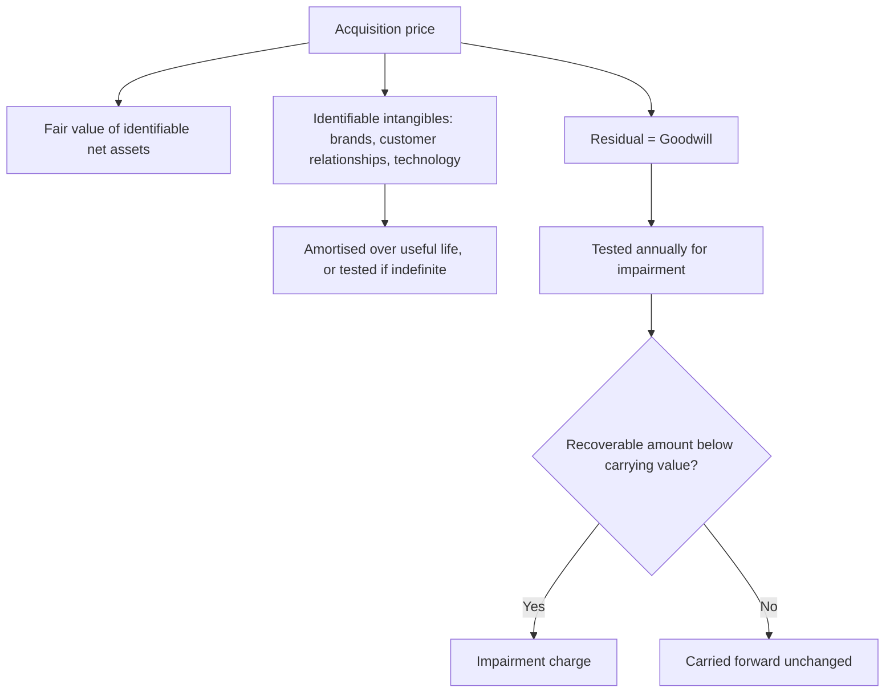

# Goodwill, Intangibles and Impairment

## The Problem / Why this matters
Goodwill on an Indian balance sheet is the accumulated record of what management paid above the fair value of net assets acquired. It sits there indefinitely, tested annually against assumptions management itself provides, and is written off only when the case for it has become indefensible — which is usually long after the acquisition stopped working. For serial acquirers, goodwill can be a large share of the balance sheet, and how an analyst treats it changes book value, returns on capital and the assessment of management's capital allocation.

## Core Idea
Goodwill is **a record of past capital allocation, not an asset with independent value**. Its most useful analytical role is as evidence about whether management's acquisitions have worked — and an impairment is confirmation of a value destruction that happened years earlier.

## Why it works this way
Goodwill is a residual: purchase price minus the fair value of identifiable net assets. It has no separable existence and cannot be sold. Its carrying value persists only so long as the cash-generating unit it belongs to supports it, and that test depends on forecasts prepared by the same management that made the acquisition.

## Full technical content

### The purchase price allocation

When an acquisition completes, the price is allocated:
1. **Fair value of identifiable tangible net assets.**
2. **Identifiable intangibles** recognised separately — brands, customer relationships, technology, non-compete agreements, order backlogs.
3. **Goodwill** — the residual.

**Why the allocation matters analytically:**
- **Identifiable intangibles with finite lives are amortised**, creating a real charge against reported earnings for years afterward.
- **Goodwill is not amortised** under current standards; it is tested for impairment.
- **Therefore the allocation between the two directly affects future reported earnings.** An allocation weighted toward goodwill produces higher reported earnings than one weighted toward amortisable intangibles, for identical economics.
- The allocation is a judgement, supported by valuation, and it is worth noting when a serial acquirer consistently allocates very little to amortisable intangibles.

**Companies frequently present "cash EPS" or "adjusted earnings" excluding acquisition-related amortisation.** There is a defensible argument for this — the charge is non-cash and relates to assets already paid for. There is a stronger counter-argument for a serial acquirer: **if acquisitions are the growth engine, the cost of acquiring is an ongoing cost of the business model, and excluding it every year presents a company that never appears to pay for its growth.** State which treatment you use and why.

### The impairment test and why it is late

The test compares the carrying value of a cash-generating unit to its recoverable amount — the higher of fair value less costs of disposal and value in use, the latter being a discounted cash flow.

**The structural problem:** the value-in-use calculation uses forecasts prepared by management, discount rates selected with management input, and terminal assumptions set by management. Management has strong incentives to avoid an impairment, since it is a public admission that an acquisition failed.

**Consequences:**
- **Impairments lag economic reality**, often by years.
- **They cluster** — with management changes, with sector downturns that make optimism untenable, and around auditor changes.
- **An impairment is confirmation, not news.** The value was destroyed when the acquisition underperformed; the accounting caught up later.

**A new CEO taking a large impairment early is a recognised pattern** — it clears the deck, is attributed to the predecessor, and lowers the base against which future performance is measured. Read it as information about the past rather than the present.

### The disclosures worth reading

The impairment testing note discloses, for material cash-generating units, the key assumptions used:

| Disclosure | What to check |
|---|---|
| **Discount rate** | Against your own cost of capital for that business; an unusually low rate supports a carrying value that a realistic rate would not |
| **Terminal growth rate** | Against nominal GDP; above it is indefensible |
| **Forecast growth** | Against the unit's actual recent performance — a unit that has declined for three years with a 12% forecast growth assumption is being supported by optimism |
| **Sensitivity disclosure** | Companies often disclose how much the assumptions can change before impairment; a disclosure that headroom is minimal is a strong early warning |

**That sensitivity disclosure is the single most useful item and is almost never read.** A note stating that a 50bp increase in the discount rate would trigger impairment is telling you the carrying value is on the edge.

### Analytical treatments

**Three defensible approaches, depending on the question:**

1. **Leave goodwill in.** Book value and capital employed include what was actually paid, so RoCE reflects the return on all capital deployed, including for acquisitions. **This is the right treatment for assessing management's capital allocation**, because it holds them accountable for the price paid.

2. **Exclude goodwill.** Return on tangible capital shows the operating business's economics independent of acquisition history. **This is the right treatment for assessing operating quality** and for comparing against a peer that grew organically.

3. **Present both** — which is what a good note does, since they answer different questions.

**Tangible book value** — equity less goodwill and intangibles — is the more conservative measure and is the relevant one for financial companies and for downside scenarios.

### What goodwill tells you about management

This is the most valuable use of the balance-sheet line:

- **Large goodwill with poor consolidated RoCE** means acquisitions were overpaid for. The operating businesses may be fine; the prices were not.
- **Compare RoCE including and excluding goodwill.** A wide gap quantifies exactly how much value the acquisition programme destroyed.
- **Repeated impairments** are a track record, and one that predicts future acquisitions poorly.
- **Goodwill growing while returns fall** is the classic value-destroying acquisition programme, visible years before any impairment.
- **A serial acquirer whose organic growth is undisclosed** is concealing the relevant number; insist on the organic split, as the restatement chapter also requires.

### Other intangibles

- **Internally generated brands are not recognised**, so a company with a valuable brand built organically shows no asset for it while an acquirer of the same brand does. **This makes book-value comparisons between organic and acquisitive companies structurally misleading**, and is a reason to prefer earnings- or cash-based measures for such comparisons.
- **Capitalised development costs** — permitted under conditions — inflate current earnings relative to a company expensing the same spend. Check the capitalisation policy and the amount capitalised against the cash outflow.
- **Indefinite-life intangibles** are tested rather than amortised, and the same optimism problem applies.
- **Software and technology intangibles** in a fast-moving field may have real lives far shorter than the amortisation period assumed.

## Common mistakes
- Treating goodwill as an **asset with value** rather than a record of what was paid.
- Computing RoCE **only** excluding goodwill, which lets management off for overpaying.
- Accepting **adjusted earnings** that exclude acquisition amortisation for a serial acquirer.
- Not reading the **impairment sensitivity disclosure**, the best early warning available.
- Failing to check the **terminal growth and discount rate** used in the impairment test.
- Treating an impairment as new information rather than as delayed confirmation.
- Comparing book value across **organic and acquisitive** companies without adjustment.
- Ignoring **capitalised development costs** when comparing margins.

## Interview angle
"Goodwill is 40% of the balance sheet. How do you treat it?" Say that you compute returns both ways because they answer different questions — RoCE including goodwill assesses management's capital allocation and holds them accountable for the prices paid, while RoCE excluding it shows the operating businesses' economics for comparison against an organically grown peer — and the gap between the two quantifies how much the acquisition programme destroyed. Then go to the impairment note, and be specific about what you read there: the discount rate and terminal growth assumptions used in the value-in-use test, checked against your own cost of capital and against nominal GDP, and above all the sensitivity disclosure, since a note saying a small change in assumptions would trigger impairment is telling you the carrying value is already on the edge. Add the structural point that shows judgement — the test relies on management's own forecasts and management has strong incentives to avoid admitting an acquisition failed, so impairments lag economic reality by years and are confirmation rather than news, which is why goodwill growing while returns fall is visible long before any write-off.
