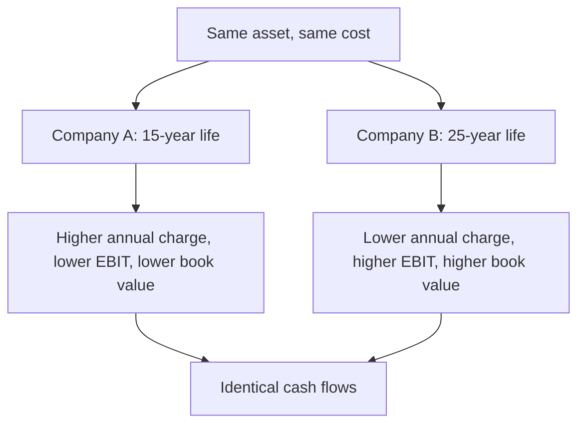

# Depreciation Policy and Asset-Life Comparability

## The Problem / Why this matters
Depreciation is the largest accounting estimate in most capital-intensive companies, and it is set by management's judgement about asset lives and residual values. Two identical plants can carry materially different annual charges purely because of policy, which flows straight through to reported margins, earnings and book value. Since analysts routinely compare EBIT margins and P/E ratios across companies in the same sector, an undetected policy difference produces a comparison that is not a comparison.

## Core Idea
Depreciation policy is **an assumption, not a fact** — so cross-company comparisons of EBIT, PAT and book value require checking the policy, and where it differs materially, normalising it.

## Why it works this way
Accounting standards require depreciation over useful life, and useful life is estimated by management with reference to a prescribed schedule but with discretion to justify a different life. A longer assumed life spreads the same cost over more years, lowering the annual charge, raising reported profit, and leaving a higher net asset value on the balance sheet — with no difference in cash or economics.

## Full technical content

### Where the discretion lies

| Element | Effect of a more aggressive choice |
|---|---|
| **Useful life** | Longer life → lower annual charge → higher reported profit |
| **Residual value** | Higher residual → lower depreciable base → lower charge |
| **Method** | Straight-line versus written-down value changes the profile across years, not the total |
| **Componentisation** | Separately depreciating components with different lives; affects timing |
| **Start of depreciation** | When an asset is "ready for use" — a judgement that can defer the charge |
| **Capitalisation boundary** | What is capitalised versus expensed — the largest lever of all |

### The checks

**1. Read the accounting policy note.** Asset lives are disclosed by class. Compare them to peers' disclosed lives for the same asset classes — this is a direct, cheap comparison that few analysts perform.

**2. Compute the implied depreciation rate.**
Depreciation ÷ Gross block, and Depreciation ÷ Net block.
Compare across peers and across time for the same company. A rate materially below peers indicates longer assumed lives, higher residual values, or a differently aged asset base — and the last of these is checkable.

**3. Check the age of the asset base.**
Accumulated depreciation ÷ Gross block gives the proportion of asset life consumed. A high ratio means an old asset base, which has two implications:
- **Reported profit is flattered** by low depreciation on nearly fully depreciated assets that are still producing.
- **Replacement capex is coming**, and at current prices rather than historical cost — so future capex will exceed current depreciation, and a DCF assuming otherwise overstates free cash flow.

**This is a genuine and common analytical error:** a company with an old, largely depreciated asset base shows excellent margins and returns that are not sustainable once replacement is required.

**4. Watch for policy changes.** A change in useful life is disclosed and immediately changes reported profit. **A life extension announced in a weak year is a specific pattern worth flagging**, since it raises reported earnings with no economic change.

**5. Compare depreciation to capex over a cycle.** Over a long period in a stable business, capex should approximate depreciation. Persistent capex well below depreciation means the asset base is shrinking; persistent capex well above means expansion, or that depreciation understates true economic consumption.

### The capitalisation boundary — the larger issue

Whether spending is capitalised or expensed matters more than the depreciation rate:

- **Repairs and maintenance capitalised** as improvements shift cost from the P&L to the balance sheet, raising current profit.
- **Interest capitalised during construction** is legitimate and standard, but the amount matters — a company with a long build programme capitalises substantial interest, flattering reported finance costs relative to its actual borrowing.
- **Development costs capitalised** rather than expensed, permitted under conditions, raise current earnings relative to a peer expensing the same activity.
- **Employee costs capitalised** on internally constructed assets or developed software.

**The checks:** compare capitalised amounts to cash outflow; compare R&D expensed as a percentage of revenue against peers; watch for a rising proportion of costs being capitalised without a corresponding rise in activity.

### Normalising for comparison

Where policies differ materially and the comparison matters:

1. **Recompute depreciation** for each company on a common assumed life for the same asset class.
2. **Restate EBIT and PAT** accordingly.
3. **Restate net block and book value** on the common basis.
4. **State that you have done this** and show the adjustment.

This is real work and is only warranted where the difference is material — but in capital-intensive sectors it frequently is, and it is exactly the kind of adjustment that produces a genuinely differentiated view of relative valuation.

**The simpler alternative:** use **EBITDA-based and cash-based measures**, which are unaffected by depreciation policy. This is one of the strongest arguments for EV/EBITDA in capital-intensive sectors, and for cross-border comparisons where policies vary more widely. But note the counter-discipline: EBITDA ignores the real cost of asset consumption, so a company genuinely wearing out its assets looks identical to one that is not. **Use EBITDA for comparability and free cash flow after capex for economics** — the two together, not one alone.

### The interaction with returns

- **RoCE is affected in both directions**: a lower depreciation charge raises EBIT while a higher net block raises capital employed. The net effect depends on the asset base's age and is not intuitive, which is why it should be computed rather than assumed.
- **An old asset base flatters RoCE substantially** — low net block in the denominator, low depreciation in the numerator. **A company with an unusually high RoCE and a high accumulated-depreciation ratio is often showing an accounting artefact rather than superior economics**, and this check should be routine before praising a company's returns.
- **Gross-block-based returns** (EBITDA ÷ gross block) are a useful cross-check precisely because they neutralise the asset-age effect.

### Sector notes

- **Utilities and infrastructure** — very long asset lives, and regulated returns may be computed on a prescribed depreciation basis different from the accounting one.
- **Telecom** — spectrum and network assets with lives that are judgement-heavy and technology-dependent.
- **Technology and equipment-intensive services** — assumed lives may exceed genuine economic obsolescence.
- **Shipping and aviation** — residual values are large and market-linked, so the residual assumption matters as much as the life.
- **Real estate** — inventory rather than fixed asset for developed property, so the issue shifts to inventory valuation.

## Common mistakes
- Comparing **EBIT margins** across peers without checking asset-life policies.
- Ignoring an **old asset base** flattering both margins and RoCE.
- Assuming future capex equals current **depreciation** for a company with aged assets.
- Missing a **useful-life extension** disclosed in a weak year.
- Overlooking the **capitalisation boundary**, which matters more than the depreciation rate.
- Using EBITDA alone, ignoring the real cost of asset consumption.
- Praising a high RoCE without checking the **accumulated depreciation ratio**.
- Ignoring **capitalised interest** when assessing finance costs.

## Interview angle
"Two companies in the same sector report very different EBIT margins. What might explain it besides operations?" Depreciation policy is a strong answer if you can be concrete: asset lives are management estimates disclosed by class in the accounting policy note, and a longer assumed life lowers the annual charge, raises EBIT and leaves a higher net block, with no difference in cash whatsoever — so the first check is comparing disclosed lives and the implied depreciation rate against gross block for both companies. Add the asset-age check, which is accumulated depreciation over gross block: an old, largely depreciated asset base flatters both margins and RoCE, because the charge is low and the net block in the denominator is small, and that advantage reverses when replacement capex arrives at current prices rather than historical cost — so a DCF assuming future capex equals current depreciation overstates free cash flow. Mention that the capitalisation boundary matters even more than the depreciation rate, and that EBITDA neutralises the policy difference for comparability but ignores real asset consumption, which is why you pair it with free cash flow after capex rather than using either alone.
