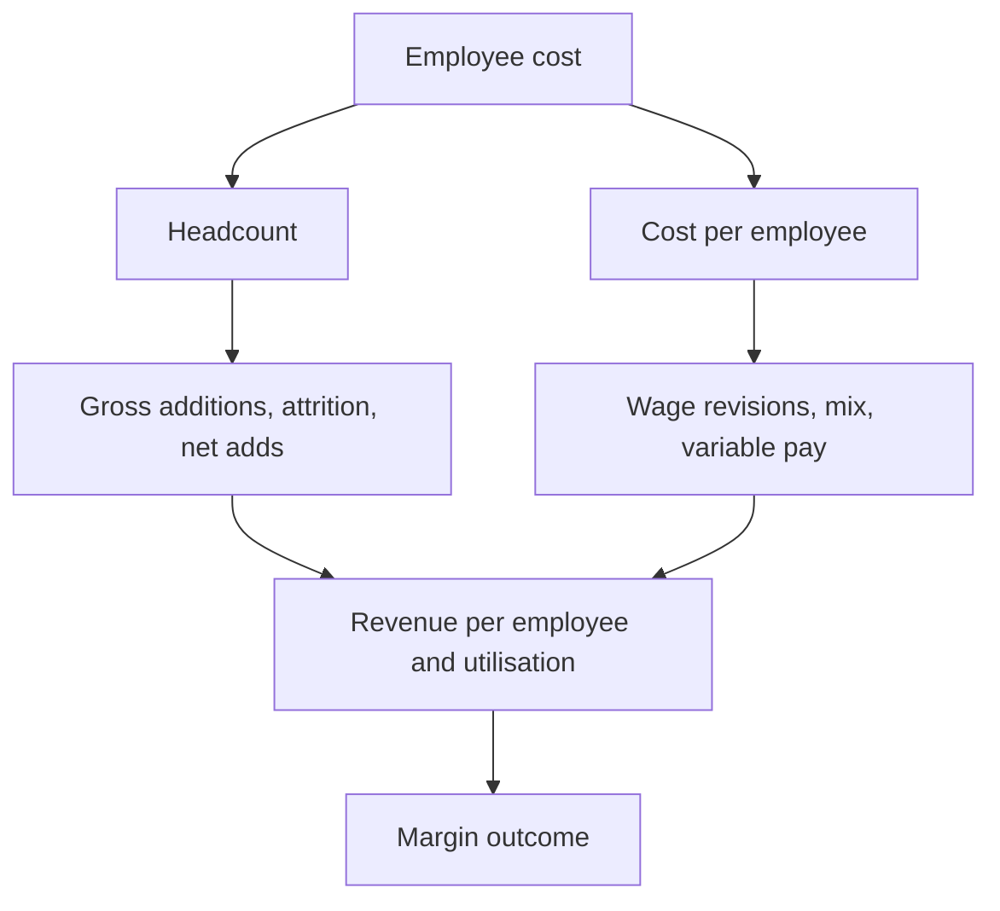

# Employee Costs and Productivity Metrics

## The Problem / Why this matters
For services businesses, employee cost is the largest line in the P&L and the primary determinant of margin. For manufacturers it is a substantial semi-fixed cost that drives operating leverage. Yet it is commonly modelled as a percentage of revenue, which assumes away the entire dynamic — headcount is added in advance of revenue, wage inflation is contracted, attrition costs are real, and productivity changes are the actual margin story. Building this line properly is one of the clearer distinctions between a modelled forecast and an assumed one.

## Core Idea
Model employee cost as **headcount × cost per employee**, both forecast separately, because the two move for different reasons and on different timelines.

## Why it works this way
Headcount responds to expected demand, hiring lead times and attrition. Cost per employee responds to wage inflation, mix and utilisation. A single percentage-of-revenue assumption conflates both and therefore cannot capture the most common margin event in services — hiring ahead of revenue that then does not arrive.

## Full technical content

### The productivity metrics

| Metric | Construction | What it shows |
|---|---|---|
| **Revenue per employee** | Revenue ÷ average headcount | The headline productivity measure; compare across time and peers |
| **EBITDA or profit per employee** | Similarly | Better, since it captures cost as well as output |
| **Cost per employee** | Employee cost ÷ average headcount | Wage inflation and mix combined |
| **Utilisation** | Billed hours ÷ available hours (services) | The direct margin lever in people businesses |
| **Employee cost as % of revenue** | The output, not the input | Useful for comparison, not for forecasting |
| **Attrition rate** | Departures ÷ average headcount | Cost, capacity and morale signal |

**Use average headcount, not closing**, when computing per-employee metrics — a company that doubled headcount in the final month shows collapsing productivity on a closing-headcount basis for no real reason.

### Headcount as a leading indicator

The most useful application, and one that most analysts miss:

- **Hiring precedes revenue.** A services company adding staff is signalling expected demand — management is committing cost ahead of contracted revenue, which is a costly signal.
- **Hiring slowdown precedes revenue slowdown**, usually by a quarter or two, because managements see the pipeline before it converts.
- **Job postings are public** and update continuously, well before quarterly headcount disclosure. Tracking them is one of the cheapest genuine alternative-data sources available.
- **Watch the composition** — sales hiring signals expected growth, operations hiring signals current volume, and senior management hiring may signal a strategic change.

**The margin consequence:** hiring ahead of revenue compresses margins temporarily by construction. If the revenue arrives, margins recover; if it does not, the company carries cost it must eventually remove. **Distinguishing the two in real time is the analytical question**, and the evidence is in the pipeline commentary, the deal wins, and whether hiring continues or stops.

### Attrition and its costs

Attrition is disclosed by many services companies, and it carries several distinct costs:
- **Replacement cost** — recruitment, onboarding, and the productivity ramp of a new joiner.
- **Wage inflation** — replacing a leaver often costs more than retaining them, since market rates for lateral hires exceed internal increments.
- **Delivery risk** — high attrition on a specific account risks the client relationship.
- **A signal about the business** — sustained high attrition relative to peers indicates something about compensation, management or work quality.

**Falling attrition is a margin tailwind**, and rising attrition is a headwind with a lag. Both are disclosed and both are frequently underweighted in forecasts.

### Wage revision cycles

- **Timing matters and is usually disclosed.** A company implementing annual increments in a specific quarter shows a step-down in margin that quarter every year — a seasonal pattern that must be modelled, per the seasonality chapter.
- **Quantum** is often guided ("high single digit"), which is directly modellable.
- **Onsite versus offshore mix** in IT services changes cost per employee materially, since onsite staff cost several times more — so a mix shift moves both revenue per employee and cost per employee, and reading either alone is misleading.
- **Variable pay** flexes with company performance, providing a partial natural hedge in weak years, and its restoration in a recovery year is a margin headwind that surprises analysts who did not model it.

### The pyramid

In services, the shape of the workforce by experience level is a central margin driver:
- **A broader base** of junior staff lowers average cost per employee.
- **Pyramid correction** — deliberately increasing the junior proportion — is a stated margin lever in IT services and is disclosed in commentary.
- **The constraint:** clients may require experienced staff on specific engagements, and pushing the pyramid too far risks delivery quality.
- **Automation** changes the pyramid structurally, reducing the junior base and breaking the traditional headcount-linked-to-revenue relationship — which means historical revenue-per-employee trends can be misleading for a company automating meaningfully.

That last point matters for forecasting: **where automation is real, revenue growth decouples from headcount growth**, and a model tying revenue to headcount will understate a successful automation programme.

### Manufacturing and other sectors

- **Employee cost is semi-fixed** — it does not fall proportionately with volume, which is a core part of the operating leverage analysis.
- **Contract versus permanent labour** mix affects flexibility; a higher contract proportion means costs flex more with volume but may carry other risks.
- **Employee cost per unit of output** is the relevant productivity metric rather than per employee.
- **Labour disputes and shutdowns** are a specific operational risk in some sectors and locations, and past incidents are worth knowing.

### Modelling it properly

1. **Forecast headcount** — from stated hiring plans, historical net adds, and the demand outlook.
2. **Forecast cost per employee** — from wage revision guidance, mix shifts and variable-pay assumptions.
3. **Multiply**, rather than applying a percentage of revenue.
4. **Sense-check the implied revenue per employee** against history and peers — if the model implies a productivity jump with no stated reason, the forecast is wrong somewhere.
5. **Model the wage revision quarter** explicitly as a step-down.
6. **Check the implied employee cost ratio** against history as an output, to confirm the forecast is plausible.

Step 4 is the discipline that catches most errors, because an implausible productivity implication is easier to spot than an implausible cost ratio.

## Common mistakes
- Modelling employee cost as a **percentage of revenue**.
- Using **closing rather than average** headcount for per-employee metrics.
- Ignoring **hiring as a leading indicator** of revenue.
- Reading margin compression from **hiring ahead of revenue** as structural deterioration.
- Not modelling the **wage revision quarter** as a recurring step-down.
- Ignoring **variable pay restoration** in a recovery year.
- Missing **onsite/offshore mix** effects on both revenue and cost per employee.
- Tying revenue to headcount where **automation** has broken that relationship.
- Overlooking **attrition** as both a cost and a signal.

## Interview angle
"An IT services company's margins fell 150bp this quarter. How do you work out whether it matters?" Decompose the employee line rather than accepting the headline: separate headcount from cost per employee, because they move for different reasons. If margins fell because headcount rose ahead of revenue, that is management committing cost against an expected pipeline, and it recovers if the revenue arrives — so the question becomes whether deal wins and pipeline commentary support it, and whether hiring is continuing or has stopped. If it fell because cost per employee rose, check whether this is the annual wage revision quarter, which is a recurring step-down that should have been modelled, or a mix shift toward onsite, or variable pay being restored after a weak year. Add utilisation and the pyramid, both disclosed and both direct margin levers. And mention the leading indicator worth tracking between results — job postings are public and update continuously, well ahead of quarterly headcount disclosure, and a hiring slowdown typically precedes a revenue slowdown by a quarter or two.
