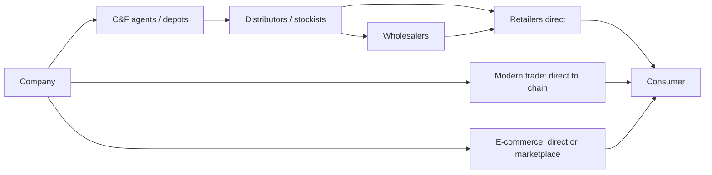

# Distribution, Channel Structure and Route to Market

## The Problem / Why this matters
In India, distribution is frequently the moat. A consumer company's competitive position rests more on the number of outlets it reaches and the economics it offers its trade partners than on its product formulation, and a new entrant with a superior product routinely fails because it cannot get shelf space. Yet distribution is analysed superficially — an outlet count in an investor presentation, quoted without examination of what it means or whether it is comparable.

## Core Idea
Distribution creates value through **reach, economics and control** — how many points of sale you touch, whether your channel partners make money, and how much visibility and influence you have over what happens at the shelf.

## Why it works this way
A retailer stocks a finite number of products and allocates shelf space to those that generate the most profit per unit of space. A brand that reaches more outlets, moves faster and offers better trade margins wins that allocation — and the incumbent's accumulated relationships are expensive and slow for a challenger to replicate.

## Full technical content

### Reading the reach numbers

Companies disclose outlet reach, and the numbers require care:

| Metric | What it means | The catch |
|---|---|---|
| **Total outlets reached** | Outlets stocking the product, however indirectly | Includes wholesale-served outlets with no direct relationship |
| **Direct reach** | Outlets serviced directly by the company's distributors | The meaningful number; much smaller |
| **Distributor count** | Channel partners | Says little without outlet productivity |
| **Outlet productivity** | Revenue per outlet | The quality measure that reach alone misses |
| **Numeric distribution** | % of outlets in a universe stocking the brand | Standard measure, comparable across companies |
| **Weighted distribution** | Weighted by outlet size or category sales | More informative than numeric |

**Direct reach is the number that matters.** Direct servicing means better visibility, faster replenishment, control over merchandising and reliable sell-out data. Wholesale-dependent reach means the company does not know what happens beyond the wholesaler — which is exactly where inventory builds up invisibly.

**Growing reach with falling productivity per outlet** is expansion into outlets that do not sell much, which raises cost more than revenue. Always check the two together, since companies present the flattering one.

### Channel economics

Whether channel partners make money determines whether they push your product:

- **Trade margins** through each layer — distributor, wholesaler, retailer.
- **Return on investment for the distributor**, which depends on margin and on how fast stock turns. **A distributor with a modest margin on fast-moving stock earns a better return than one with a high margin on slow stock**, and companies compete on this composite rather than on headline margin.
- **Credit terms** extended to the trade, which sit in the company's receivables.
- **Schemes and trade incentives**, which are effectively price discounts and may be netted from revenue or booked as expenses — check which, because it affects reported gross margin.

**Distributor churn** is a warning signal: partners leaving indicate poor economics or a deteriorating relationship, and rebuilding a distribution network is slow and expensive.

### Primary versus secondary sales — the central discipline

- **Primary sales** — company to distributor. This is what the company reports as revenue.
- **Secondary sales** — distributor to retailer.
- **Tertiary / off-take** — retailer to consumer, the true demand signal.

**Reported revenue is primary.** If primary exceeds secondary for a period, inventory is building in the channel, and a correction will follow. This is the single most important thing to understand about consumer and auto companies, and it explains a large share of apparently sudden demand collapses.

**Detection:**
- Companies increasingly disclose secondary sales or off-take growth — where they do, compare.
- **Receivable days rising** alongside strong revenue growth suggests channel loading financed by credit.
- **Management commentary** on channel inventory, which is usually given if asked on the call.
- **The auto sector's dispatches-versus-retails gap** is the clearest published version of this, and the same logic applies wherever a channel exists.

**Channel loading before a price increase** is legitimate and reverses predictably, as the pass-through chapter notes. **Channel loading to meet a quarterly target** is a quality-of-earnings problem and usually recurs.

### Channel evolution

The structural shift worth understanding for any consumer coverage:

| Channel | Characteristics |
|---|---|
| **General trade** | Fragmented, relationship-driven, credit-based; the incumbent's moat |
| **Modern trade** | Chains buying centrally; better data, lower margins, private-label competition |
| **E-commerce** | National reach without physical distribution; changes the entry barrier fundamentally |
| **Quick commerce** | Dark stores, limited assortment; favours high-velocity SKUs and pack sizes |
| **Direct-to-consumer** | Company-owned; higher margin, higher customer-acquisition cost, limited scale |

**Why this matters competitively:** e-commerce and quick commerce **lower the distribution barrier that protected incumbents**. A challenger brand can now reach consumers nationally without building a physical network, which is why small brands have taken share in several categories. Assessing an incumbent's moat requires asking how much of its category is moving to channels where its distribution advantage does not apply.

**The margin question:** modern trade and e-commerce typically carry higher listing fees, marketing spend and return rates, so channel mix shift affects margin even at constant revenue. Ask for the channel mix and its margin differential.

### The B2B and industrial equivalent

- **Direct sales versus dealer networks** — direct gives control and margin, dealers give reach and working-capital relief.
- **Service networks** as the retention mechanism in equipment businesses, where spares and service are frequently the profit pool rather than the original sale.
- **Dealer financial health** is a real risk in auto and equipment, where dealers carry inventory on credit — dealer distress becomes the company's problem quickly.
- **Institutional and government channels** have different payment cycles, which shows up in receivables.

### What to build into the analysis

- **Direct reach and outlet productivity**, tracked over time rather than the headline number.
- **Channel mix** and its margin differential.
- **Primary versus secondary** growth, wherever it can be established.
- **Receivable days and inventory days**, as the financial trace of channel behaviour.
- **Distributor economics and churn**, from commentary and primary work.
- **Competitive reach comparison** — where peers disclose it, direct reach is directly comparable and is one of the cleaner competitive metrics available.

## Common mistakes
- Quoting **total reach** rather than direct reach.
- Celebrating reach expansion without checking **outlet productivity**.
- Treating reported revenue as **demand** when it is primary sales.
- Missing **channel loading** signalled by rising receivable days.
- Ignoring **channel mix shift** effects on margin.
- Assuming a distribution moat holds as categories move to **e-commerce**.
- Overlooking **distributor economics** — margin alone, ignoring stock turns.
- Ignoring **dealer financial health** in auto and equipment.

## Interview angle
"A consumer company reports 14% revenue growth. What do you check before believing it reflects demand?" The primary-versus-secondary distinction: reported revenue is sales to distributors, not to consumers, so the first question is whether secondary sales or off-take grew at the same rate — and if the company does not disclose it, look for the financial trace, which is receivable days and channel inventory commentary, since loading the channel to meet a target shows up as revenue financed by credit. Then examine the reach numbers properly: total outlets reached includes wholesale-served outlets the company has no visibility into, so direct reach is the meaningful figure, and reach growing while revenue per outlet falls means expansion into unproductive outlets that costs more than it earns. Add the structural point — distribution has historically been the incumbent moat in India, and e-commerce and quick commerce lower that barrier, so assessing the moat means asking how much of the category is shifting to channels where the physical network confers no advantage, and what that mix shift does to margin.
