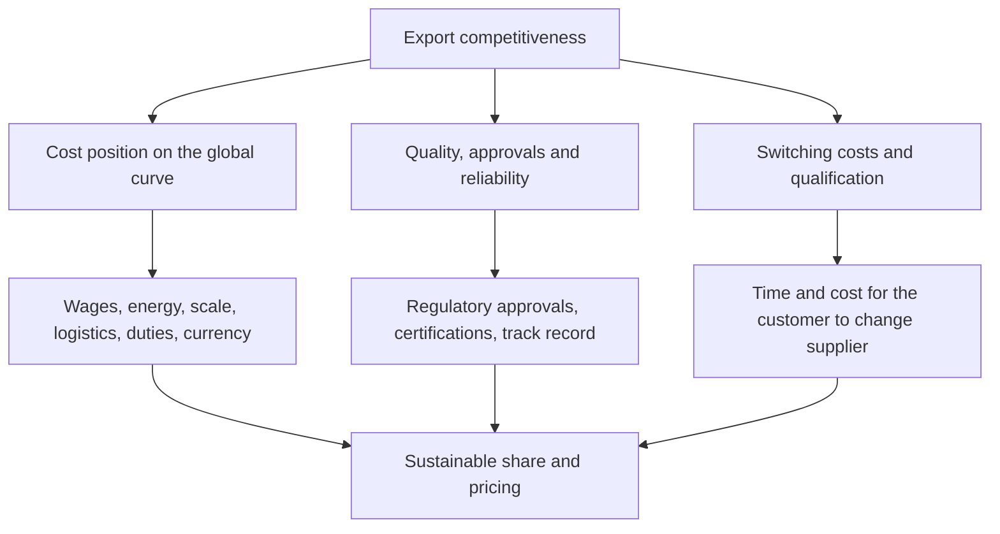

# Exports and Global Competitiveness

## The Problem / Why this matters
A substantial part of the Indian equity market's growth narrative rests on export competitiveness — IT services, pharmaceuticals, chemicals, auto components, textiles and engineering goods all sell into global markets against global competitors. Assessing whether a company can win and hold that business requires understanding its position on a global cost curve, not just its domestic peer comparison. Analysts who benchmark only against Indian peers can conclude a company is well-positioned when the entire domestic industry is uncompetitive globally.

## Core Idea
Export competitiveness rests on **relative cost position, relative quality and reliability, and customer switching costs** — assessed against global competitors, not domestic ones.

## Why it works this way
A global customer chooses among suppliers worldwide. Being the cheapest producer in India is irrelevant if producers in another country are cheaper still, or if the customer values qualification and reliability above price. The relevant benchmark is always the customer's alternative, which is rarely another Indian company.

## Full technical content

### The cost curve

The foundational analysis for any export business in a traded good:

- **Where does the company sit** on the global cost curve for its product? Bottom-quartile producers survive downturns and set the marginal price; top-quartile producers are the marginal supply and lose money first.
- **Cost components to compare internationally**: labour, energy, raw material access, scale, logistics to the customer, and effective tax.
- **India's typical position**: labour cost advantage, offset in many sectors by higher power costs, logistics costs and scale disadvantage against Chinese producers.
- **Freight is frequently decisive** for bulk products — a landed-cost comparison, not an ex-works one, determines competitiveness, and freight rates move enough to change competitive position entirely for extended periods.

**Where to get the data:** global peers' disclosures, industry association benchmarking, trade data showing price realisations by origin, and rating agency sector reports. Building even a rough international cost comparison is genuinely differentiated work, because most domestic analysts do not attempt it.

### Non-cost competitiveness

Cost is necessary but frequently not sufficient. What sustains export businesses:

| Factor | Where it matters most |
|---|---|
| **Regulatory approvals** | Pharma — facility approvals by importing-country regulators are the licence to sell |
| **Customer qualification** | Auto components, aerospace, speciality chemicals — long approval cycles |
| **Quality and consistency** | Everything; failure is remembered far longer than success |
| **Reliability of supply** | Increasingly valued after global supply disruptions |
| **Intellectual property** | Formulation, process, design capability |
| **Scale to serve large customers** | Global customers require suppliers who can serve them globally |

**Qualification is the moat in several Indian export sectors.** A speciality chemicals supplier qualified into a global customer's product has a position that a cheaper competitor cannot take quickly, because the customer must revalidate, refile and retest. **The analytical questions:** how long is the qualification cycle, how many products are qualified, and what proportion of revenue comes from qualified positions versus spot business? Those two revenue types deserve completely different multiples.

### The "China plus one" question

A dominant theme in Indian export narratives, and one that requires discipline rather than enthusiasm:

- **The direction is real** — customers diversifying supply chains creates opportunity for Indian suppliers.
- **But the evidence must be company-specific.** The relevant questions: which customers, which products, what volumes, what timeline, and is there a signed contract or an expression of interest?
- **Check whether it appears in the numbers.** Export revenue growth, new customer additions, capacity commitments, and — most tellingly — capex being committed against specific orders.
- **Scale and speed** are the constraints. Chinese capacity in several categories is very large, and replacing a meaningful share requires capital and time that Indian producers may not deploy fast enough.
- **Cost gaps do not disappear** because a customer wants diversification; they are willing to pay some premium for resilience, but the premium is finite.

**The discipline: treat it as a testable claim with monitorable evidence**, not as a narrative that justifies a multiple. Where a company has been talking about it for three years with no export revenue inflection, that is the answer.

### Trade policy and its effects

- **Import duties in destination markets** directly affect competitiveness, and changes are dated, announced events.
- **Anti-dumping and countervailing duties** — both those protecting Indian producers domestically and those imposed on Indian exports abroad. These are specific, dated and researchable, and a favourable determination can transform an industry's economics.
- **Free trade agreements** change relative access.
- **Export incentive schemes** — where a company's profitability depends materially on an incentive scheme, that is a policy risk and the sustainability of the scheme belongs in the analysis. **Check whether incentives are booked in other income or netted from costs**, since the presentation affects reported margins.
- **Non-tariff barriers** — standards, certification, and regulatory requirements that function as trade barriers.

### Currency and the competitive dimension

Beyond the direct translation effect covered in the currency chapter:
- **Relative currency movement against competing exporters' currencies** is what determines competitiveness. A rupee depreciation against the dollar means little if a competing exporter's currency depreciated more.
- **Cross-rates matter** for the customer's decision, which is made in their own currency.
- **Currency movements can be competed away** — where the industry is competitive and inputs are globally priced, a depreciation benefit gets passed to customers in price over time rather than retained as margin. **Sustained margin expansion from currency requires pricing power**, which returns to the pass-through analysis.

### Customer concentration and its two sides

- **Concentration is a risk** — losing one large customer can be existential.
- **It is also evidence of qualification.** A supplier with a decade-long relationship with a demanding global customer has a validated position, and that relationship is a real asset.
- **Assess the customer's own health** and their strategy, since a customer in difficulty transmits it upstream.
- **Check the contract structure** — long-term agreements with formula pricing behave very differently from purchase-order business.

### What to build into the analysis

- **A global cost-curve position estimate**, however rough.
- **Qualified versus spot revenue** split, where relevant.
- **Customer concentration** with an assessment of relationship depth.
- **Approval and qualification status** — plant approvals, product registrations, customer validations.
- **Trade policy exposures** with dates.
- **Realised export prices** versus global benchmarks, from trade data where available.
- **Competitors' capacity plans globally**, since supply from anywhere affects price — the same discipline as the domestic capex chapter, applied worldwide.

## Common mistakes
- Benchmarking only against **domestic peers** for a globally traded product.
- Comparing **ex-works costs** rather than landed costs.
- Accepting a **"China plus one"** narrative without company-specific evidence.
- Treating a currency benefit as **permanent margin** where it will be competed away.
- Ignoring **export incentive** dependence and its policy risk.
- Overlooking **qualification status** as the actual moat in several sectors.
- Failing to distinguish **qualified from spot** revenue.
- Ignoring global competitors' **capacity additions**.

## Interview angle
"An Indian chemicals company says it is a China-plus-one beneficiary. How do you test that?" Insist on company-specific evidence rather than the theme: which customers, which products, what volumes, whether there are signed contracts or only expressions of interest, and whether capex is being committed against specific orders — and then check whether it shows in export revenue, new customer additions and realisations rather than only in the presentation. Frame the underlying competitiveness question properly: the benchmark is global producers, not Indian peers, and the comparison must be on landed cost including freight and duties rather than ex-works, since freight alone can decide competitiveness for bulk products. Then identify what actually sustains the position in this sector, which is usually qualification — a supplier validated into a global customer's product cannot be displaced quickly because the customer must revalidate and refile, so the split between qualified revenue and spot business matters more than the total and deserves a different multiple. Finish by noting that a diversification premium is finite: customers will pay something for resilience, but not an unlimited amount over a persistent cost gap.
