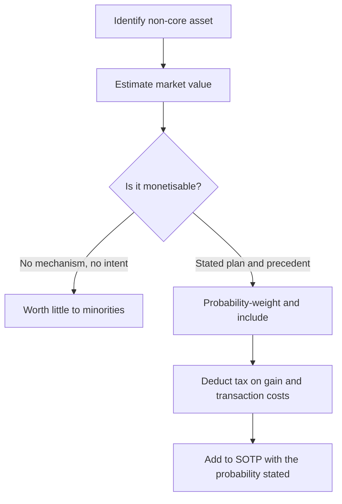

# Land, Non-Core Assets and Hidden Value

## The Problem / Why this matters
Balance sheets carry assets at historical cost, and in India that historical cost can be decades old. A mill with land purchased in the 1970s inside a city that has grown around it carries that land at a fraction of its market value. Similar gaps exist in investments in listed group companies, surplus real estate, and idle capacity. These create genuine value not visible in book value or in any earnings-based multiple — and equally, they create a well-known trap, because value that management will never realise is worth very little to a minority shareholder.

## Core Idea
Hidden asset value is real but is **only worth what its probability of realisation makes it worth** — and the binding question is always whether management has any intention or mechanism to monetise it.

## Why it works this way
Historical-cost accounting does not revalue land and long-held investments. An asset bought at ₹2cr and worth ₹200cr today appears at ₹2cr. But a minority shareholder receives value from an asset only if it generates cash flow or is sold and the proceeds distributed or reinvested productively. An asset that does neither contributes nothing to the shareholder's return regardless of its appraised value.

## Full technical content

### The categories

| Asset | Where it hides | How to value it |
|---|---|---|
| **Surplus land** | Fixed assets at historical cost; area sometimes disclosed in the annual report or property notes | Area × market rate for that location and permitted use |
| **Investments in listed companies** | Investment note, often at cost or fair value | Market value of the stake, less a holding discount |
| **Investments in unlisted group entities** | Investment note at cost | Requires valuation; be conservative |
| **Idle or mothballed capacity** | Fixed assets; utilisation disclosure | Replacement value, or the value of restarting |
| **Brands and IP** | Not recognised if internally generated | Only relevant if separately monetisable |
| **Excess cash and treasury investments** | Current assets | At value, but assess whether it will ever be returned |
| **Legacy real estate** — offices, guest houses, township land | Fixed assets | Market value less realisation friction |

### Valuing it honestly

**1. Establish the asset exists and its extent.** Land area is sometimes disclosed in the annual report, in the fixed-asset schedule notes, or in charge documents filed with lenders. Where it is not, estimates from site visits and public records are approximate and should be labelled as such.

**2. Value it at a defensible market rate**, with the specific location and permitted use — agricultural, industrial, commercial or residential zoning changes the value by an order of magnitude, and land held by an industrial company frequently cannot be sold for residential use without a conversion process that takes years and may fail.

**3. Deduct realisation costs**: capital gains tax on the gain, transaction costs, and the cost of relocating any operations currently on the land.

**4. Assess monetisability** — the step that determines everything:
- Is there a **stated intention** to monetise?
- Is there a **precedent** — has this management sold assets before and what happened to the proceeds?
- Are there **encumbrances** — is the land mortgaged to lenders?
- Are there **legal or title issues**? Land title disputes in India are common and can block a sale for decades.
- Is the asset **operationally necessary** despite appearing surplus?

**5. Probability-weight and state the probability.** A ₹900cr land value with a 20% probability of realisation contributes ₹180cr, and presenting the full amount as value is the standard error.

**6. Ask what happens to the proceeds.** Even a realised sale benefits minorities only if the cash is distributed or reinvested at returns above the cost of capital. **A company that sells land and lends the proceeds to a promoter entity has converted a hidden asset into a related-party receivable**, which is worse than not selling it.

### The asset-value trap

The pattern to recognise, because it recurs:

1. A company trades far below the appraised value of its assets.
2. Analysts and investors identify the gap and recommend it.
3. Management has no intention of selling, since the assets support their control and their operations.
4. The gap persists for years or decades.
5. Investors who bought for the asset value earn nothing while the operating business consumes cash.

**The condition that separates opportunity from trap is a mechanism and an intent.** Asset value with neither is a permanent feature of the stock, not a catalyst — the same conclusion the holding-company, sum-of-the-parts and takeover-value chapters all reach from different starting points. It is worth stating plainly because the asset-value pitch is superficially compelling and is made constantly.

**What makes realisation more likely:**
- A **stated monetisation plan** with a timeline.
- **Financial pressure** — a company needing cash to service debt is more likely to sell.
- **A change of control or management**, since a new owner has no attachment to legacy assets.
- **Activist or institutional pressure**, where the shareholder base can exert it.
- **A demonstrated track record** of monetisation and sensible use of proceeds.
- **Succession events** in promoter families, which frequently trigger restructuring.

### Cross-holdings and treasury shares

- **Investments in listed group companies** are the most quantifiable form of hidden value, since a market price exists. Apply a holding discount, since the parent's shareholders cannot access the stake directly, and the discount should reflect the realistic probability of monetisation as well as tax.
- **Cross-holdings between group companies** create circular value that must be handled carefully in a sum-of-the-parts to avoid double-counting.
- **Treasury shares** held through trusts affect the effective share count and are disclosed.
- **Consistency matters:** the same holding discount logic that applies to a holding company applies here, and applying a discount in one place and not the other is inconsistent.

### Presenting it in research

- **Separate the operating valuation from the asset valuation** explicitly. The operating business valued on its earnings, plus a probability-weighted asset value, with both stated.
- **State the probability and the basis** for it, so a reader can substitute their own.
- **Never present gross asset value as a target price** — the most common failure in this kind of note.
- **Identify the catalyst** or state clearly that there is none.
- **Include the tax and transaction costs**, which are frequently omitted.
- **Treat it as optionality**: "we value the operating business at ₹310 per share; surplus land could add ₹120 per share gross, which we include at ₹30 reflecting a 25% probability of monetisation within five years" is honest, useful and rare.

That formulation is the whole chapter in one sentence, and it is the difference between a credible asset-value note and a promotional one.

## Common mistakes
- Presenting **gross asset value** as a target price.
- Ignoring **capital gains tax and transaction costs**.
- Assuming industrial land can be sold at **residential rates** without conversion.
- Ignoring **encumbrances and title issues**.
- Recommending on asset value with **no mechanism and no intent**.
- Not asking what happens to the **proceeds** after a sale.
- Double-counting **cross-holdings** in a sum-of-the-parts.
- Applying a holding discount inconsistently across similar situations.
- Treating an asset as surplus when it is operationally necessary.

## Interview angle
"This company's land is worth more than its market cap. Is it a buy?" The answer turns on realisation, not on the appraisal. Ask whether management has any stated intention to monetise, whether they have done so before and what happened to the proceeds, whether the land is mortgaged or has title issues, and whether it is genuinely surplus rather than operationally necessary — because asset value with no mechanism and no intent is a permanent feature of the stock rather than a catalyst, and gaps like this persist for decades. Then price it honestly: deduct capital gains tax and transaction costs, use the value for the permitted use rather than assuming a zoning conversion that may take years and fail, probability-weight the result, and present it as optionality on top of the operating valuation rather than as a target price. Add the question most people skip — even a completed sale only helps minorities if the proceeds are distributed or reinvested above the cost of capital, and a company that sells land and lends the money to a promoter entity has made shareholders worse off, not better.
