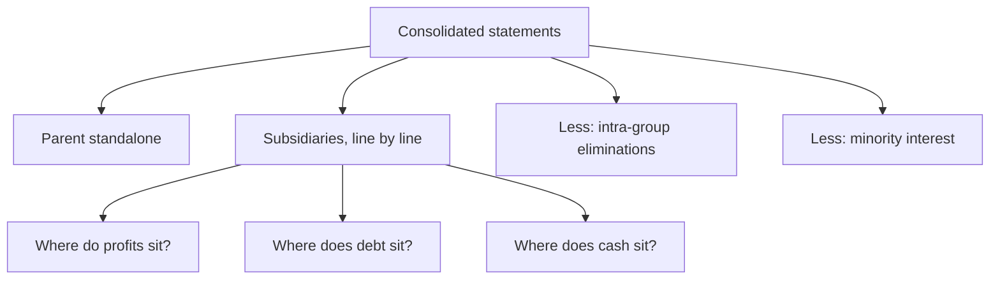

# Consolidated versus Standalone Financials

## The Problem / Why this matters
Indian companies report both standalone and consolidated financial statements, and the difference between them is frequently where the interesting information lives. Analysts default to consolidated — correctly, since it reflects the whole group — but the standalone statements reveal how much of the business is the parent's own operations, how much cash actually sits where the listed shareholders' claim is, and what the parent is doing with subsidiaries. Comparing the two is a five-minute exercise that regularly surfaces things neither statement shows alone.

## Core Idea
**Consolidated tells you what the group earns; standalone tells you what the listed entity itself does and holds.** The difference between them is the subsidiary business, and examining that difference is where several important questions get answered.

## Why it works this way
Consolidation adds subsidiaries line by line and eliminates intra-group transactions, presenting the group as one economic unit. That is the right basis for valuation. But it also conceals where within the group the profits, the cash and the debt actually sit — which matters, because a shareholder in the parent has a direct claim only on the parent, and an indirect claim on subsidiaries that may be encumbered, partly owned or in another jurisdiction.

## Full technical content

### The comparisons worth making

| Comparison | What it reveals |
|---|---|
| **Consolidated revenue vs standalone** | How much of the business is subsidiaries |
| **Consolidated PAT vs standalone PAT** | Whether subsidiaries add or destroy profit |
| **Consolidated debt vs standalone debt** | Where leverage sits, and whether the parent has guaranteed it |
| **Consolidated cash vs standalone cash** | Whether cash is accessible to the parent's shareholders |
| **Minority interest** | How much of subsidiary profit belongs to others |
| **Investments in subsidiaries** (standalone) | The parent's carrying value, and whether it has been impaired |
| **Loans to subsidiaries** (standalone) | Cash the parent has advanced downward |

### The specific situations these reveal

**1. Subsidiaries losing money.** Where consolidated PAT is materially below standalone PAT, subsidiaries are loss-making. **This is one of the fastest ways to identify a problem**, and it takes one subtraction. Then ask which subsidiary, whether the losses are growing, whether the parent is funding them, and whether there is a plan.

**2. Profits in partly owned subsidiaries.** A high minority interest means a substantial share of consolidated profit belongs to other shareholders. Consolidated EPS already accounts for this, but consolidated *EBITDA* does not — so EV/EBITDA computed on consolidated EBITDA against a market cap reflecting only the parent's share overstates cheapness. **Check minority interest before using consolidated EBITDA multiples.**

**3. Cash trapped in subsidiaries.** Consolidated cash may sit in a subsidiary that cannot easily distribute it — because of local regulation, tax on repatriation, minority shareholders, or lender restrictions. **Cash in a 51%-owned subsidiary is only 51% the parent's shareholders' cash**, and even that is subject to a dividend decision. Netting full consolidated cash against debt in an enterprise value calculation can therefore overstate value.

**4. Debt at the subsidiary level.** Where debt sits determines who has recourse to what. Lenders to a subsidiary have first claim on that subsidiary's assets and cash flows, ahead of the parent's shareholders. **Structural subordination** — the parent's equity ranking behind subsidiary debt — is a real and frequently ignored risk.

**5. The parent as a holding company.** Where standalone revenue is negligible and consolidated revenue is large, the listed entity is essentially a holding company, and the holding-company discount analysis applies — the shareholders' claim runs through dividends and distributions from subsidiaries rather than through operations.

**6. Loans and investments flowing downward.** The standalone statements show what the parent has advanced to subsidiaries. **Persistent funding of a subsidiary that never repays is capital leaving the listed entity's shareholders**, and the related-party analysis applies with full force where the subsidiary is partly owned by promoters.

**7. Impairment of investments in subsidiaries.** The standalone statements carry investments in subsidiaries at cost less impairment. **An impairment in the standalone accounts is an admission that a subsidiary is worth less than was paid** — and this frequently appears in the standalone statements before the consolidated statements show a corresponding write-down, making it an early signal that almost nobody reads.

### Which to use for what

| Purpose | Basis |
|---|---|
| **Valuation** | Consolidated — it reflects the whole economic entity |
| **EPS and per-share metrics** | Consolidated, after minority interest |
| **Assessing where value sits** | Both, compared |
| **Dividend capacity** | Standalone, since dividends are paid by the parent from its own distributable profits |
| **Debt serviceability at the parent** | Standalone plus dividend flows from subsidiaries |
| **Related-party analysis** | Standalone, which shows parent-subsidiary flows that consolidation eliminates |

**The dividend-capacity point deserves emphasis.** Dividends are declared by the listed entity from its own profits available for distribution. A group with strong consolidated profits but a parent whose standalone profits are small may be constrained in paying dividends regardless of group performance — and forecasting a payout from consolidated earnings without checking standalone distributable profits will produce a wrong dividend forecast.

### The subsidiary disclosures

Indian companies disclose, in a statement attached to the accounts, summary financial information for each subsidiary, associate and joint venture — typically capital, reserves, total assets, turnover and profit.

**This is a valuable and under-used disclosure.** It lets you:
- Identify which subsidiaries are large and which are loss-making.
- Track a specific subsidiary's performance over years.
- Spot subsidiaries with substantial assets and no turnover, which warrant a question.
- Notice new subsidiaries incorporated, and in which jurisdictions.
- Identify **overseas subsidiaries in low-disclosure jurisdictions**, which — combined with a high proportion of consolidated revenue audited by other auditors — is the structural risk pattern the audit chapter flags.

### Building it into the routine

At every annual result:
1. **Subtract standalone from consolidated** for revenue, EBITDA, PAT, debt and cash.
2. **Read the subsidiary summary statement** and note changes.
3. **Check minority interest** as a proportion of consolidated profit.
4. **Check loans to and investments in subsidiaries** in the standalone accounts, and whether they are growing.
5. **Check for impairment** of subsidiary investments in the standalone accounts.
6. **Assess where cash and debt sit**, and adjust the enterprise value calculation if material.

## Common mistakes
- Using **consolidated EBITDA multiples** without checking minority interest.
- Netting **full consolidated cash** against debt when cash is trapped in partly owned or overseas subsidiaries.
- Ignoring **structural subordination** where debt sits at subsidiaries.
- Forecasting dividends from **consolidated** earnings without checking standalone distributable profits.
- Missing loss-making subsidiaries visible from a single subtraction.
- Never reading the **subsidiary summary statement**.
- Overlooking **impairment of subsidiary investments** in the standalone accounts as an early signal.
- Ignoring persistent parent funding of subsidiaries that never repay.

## Interview angle
"Why would you look at standalone financials when consolidated is the right basis for valuation?" Because the difference between them answers questions neither shows alone. A single subtraction — consolidated PAT minus standalone PAT — tells you immediately whether subsidiaries are adding or destroying profit. Where debt and cash sit determines who has recourse to what: subsidiary lenders rank ahead of the parent's shareholders, which is structural subordination, and cash held in a partly owned or overseas subsidiary is not fully available, so netting full consolidated cash in an enterprise value calculation overstates value. Dividend capacity is a standalone question, since dividends are paid by the listed entity from its own distributable profits, so forecasting a payout off consolidated earnings can be simply wrong. Add the two early signals: the standalone accounts carry investments in subsidiaries at cost less impairment, and an impairment there is an admission a subsidiary is worth less than was paid — often appearing before anything shows in the consolidated numbers — and the attached subsidiary summary statement lets you track each entity's performance and spot new ones incorporated in low-disclosure jurisdictions.
