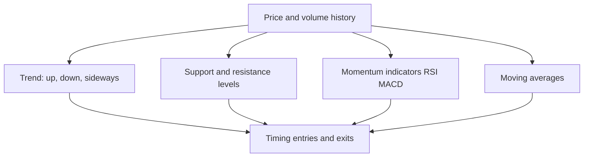

# Technical Analysis Essentials

## The Problem / Why this matters
While fundamental analysis asks *what a stock is worth*, **technical analysis** asks *what the price is likely to do next*, from the price and volume history itself. It's the core toolkit for traders and technical research analysts, and it's used alongside fundamentals for timing entries and exits. Even fundamentally-driven roles expect you to understand trends, support/resistance, and the main indicators — and for trading/TRA roles it's central.

## Core Idea
Technical analysis studies **price and volume patterns** to forecast future price movement, resting on three assumptions: the price discounts everything, prices move in trends, and history tends to repeat (because human behaviour does). Its tools identify trends, key price levels, momentum, and reversals.

## Why it works this way
Price reflects the collective actions of all participants, so patterns in price can reveal the balance of supply and demand and the psychology (fear/greed) driving it. Trends persist because participants react and herd; levels matter because memory and orders cluster at them; patterns repeat because human behaviour under uncertainty is repetitive.

## Full technical content

**The three assumptions of technical analysis:**
1. **The market discounts everything** — all known information is already in the price, so study the price.
2. **Prices move in trends** — once established, a trend is more likely to continue than reverse.
3. **History repeats** — patterns recur because market psychology is consistent over time.

**Trend.** The primary concept: an **uptrend** = higher highs and higher lows; a **downtrend** = lower highs and lower lows; **sideways/range** = no clear direction. "The trend is your friend" — trade with it until it clearly breaks. **Trendlines** connect the lows (uptrend) or highs (downtrend).

**Support & resistance.** **Support** = a price level where buying tends to emerge and halt declines; **resistance** = where selling tends to emerge and cap advances. A broken resistance often becomes new support (and vice versa). These levels are where traders place orders and stops.

**Moving averages (MA).** Smooth price to reveal the trend. Simple (SMA) or exponential (EMA). A price above its MA is bullish; below is bearish. Crossovers signal trend changes: a **golden cross** (50-day crosses above 200-day) is bullish; a **death cross** (50-day below 200-day) is bearish.

**Momentum / oscillators:**
| Indicator | What it shows |
|---|---|
| **RSI** (Relative Strength Index) | Momentum, 0–100; > 70 overbought, < 30 oversold; divergences signal reversals |
| **MACD** (Moving Average Convergence Divergence) | Trend + momentum via two EMAs and a signal line; crossovers and histogram |
| Stochastic | Momentum vs recent range |
| Bollinger Bands | Volatility bands around an MA |

**Volume** confirms moves — a breakout on high volume is more reliable than on low volume. **Chart patterns** (head-and-shoulders, double top/bottom, triangles, flags) signal continuation or reversal.

**Technical vs fundamental — complementary.** Fundamentals answer *what* to buy (value); technicals answer *when* (timing). Many analysts use fundamentals for the thesis and technicals for entry/exit and risk (stops).

## Worked examples

**Example 1 — trend and trendline.** A stock makes higher highs and higher lows for months (uptrend); a trendline drawn under the rising lows holds. A trader buys on pullbacks to the trendline with a stop just below it, riding the trend until the line breaks — a break signalling the uptrend may be over.

**Example 2 — support turned resistance.** A stock repeatedly bounces off ₹100 (support). It finally breaks below to ₹90. On the next rally, ₹100 now acts as *resistance* — sellers who were trapped exit there. The old floor becomes the new ceiling, a classic level flip.

**Example 3 — RSI divergence.** Price makes a new high but RSI makes a *lower* high (bearish divergence) — momentum is weakening even as price rises, warning of a possible reversal. Combined with resistance, it's a signal to tighten stops or take profit.

**Example 4 — golden cross vs a false start.** The 50-day MA crosses above the 200-day MA (a golden cross) after a long downtrend, a classically bullish signal. Two weeks later, price stalls and the 50-day MA turns back down without the 200-day MA reversing — a "false" golden cross that didn't lead to a sustained trend. A disciplined technical analyst treats the golden cross as raising the odds of a trend change, not guaranteeing one, and waits for price to also clear a nearby resistance level or hold above the crossed MAs for several sessions before committing full size — precisely the "probabilities, not certainties" discipline this chapter's traps section warns about.

**Example 5 — combining fundamentals and technicals on one name.** An equity analyst has a fundamental Buy thesis on a stock (undervalued on DCF and comps, per the Applied Equity Valuation chapter) but the stock is in a technical downtrend, trading below its 200-day MA with weak relative strength versus the sector. Rather than buying immediately on the fundamental case alone, the analyst waits for a technical confirmation — a break above the downtrend line with rising volume, or the stock reclaiming its 200-day MA — before initiating the position, using the technical setup purely for entry timing and initial stop placement (just below the reclaimed MA) while the fundamental thesis remains the reason for being long at all. This is the concrete version of "fundamentals for what, technicals for when" that interviewers ask candidates to articulate.

## How it is tested in interviews
- **"What is technical analysis and its assumptions?"** — "Studying price and volume to forecast prices, on three assumptions: the price discounts everything, prices move in trends, and history repeats."
- **"Technical vs fundamental analysis?"** — "Fundamentals estimate intrinsic value (what to buy); technicals study price/volume for direction and timing (when). They're complementary."
- **"What is support and resistance?"** — "Levels where buying (support) or selling (resistance) tends to emerge; broken resistance often becomes support."
- **"What do RSI and MACD tell you?"** — "RSI is a 0–100 momentum gauge (>70 overbought, <30 oversold); MACD combines trend and momentum via EMA crossovers. Divergences warn of reversals."
- **"What's a golden cross?"** — "The 50-day MA crossing above the 200-day — a bullish trend signal; the reverse (death cross) is bearish."

## Traps & common mistakes
- Treating technicals as **certainty** — they're probabilities, not guarantees.
- Ignoring **volume** confirmation of breakouts.
- Using indicators in **isolation** rather than confluence (trend + level + momentum).
- Fighting the **trend** ("catching a falling knife").
- Forgetting technicals are best **combined** with fundamentals and risk management (stops).

## First-principles recap
- Technical analysis forecasts price from price/volume history.
- Three assumptions: price discounts everything, trends persist, history repeats.
- Core tools: **trend**, **support/resistance**, **moving averages**, **RSI/MACD**, **volume**.
- Golden/death crosses and divergences signal trend/momentum shifts.
- Best used **with** fundamentals — value for *what*, technicals for *when*.

## Quick-reference
| Tool | Signal |
|---|---|
| Trend | Higher highs/lows = up; trade with it |
| Support/resistance | Buy/sell levels; break flips role |
| Moving average | Above = bullish; golden/death cross |
| RSI | >70 overbought, <30 oversold, divergence |
| MACD | EMA crossover, momentum |
| Volume | Confirms breakouts |
