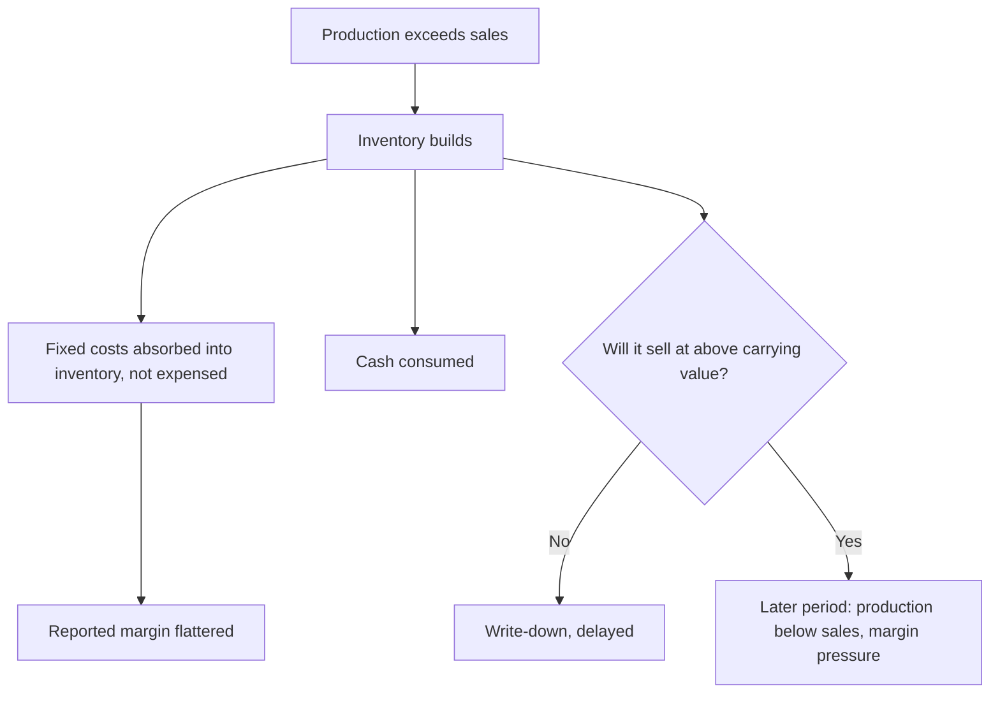

# Inventory Analysis and Valuation

## The Problem / Why this matters
Inventory sits between the income statement and the cash flow statement and can distort both. It is valued at cost or net realisable value, whichever is lower — a test involving judgement — and it absorbs cash while flattering reported profit when it builds. Rising inventory is one of the earliest and most reliable warning signals of demand weakness or obsolescence, and it appears in the balance sheet before it appears in revenue.

## Core Idea
Inventory is a **claim about future sales**. Every rupee of it asserts that the goods will be sold at above their carrying value, and rising inventory days is that assertion becoming less credible.

## Why it works this way
Production costs are capitalised into inventory and released to the P&L only when the goods are sold. A company producing more than it sells therefore reports better margins than its actual demand justifies, because fixed costs are absorbed into unsold stock rather than charged against revenue. The correction arrives later, as either a write-down or a period of production below sales.

## Full technical content

### The metrics

| Metric | Construction | Reading |
|---|---|---|
| **Inventory days** | (Inventory ÷ COGS) × 365 | The headline measure; compare to history and peers |
| **Inventory turnover** | COGS ÷ average inventory | The inverse; same information |
| **Days by component** | Raw material, WIP, finished goods separately | Where the build is located tells you the cause |
| **Inventory growth vs revenue growth** | Direct comparison | Inventory growing faster is the warning |
| **Write-downs** | Disclosed in the notes | The delayed admission |

**The component split is the most informative and most skipped step.** The disclosure separates raw material, work in progress and finished goods, and each build means something different:

- **Raw material rising** — either input prices rose, or the company is stocking ahead of an expected price increase or supply disruption. Often benign, sometimes a bet.
- **Work in progress rising** — production bottlenecks, or a longer production cycle from a mix change.
- **Finished goods rising** — the serious one. Goods are made and not sold. This is a demand signal.

### Interpreting a build

The essential question: is this **deliberate and productive** or **involuntary**?

**Potentially benign explanations:**
- Building ahead of a **seasonal peak** — check whether the same build occurred in the same quarter in prior years.
- Stocking ahead of an announced **price increase** in inputs.
- **New product launch** requiring pipeline fill.
- **Capacity expansion** requiring a larger working stock.
- **Supply-chain security** after a disruption — a structural shift in policy that raises steady-state inventory permanently.

**Warning explanations:**
- **Demand weakness** with production not yet adjusted.
- **Obsolescence** accumulating in slow-moving stock.
- **Channel refusal** — the trade is not accepting more stock, which links to the primary-versus-secondary analysis.
- **Deliberate production for absorption** — running plants to absorb fixed costs and report better margins, which the operating leverage chapter explains and which is a real practice in capital-intensive industries.

**The distinguishing evidence:** management commentary with a specific reason, the same pattern in prior years, and whether the build reverses in the following quarter. **A build that persists for three or more quarters with an explanation that changes each time is a demand problem.**

### Valuation methods and comparability

Inventory is carried at the lower of cost and net realisable value. The cost formula matters for comparability:

- **FIFO** — first in, first out. In a rising-cost environment, older cheaper costs flow to COGS, raising reported margins and leaving inventory carried near current cost.
- **Weighted average** — smooths the effect.
- **LIFO** is not permitted under Indian standards but is permitted under US GAAP, which is a specific cross-market comparability issue as the accounting-standards chapter notes.
- **Standard costing** with variance treatment, used in manufacturing.

**Where methods differ, gross margins are not directly comparable** in a period of significant input price movement. Check the policy note.

### The net realisable value test and write-downs

The judgement that produces the surprise:
- Inventory must be written down where its net realisable value is below cost.
- **This test depends on management's view of future selling prices**, which creates the same optimism problem as the goodwill impairment test.
- **Write-downs are therefore late**, arriving when the position is undeniable.
- **Watch for a pattern**: repeated write-downs indicate systematic over-production or persistent obsolescence, and a management that keeps being surprised by its own inventory.

**Sector-specific obsolescence risk:**

| Sector | Risk |
|---|---|
| **Fashion and apparel** | Season-specific; unsold stock loses value rapidly |
| **Technology and consumer electronics** | Rapid product cycles |
| **Pharmaceuticals** | Expiry dates; batch-level shelf life |
| **Food and FMCG** | Shelf life; near-expiry stock discounted heavily |
| **Automobiles** | Model-year changes; dealer inventory is the visible version |
| **Commodities** | Price risk rather than obsolescence, but mark-downs are large and fast |

### Inventory and the cash flow statement

- **An inventory build consumes cash**, which is why the cash-versus-profit check catches it. A company reporting strong profit with weak operating cash flow, where the gap is inventory, is producing goods it has not sold.
- **Growth legitimately consumes inventory investment** — the question, as always, is whether inventory *days* are stable (growth) or rising (a problem).
- **Year-end figures may be managed.** Production can be timed, and purchases deferred, to present a better year-end position. **Compare year-end to year-end and be aware that the year-end figure is the most likely to be flattered.**

### Commodity inventory and price risk

For companies holding price-sensitive inventory:
- **Inventory gains and losses** can dominate reported earnings in a volatile period, and are not operating performance. Refiners, metals traders and jewellery retailers are the clearest cases.
- **Separate inventory gain from operating margin** in the analysis, because one is a windfall and the other is the business.
- **Hedging** — check whether the company hedges inventory price risk, which changes the earnings pattern exactly as currency and input hedges do.
- **A rising price environment flatters earnings** through inventory gains, and analysts extrapolating those margins repeat the peak-cycle error in a different form.

### Building it into the analysis

1. **Track inventory days quarterly**, by component where disclosed.
2. **Compare inventory growth to revenue growth** — divergence is the signal.
3. **Read the write-down disclosure** and track it across years.
4. **Ask about it on the call** where a build is unexplained; management usually answers, and the quality of the answer is informative.
5. **Model the correction** — where a build looks involuntary, forecast a period of production below sales, with the associated margin pressure from under-absorbed fixed costs.
6. **Separate inventory gains** from operating margin in commodity-exposed businesses.

## Common mistakes
- Looking at total inventory without the **component split**.
- Reading a **seasonal build** as a demand problem, or vice versa.
- Missing the **fixed-cost absorption** effect flattering margins during a build.
- Assuming write-downs are timely.
- Comparing gross margins across companies using **different cost formulas** in a volatile input environment.
- Comparing a **year-end inventory figure to a mid-year** one.
- Treating **inventory gains** in commodity businesses as operating performance.
- Confusing growth-driven inventory rupees with rising inventory **days**.

## Interview angle
"Inventory days rose from 62 to 89. What do you do?" Split it first, because the component tells you the cause: raw material building may be stocking ahead of a price increase or supply disruption, work in progress suggests a production bottleneck or mix change, but finished goods building is the serious one because it means goods are made and not sold. Then test whether it is deliberate or involuntary — check whether the same build appears in this quarter in prior years, whether management gave a specific reason, and critically whether it reverses next quarter, since a build persisting three quarters with a different explanation each time is a demand problem. Add the margin point that most people miss: while inventory is building, fixed production costs are being capitalised into stock rather than expensed, so the reported margin is flattered during exactly the period the problem is developing — and the correction comes later as either a write-down or a stretch of producing below sales with under-absorbed fixed costs. Finish with the cash check: an inventory build shows up as profit without operating cash flow, which is why comparing cumulative CFO to cumulative PAT catches it.
