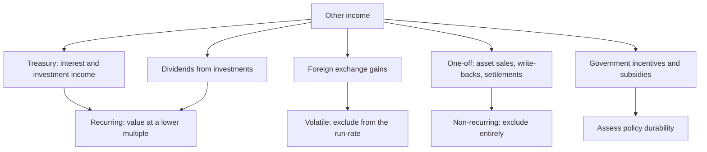

# Other Income, Treasury and the Quality of the Bottom Line

## The Problem / Why this matters
"Other income" is the least examined line in the P&L and one of the most revealing. For a cash-rich company it can be a substantial share of profit before tax; for a company under stress it is where one-off gains are parked to support reported earnings. Because it sits below EBITDA and above PAT, it flows into EPS, P/E and every earnings-based valuation while contributing nothing to the operating business's worth. Decomposing it is a five-minute exercise that regularly changes the assessment of a company's earnings quality.

## Core Idea
Separate **operating earnings from non-operating income**, and value each appropriately — recurring treasury income on a company's actual cash balance is worth something, but not the same multiple as operating profit, and one-off gains are worth nothing on a forward basis.

## Why it works this way
A P/E multiple embeds an expectation about the growth and durability of the earnings stream. Interest on a cash pile does not grow with the business and disappears if the cash is spent; a gain on an asset sale does not recur at all. Applying a single multiple to a blended earnings figure therefore overvalues the non-operating component systematically.

## Full technical content

### Decomposing the line

The notes disclose the composition of other income. What to look for:

| Component | Character | Treatment |
|---|---|---|
| **Interest on deposits and bonds** | Recurring while the cash exists | Value the cash on the balance sheet, not the income stream, to avoid double-counting |
| **Gains on mutual fund and investment holdings** | Partly mark-to-market, volatile | Normalise; do not extrapolate a good market year |
| **Dividend income** | Recurring if the stake is held | Relates to an asset that should be valued separately |
| **Foreign exchange gains/losses** | Volatile, often reversing | Exclude from the run-rate; check whether operating or translation |
| **Profit on sale of assets** | One-off | Exclude entirely |
| **Provision write-backs** | One-off, and worth investigating | Exclude; ask why the provision was made and why reversed |
| **Government grants and incentives** | Recurring while the scheme lasts | Assess policy durability and expiry |
| **Insurance claims received** | One-off | Exclude; note the underlying event |
| **Liabilities written back** | One-off, and a quality flag | Exclude; frequent write-backs suggest over-provisioning earlier |

### The double-counting trap

The most common valuation error involving other income:

**If you value the company's surplus cash separately** — adding net cash to the equity value, or deducting it in an enterprise value calculation — **you must exclude the interest income that cash generates from the earnings you capitalise.** Otherwise the same cash is counted twice: once as an asset and once as the earnings stream it produces.

**The two consistent approaches:**
1. **Value operating earnings at an operating multiple, then add net cash separately.** Requires stripping treasury income out of earnings.
2. **Value total earnings including treasury income at a blended multiple**, and do not add cash separately.

The first is cleaner and more informative, since it makes the cash position visible and lets a reader form their own view about whether the cash will ever be deployed or returned. **State which approach you used.**

### The cash-hoard question

Many Indian companies hold cash far in excess of operating requirements, and how to treat it is a genuine judgement:

- **Cash earning a deposit rate is earning below the cost of equity**, so it dilutes return on equity and, held indefinitely, destroys value in the sense that shareholders could deploy it better themselves.
- **The market frequently discounts excess cash** rather than valuing it at par, precisely because of doubts about whether it will ever be returned. **This is legitimate, and applying a discount to cash where the company has a long record of hoarding is defensible** — but it should be stated rather than done silently.
- **The questions that determine the discount:** is there a stated capital-allocation policy? Has the company ever returned meaningful capital? Is the cash earmarked for a specific announced use? Is it held at the parent or trapped in subsidiaries, per the consolidated-versus-standalone analysis?
- **Promoter-controlled companies with large cash and no distribution** raise a governance question rather than merely a capital-allocation one.

### Exceptional and extraordinary items

Presented separately, and requiring judgement rather than automatic exclusion:

- **Genuinely one-off items** — a large legal settlement, a natural disaster loss — should be excluded from the run-rate.
- **"Exceptional" items that recur every year are not exceptional.** Restructuring charges taken annually for five consecutive years are an operating cost of a business that is perpetually restructuring, and should be treated as such.
- **Check both directions.** Companies are more willing to exclude losses than gains from adjusted figures, and an adjusted-earnings presentation that only ever removes negatives is not a neutral measure.
- **The analyst's own adjusted figure should be symmetric** and its basis stated.

### Government incentives — a specific Indian issue

Export incentives, state industrial subsidies, and production-linked incentives can be a substantial share of profit for some companies.

- **Check where they are booked** — in other income, or netted against costs. The presentation affects reported operating margins materially and differs across companies, which breaks peer comparability.
- **Assess durability**: schemes have defined periods and can be modified or withdrawn.
- **Where a company's profitability depends on an incentive**, the sustainable earnings power without it should be computed and disclosed in the note, because that is the base a buyer of the business would use.
- **Timing of receipt versus recognition** — incentives recognised but not received sit in receivables and can be delayed for years, which is a working-capital and credit-risk issue rather than an earnings one.

### Treasury operations as a risk

For companies holding large investment portfolios:
- **What is the portfolio invested in?** Debt funds, corporate bonds, equity, or structured products each carry different risk, and it is disclosed.
- **Credit risk in the portfolio** is a real exposure — companies have taken losses on corporate paper.
- **Mark-to-market volatility** flows through the P&L or OCI depending on classification, which affects reported earnings volatility.
- **A manufacturing company running a large active trading book** is a governance and competence question, not just an accounting one.

### Building it into the analysis

1. **Decompose other income** from the notes, every year.
2. **Separate recurring from one-off**, symmetrically.
3. **Compute operating profit and operating EPS** excluding non-operating income.
4. **Value the operating business on operating earnings**, and the cash and investments separately, with any discount stated.
5. **Track other income as a percentage of PBT** over time — a rising share means the operating business is contributing less than the headline suggests.
6. **Flag incentive dependence** and its expiry.

## Common mistakes
- Applying an operating **P/E to blended earnings** including treasury income.
- **Double-counting cash** — adding net cash and capitalising the interest it earns.
- Treating annually recurring **"exceptional" items** as exceptional.
- Accepting an **asymmetric** adjusted-earnings presentation.
- Extrapolating a good year's **mark-to-market** investment gains.
- Ignoring where **government incentives** are booked when comparing peers.
- Overlooking **credit risk** in a company's treasury portfolio.
- Valuing excess cash at par without assessing whether it will ever be returned.

## Interview angle
"Other income is 28% of this company's profit before tax. What does that change?" Decompose it from the notes first, because the components behave completely differently: interest and investment income is recurring while the cash exists, foreign exchange gains are volatile and often reverse, and asset sale profits and provision write-backs are one-offs that should be stripped out entirely. Then make the valuation point precisely — value the operating business on operating earnings at an operating multiple and add net cash separately, or capitalise blended earnings and do not add cash, but never both, because adding net cash while also capitalising the interest that cash earns counts the same asset twice. Add the judgement about the cash itself: a large hoard earning a deposit rate is earning below the cost of equity, and the market often discounts it rather than valuing it at par, which is defensible where the company has never returned meaningful capital — but that discount should be stated rather than applied silently. Finish with the symmetry discipline: companies exclude losses from adjusted earnings more readily than gains, and your own adjusted figure has to treat both the same way.
