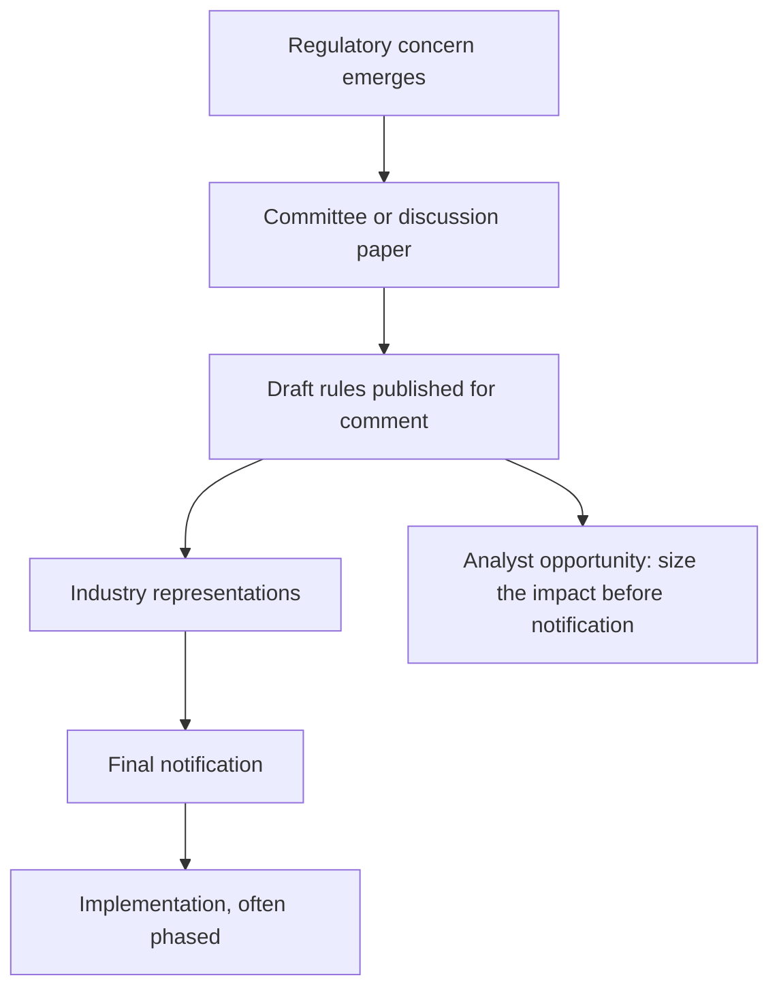

# Policy and Regulatory Risk Assessment

## The Problem / Why this matters
A regulatory decision can transform an industry's economics overnight — a tariff change, a pricing order, a lending norm, a licensing condition. Indian equity investors have repeatedly seen entire sectors re-rate or de-rate on policy, and analysts covering regulated industries spend as much time on the regulator as on the companies. The temptation is to treat policy as unforecastable and therefore ignore it; the better approach is to distinguish what can be anticipated from what cannot, and to size the exposure either way.

## Core Idea
Most regulatory change is **procedural before it is substantive** — consultation papers, draft rules, committee reports and precedent all precede the final decision — so the informed analyst has warning that the market often ignores.

## Why it works this way
Regulators in most sectors must consult, publish drafts and allow comment before finalising rules. That process is public and generates a documented trail of intent. The market frequently prices the change only at final notification, which means the interval between the draft and the notification is available to anyone reading the primary documents.

## Full technical content

### Mapping the exposure

For every covered company, establish:

| Question | Why |
|---|---|
| **Which regulators** have authority over it? | Often more than one — sectoral, competition, environmental, tax |
| **What is regulated** — price, quantity, entry, quality, or conduct? | Determines what a change can do |
| **How much of profit** depends on a regulated parameter? | Sizes the exposure |
| **What is the review cycle** — is there a periodic tariff or price review? | Creates dated events |
| **What precedent exists** for similar decisions? | The best available predictor |

**Price regulation is the most consequential**, since it directly sets the revenue line. Quantity and entry regulation shape the competitive structure over longer periods. Conduct regulation typically raises costs.

### The forecastable and the unforecastable

**Reasonably forecastable:**
- **Scheduled reviews** — tariff orders, periodic price revisions, licence renewals. These have dates.
- **Draft rules already published**, where the direction is stated and only the final calibration is uncertain.
- **Phased implementation** of announced changes, where the schedule is public.
- **Precedent-driven outcomes** where a regulator has decided similar matters before.
- **Court and tribunal timelines**, in broad terms.

**Not forecastable:**
- Sudden policy responses to a crisis or a scandal.
- Political decisions driven by electoral considerations.
- The specific calibration of a new rule before consultation.

**The discipline is to treat the two differently.** Build the forecastable into the model with dates and scenarios; handle the unforecastable through sizing and by identifying which sectors carry structurally higher policy risk, rather than pretending to predict it.

### Reading the process

The primary sources, all public and mostly unread:

- **Discussion and consultation papers**, which state the regulator's thinking and the options considered.
- **Draft regulations** with the specific proposed text.
- **Industry association representations**, which reveal what the industry fears most — often the sharpest available summary of the real impact.
- **Final orders with reasoning**, which explain how the regulator weighed the arguments and therefore how it may decide next time.
- **Committee and working group reports**, which frequently precede rule-making by a year or more.
- **Regulatory speeches and annual reports**, which signal priorities.

**The most valuable single habit** is reading the regulator's stated reasoning in past orders. It reveals the framework being applied, which is far more predictive of future decisions than commentary about them.

### Sizing the impact

Where a change is proposed, quantify rather than describe:

1. **Identify the parameter** affected and the company's exposure to it.
2. **Compute the sensitivity** — a 50bp change in a mandated rate, a 10% tariff cut, a cap at a specified level.
3. **Model the scenarios**: as proposed, as likely modified after representations, and unchanged.
4. **Probability-weight**, with the basis stated.
5. **Check the transition provisions** — grandfathering and phasing often reduce the immediate impact substantially, and are frequently overlooked in the initial market reaction.
6. **Consider second-order effects** — a rule that hurts an industry's margins may drive consolidation, which helps survivors. **The first-order impact is priced quickly; the second-order effects are where the analysis adds value.**

That last point is where a differentiated view most often comes from in regulated sectors.

### Sector patterns

| Sector | Principal policy exposure |
|---|---|
| **Banks and NBFCs** | Prudential norms, provisioning, capital requirements, lending caps, rate regulation |
| **Pharmaceuticals** | Price control on scheduled formulations; approval regimes in export markets |
| **Utilities and power** | Tariff orders, fuel supply, renewable obligations |
| **Telecom** | Spectrum, licence fees, interconnect, tariff intervention |
| **Insurance** | Product regulation, distribution rules, capital requirements |
| **Oil and gas** | Pricing mechanisms, subsidy sharing, exploration terms |
| **Mining** | Auction terms, royalties, environmental clearances |
| **Real estate** | Development regulation, project registration and disclosure rules |
| **Internet platforms** | Data, content, competition and payment regulation |
| **PSUs** | Government as controlling shareholder and policy-maker simultaneously |

### The government-as-shareholder problem

For PSUs, an additional dimension covered in the PSU chapter and worth restating here: the controlling shareholder sets policy affecting the company, and its objectives may include fiscal, social or political goals rather than shareholder value. **Dividend and buyback decisions may reflect the government's fiscal needs; pricing decisions may reflect inflation management.** This is not a governance failure in the usual sense — it is a structural feature that a minority investor must price rather than protest.

### How it enters the recommendation

- **State the exposure explicitly**, quantified — what proportion of profit depends on a regulated parameter.
- **Give scenarios with probabilities**, not a single assumption.
- **Include scheduled regulatory events** in the catalyst calendar.
- **Use a higher discount or a lower multiple** where policy risk is genuinely elevated — but justify it with the specific exposure rather than a general assertion.
- **Distinguish the sector view from the stock view**: policy usually affects all participants, so the analytical question is often who is best positioned to absorb it, not whether the sector is affected.

That reframing — from "is this bad for the sector" to "who survives it best" — is what turns policy analysis into stock selection.

## Common mistakes
- Treating policy as unforecastable and therefore ignoring the **consultation trail**.
- Reacting only at **final notification**, when drafts were public months earlier.
- Describing an impact rather than **quantifying** it.
- Ignoring **grandfathering and phasing** provisions.
- Missing **second-order effects** such as consolidation, where the differentiated view usually lies.
- Applying a vague "regulatory risk" discount without specifying the exposure.
- Forgetting that policy usually affects **all participants**, so relative positioning is the question.
- Ignoring that in PSUs the controlling shareholder is also the policy-maker.

## Interview angle
"A draft regulation would cap fees in a sector you cover. How do you handle it?" Treat it as a process with a documented trail rather than an event: read the consultation paper for the regulator's stated reasoning, read the industry representations to see what the sector itself thinks the real impact is, and look at how this regulator has decided similar matters before, because past orders reveal the framework being applied and that is more predictive than commentary. Then quantify rather than describe — compute what proportion of profit depends on the capped parameter, model the outcome as proposed, as likely modified after representations, and unchanged, probability-weight them, and check the transition provisions, since grandfathering and phasing frequently reduce the near-term impact far more than the initial reaction assumes. Finish with the reframing that produces a stock call rather than a sector view: the rule affects every participant, so the question is who absorbs it best — who has the scale, the mix or the balance sheet to survive it — and the second-order consequence, often consolidation that benefits the survivors, is where the differentiated view usually sits because the first-order impact gets priced within hours.
