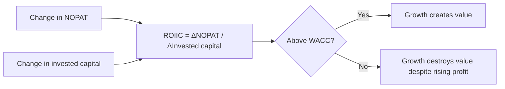

# Return on Incremental Invested Capital

## The Problem / Why this matters
Reported RoCE is an average across all the capital a company has ever deployed, including investments made decades ago under different conditions. It tells you about the past. What determines future value creation is the return on the capital being deployed *now* — and that number can be far below the average while the average still looks healthy, because good legacy assets mask poor new investment for years. Companies destroying value at the margin frequently continue reporting respectable headline returns throughout.

## Core Idea
**Return on incremental invested capital (ROIIC)** measures what new capital earns. It is the number that determines whether growth creates or destroys value, and it deteriorates before average returns do.

## Why it works this way
Average return is a weighted blend of old and new investment. A company with a large base of high-return legacy assets can invest new capital at 6% for several years while its reported RoCE, dominated by the legacy base, declines only gradually. The incremental measure isolates the new decisions, which is what management is actually being judged on.

## Full technical content

### The calculation

**ROIIC = Change in NOPAT ÷ Change in invested capital**

Where:
- **NOPAT** = EBIT × (1 − effective tax rate)
- **Invested capital** = net fixed assets + net working capital + goodwill and intangibles (or, equivalently, total debt + equity − non-operating cash)

**Practical construction:**
- Measure over **multiple years, not one**. Single-year ROIIC is extremely noisy because investment and its returns are not contemporaneous.
- A common approach is a **rolling three- or five-year measure**: (NOPAT in year t − NOPAT in year t−3) ÷ (Invested capital in year t−1 − Invested capital in year t−4), lagging the capital to allow for the gestation period.
- **Choose the lag to match the business.** A retailer's new store contributes within a year; a cement plant takes three to four. Using a one-year lag for a long-gestation business will show terrible ROIIC for a perfectly good project.

**Be explicit about the lag chosen and why** — the measure is sensitive to it, and a reader deserves to know.

### Reading the result

| ROIIC versus WACC | Interpretation |
|---|---|
| **Well above WACC** | Growth is creating value; reinvestment should be encouraged |
| **Approximately equal** | Growth is value-neutral; the company should be indifferent between reinvesting and returning capital |
| **Below WACC** | **Growth is destroying value** even while revenue and profit rise |
| **Negative** | New capital is producing no incremental profit at all |

**The critical insight for valuation:** a company growing rapidly with ROIIC below its cost of capital should be valued *lower* for growing faster, not higher. This is counterintuitive to most narrative-driven analysis and is one of the clearer places where a rigorous framework contradicts the market's instinct.

### Where the average conceals the marginal

The specific situations where this matters most:

- **A high-quality legacy business funding expansion into a poorer one.** A branded consumer company with 40% RoCE in its core, deploying capital into a commodity adjacency at 9%, reports a declining but still-good RoCE for years while destroying value at the margin.
- **Serial acquirers.** As the goodwill chapter shows, comparing RoCE with and without goodwill quantifies acquisition value destruction — ROIIC does the same thing prospectively and earlier.
- **Capacity expansion into an oversupplied market**, which the capex chapter treats: the project appears in incremental capital immediately and in incremental profit never.
- **Vertical integration** justified by strategic logic rather than returns. Ask what the integrated capital earns.
- **Diversification** into unrelated businesses, where ROIIC is usually the fastest way to demonstrate that the strategic rationale is not producing returns.

### The reinvestment rate and growth

The relationship that connects ROIIC to valuation directly:

**Sustainable growth = Reinvestment rate × ROIIC**

This means:
- A company earning 25% on incremental capital and reinvesting 60% of NOPAT can grow at 15%.
- A company earning 8% and reinvesting 60% grows at under 5% — and destroys value doing it, if its cost of capital is above 8%.
- **A company with high ROIIC but limited reinvestment opportunity should return capital**, and doing so is good capital allocation rather than an admission of low growth. This is the correct framing for evaluating a high-return business with a modest growth rate, which the market frequently under-appreciates.

**In a DCF, this relationship should be internally consistent**: the growth rate assumed must be supportable by the reinvestment rate and the return on that reinvestment. **A model assuming high growth with low capex and a stable asset turnover is asserting an implausible free lunch**, and checking this consistency is one of the more effective model audits available.

### Practical cautions

- **Noisy in any single year**, especially for lumpy-capex businesses. Always use multi-year measures.
- **Acquisitions distort it** — a large acquisition adds invested capital immediately and consolidated profit from the acquisition date, which can flatter or depress the measure depending on timing. Consider computing it excluding acquisitions to isolate organic reinvestment.
- **Working capital swings** move invested capital without representing a strategic investment decision; consider a version using fixed capital only for capital-intensive businesses.
- **Not meaningful for financial companies**, where the capital structure is the business — use return on equity and its decomposition instead.
- **Asset-light businesses** can show enormous or undefined ROIIC because the denominator is tiny; the measure is most useful for capital-intensive businesses where the deployment decision is large and discrete.

### Using it in research

- **Present ROIIC alongside RoCE** in the initiation and in annual updates. The gap between them is a forward-looking signal that average returns do not provide.
- **Compute it by segment** where disclosure allows, which identifies exactly where capital is going and what it earns — frequently the single most useful table in a conglomerate analysis.
- **Compare it to the company's own stated hurdle rate**, where management gives one. A company approving projects below its stated hurdle is worth asking about on a call.
- **Use it to assess capital allocation** in the management-quality assessment, since it is the most direct quantitative measure of whether management's investment decisions are working.
- **Frame the capital-return question** with it: a company earning below its cost of capital on new investment should be returning cash, and saying so with the number attached is far more persuasive than asserting it.

## Common mistakes
- Assessing capital allocation on **average RoCE**, which lags badly.
- Computing ROIIC over a **single year**.
- Using a lag that does not match the business's **gestation period**.
- Ignoring **acquisition** distortion of the measure.
- Applying it to **financial companies**, where it is not meaningful.
- Valuing a fast-growing company more highly when its **ROIIC is below WACC**.
- Building a DCF where the growth rate is **inconsistent** with the reinvestment rate and return.
- Treating a high-return company's decision to return capital as a negative.

## Interview angle
"The company's RoCE is 18% and stable. Is capital allocation good?" Point out that RoCE is an average across everything ever invested, so a strong legacy base can mask poor new investment for years — and the number that matters is what the capital being deployed now earns. Explain how you would compute it: change in NOPAT over change in invested capital, measured over three to five years rather than one because the measure is noisy annually, with the capital lagged to match the business's gestation period, which is a year for a retailer and three or four for a cement plant. Then give the conclusion that follows: if incremental returns are below the cost of capital, the company is destroying value while growing, and it should be valued *lower* for growing faster, not higher — which is the opposite of how growth is usually treated. Add the consistency check it enables in a DCF, since sustainable growth equals the reinvestment rate times the return on that reinvestment, so a model assuming strong growth with light capex and stable asset turnover is asserting a free lunch. And note the corollary: a high-return business with limited reinvestment opportunity returning capital is good allocation, not weakness.
