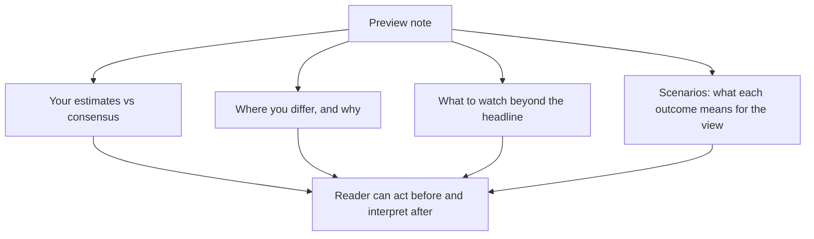

# The Pre-Results Preview Note

## The Problem / Why this matters
Results previews are among the most-read pieces an analyst produces and among the least differentiated. Most are a table of estimates with a paragraph of description, published because the calendar requires it. Yet the preview is the one moment when an analyst can say something before the market learns the answer — which makes it the piece with the highest potential value and the widest gap between what it usually is and what it could be.

## Core Idea
A preview should state **what you expect, where you differ from consensus, and what specifically to watch for** — because a preview that merely restates consensus expectations has told the reader nothing they did not have.

## Why it works this way
Consensus estimates are published and available. Reproducing them adds nothing. The value an analyst adds is either a differentiated estimate with a reason, or guidance on how to interpret the print when it arrives — which parts matter, which are noise, and what would change the view.

## Full technical content

### What a preview must contain

**1. Your estimates against consensus.** Revenue, EBITDA, PAT, and the key operating metrics for the sector. State the consensus figure and your own, and flag where the gap is material.

**2. Where you differ and why.** If your EBITDA is 7% below consensus, the reason is the note's content — a cost line others have not modelled, a volume assumption, a mix shift. **If you are in line with consensus everywhere, say so plainly and move the value to section 3 or 4.** Pretending to a differentiated view you do not have is worse than admitting alignment.

**3. What to watch beyond the headline.** Frequently the most valuable section:
- The **operating metrics** that determine whether the quarter was good, which are often not the headline numbers.
- **Balance sheet items** — inventory, receivables, debt — which do not appear in the results headline and are where problems show first.
- **Segment detail** where the aggregate conceals divergence.
- **Specific disclosures** you expect and their significance.

**4. The seasonal reference.** As the seasonality chapter requires: state the expected sequential pattern, so clients do not misread an arithmetic decline. "We expect a 14% sequential decline, against a five-year average of 18% for this quarter" converts a scary-looking print into information.

**5. What management will be asked, and what answers would matter.** This positions the reader for the call and demonstrates you know what the live questions are.

**6. Scenarios and their implications for your view.** What result would confirm the thesis, what would challenge it, and what would break it — which is the falsification discipline applied to a specific upcoming event.

That sixth element is what separates a genuinely useful preview from a competent one, and it is rare.

### Building the estimate

- **Start from the operating drivers**, not from a growth rate: volume and realisation, or headcount and utilisation, or disbursements and spreads.
- **Use the read-across** systematically — suppliers, customers, competitors and global peers who have already reported, per the read-across chapter.
- **Use published high-frequency data** — monthly production, exports, industry volumes, regulatory disclosures — which for many sectors covers most of the quarter before results.
- **Apply the seasonal profile** from historical quarterly shares.
- **Check the currency and input cost** movements over the quarter and apply the company's known hedging lag.
- **Check for one-offs** — an announced plant shutdown, a fire, a divestment, a tax item.

**For several sectors, most of the quarter is knowable before the print.** Monthly auto dispatches, cement despatch data, export figures, bank credit growth, and airline traffic are all published during the quarter. An analyst who assembles them is not forecasting so much as computing, and the preview can be genuinely precise.

### Consensus, and using it properly

- **Know what consensus actually is**, and on what basis — reported or adjusted, as the restatement chapter warns, since comparing your reported-basis estimate to a consensus adjusted figure manufactures a difference that does not exist.
- **Look at the dispersion**, not just the mean. A wide range means the market is genuinely uncertain and the print will move the stock; a tight range means expectations are settled and only a large surprise matters.
- **Know the "whisper"** — the informal expectation that has moved above or below published consensus, which is what the stock is actually priced against. Published consensus is often stale.
- **Estimate revisions in the run-up** tell you which direction expectations are moving.

### The risk of the preview

- **Being wrong publicly and specifically.** This is the cost of saying something, and it is worth paying — but it makes the reasoning quality more important, not less.
- **Anchoring yourself.** Having published an estimate, there is a pull toward defending it when the print differs. The conviction chapter's discipline applies: the estimate was a forecast, not a commitment.
- **Compliance boundaries.** A preview must rest on public information and your own analysis. **The line is crossed when a preview reflects something management told you privately** — which is the insider-trading chapter's territory, and a specific and quantified pre-result estimate that is unusually accurate invites exactly that question.

### After the print

The preview's value is completed by the review:
- **Publish promptly** — same day for a significant result.
- **Compare against your own estimate**, line by line, and say what you got wrong.
- **Answer the questions you raised** in the preview, which closes the loop for the reader.
- **State whether the thesis is intact**, using the scenarios you laid out beforehand.
- **Update the model and target** if warranted, and say if not.

**An analyst who publishes a preview with scenarios and then a review referencing those scenarios has demonstrated a process** — and that visible consistency is worth more over time than any single accurate estimate.

### Where previews add the least

Worth acknowledging honestly:
- **Where the result is essentially unforecastable** — a company with lumpy, order-driven revenue and no visibility. The honest preview says so and focuses entirely on what to watch.
- **Where the stock does not react to results** because the thesis is about something else entirely — a restructuring, a regulatory decision, an asset sale. Say that, and cover the thing that does matter.

## Common mistakes
- Publishing consensus estimates as though they were your own view.
- Omitting the **seasonal reference**, so a normal print reads as a miss.
- Focusing on the **headline** numbers when the sector's real signal is elsewhere.
- Comparing your estimate to a consensus on a **different basis**.
- Ignoring **dispersion** and the whisper number.
- Not stating **what would change your view** before the print.
- Failing to **follow up** after the result with a comparison against your own estimate.
- Defending an estimate after the print rather than updating.

## Interview angle
"What makes a good results preview?" Say that reproducing consensus adds nothing, so a preview has to do one of two things: give a differentiated estimate with the specific reason for the difference, or tell the reader how to interpret the print — which parts of the disclosure actually matter for this company, what the seasonal pattern implies so a normal sequential decline is not misread, and what balance-sheet items to check, since inventory and receivables show problems before the P&L does. Add the element that is rarest and most valuable: state in advance what result would confirm your thesis, what would challenge it and what would break it, because that is the falsification discipline applied to a dated event and it lets the client act the moment the print arrives. Mention that for many sectors most of the quarter is knowable beforehand from monthly production, dispatch, export or credit data plus read-across from peers who have already reported — so a good preview is more computation than forecast. And close the loop: publish the review the same day, compare line by line against your own estimate, and say plainly what you got wrong.
