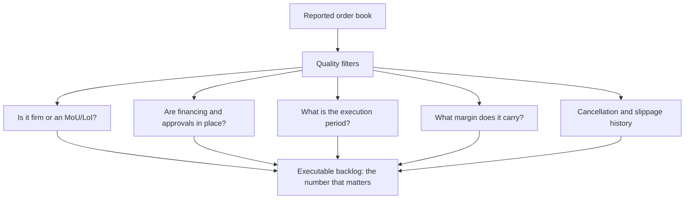

# Revenue Visibility — Order Books, Backlogs and Recurring Revenue

## The Problem / Why this matters
Two companies growing revenue at 20% can deserve very different multiples if one has three years of contracted revenue in hand and the other must win every sale afresh each quarter. Visibility reduces forecast risk, and lower forecast risk genuinely justifies a higher multiple. But visibility is frequently asserted rather than demonstrated — order books are quoted without regard to their quality, and "recurring" revenue is often nothing of the sort.

## Core Idea
Visibility is worth paying for **only to the extent the revenue is genuinely contracted, executable and profitable** — so the analysis is about the quality of the backlog, not its size.

## Why it works this way
A valuation multiple compresses expectations about future cash flows and the uncertainty around them. Contracted revenue narrows that uncertainty, which reduces the risk premium. But a contract that cannot be executed, will not be profitable, or can be cancelled provides no such reduction — it merely provides a number to quote.

## Full technical content

### Order books — the quality questions

Companies in capital goods, EPC, infrastructure, defence and shipbuilding report order books, and the headline is frequently misleading.

| Question | Why it matters |
|---|---|
| **Firm orders or letters of intent?** | LoIs and MoUs are not contracts and convert at well below 100% |
| **Is the customer's financing in place?** | An order from a customer who cannot fund it will not execute |
| **Are approvals and land secured?** | Infrastructure orders stall for years on clearances |
| **What is the execution period?** | A book covering four years is not comparable to one covering one |
| **What margin does it carry?** | Orders won in a competitive bid at low margin add revenue and no value |
| **Is there a price escalation clause?** | Fixed-price orders in an inflationary period carry cost risk |
| **What are the cancellation terms?** | And what has actually been cancelled historically |
| **How much is slow-moving?** | Old orders that have not progressed are frequently dead but still counted |

**Book-to-bill ratio** — orders received divided by revenue in the period — indicates whether the book is growing or being consumed. Above 1 means the book is building.

**Order book to revenue** — the book divided by trailing revenue — gives years of visibility, and is the more useful comparison across companies. But it must be read against the **execution period**, since a book that takes five years to execute provides less annual visibility than the ratio suggests.

**The single best check is history**: what proportion of the order book announced three years ago actually converted into revenue, and over what period? A company with a record of slow conversion deserves a discount on its stated book, and this is computable from published data.

### The warning signs in a growing book

- **Book growing while revenue stagnates** — orders are being won but not executed, which points to execution capacity, financing or approval problems.
- **Unbilled revenue rising** — work performed but not yet invoiced, which the capital goods chapter flags as an early warning of disputes or milestone failures.
- **Receivable days rising** alongside book growth — execution is happening but collection is not.
- **Aggressive bidding** to build the book — check margins on new orders where disclosed, since a book built at low margin is a revenue commitment without a profit commitment.
- **Concentration** in a few large orders or one customer, which makes the book fragile.

### Recurring revenue — separating the real from the labelled

"Recurring revenue" is a valuable characteristic and a frequently abused label. The tests:

**Genuinely recurring:**
- **Contractual with automatic renewal** and a demonstrable retention rate.
- **Embedded in the customer's operations** so switching is costly and disruptive.
- **Consumables tied to installed equipment** — the razor-and-blade structure, where the installed base creates a genuine annuity.
- **Regulatory or compliance-driven** purchases the customer cannot discontinue.
- **Maintenance and service contracts** on installed equipment.

**Not genuinely recurring, despite the label:**
- **Repeat purchases by habit** with no contract and no switching cost.
- **Multi-year contracts with termination-for-convenience clauses**, which are annual contracts with extra words.
- **Revenue that has recurred historically** in a market where a new entrant could take it.

**The evidence that settles it:** disclosed **retention or renewal rates**, and **cohort behaviour** — whether customers acquired in earlier years still spend, and how much. Where a company claims recurring revenue and discloses no retention metric, the claim is unverified.

### The installed base as an annuity

For equipment businesses, the installed base is frequently worth more than the equipment sales:
- **Spares and consumables** attached to installed units.
- **Service and maintenance contracts.**
- **Replacement cycle** — the installed base generates a predictable future replacement demand.
- **The economics are usually far better** than the original equipment sale, since the customer's switching cost is high once the equipment is installed.

**Analytically:** track the installed base and the revenue per installed unit as separate drivers. A company whose equipment sales are cyclical but whose service revenue grows steadily has a much more stable business than the headline suggests, and the two streams deserve different multiples in a sum-of-the-parts.

### Visibility and the multiple

How much is it worth?
- **Genuine multi-year contracted revenue with adequate margins** justifies a premium, because it lowers forecast risk.
- **The premium should be smaller than practitioners often assume** where the contracts are low-margin, where execution risk is high, or where the customer concentration is severe.
- **Visibility without profitability is worth little.** An EPC company with four years of order book at 4% margins and heavy working-capital intensity is not a low-risk business.
- **Ask what happens after the visible period.** A business with three years of visibility and no pipeline beyond it has a cliff, and a DCF that assumes perpetual continuation is asserting something the order book does not support.

### Building it into the model

1. **Model the backlog conversion** explicitly — opening book, plus orders won, less revenue executed, equals closing book. This forces internal consistency.
2. **Apply a conversion haircut** based on the company's own history.
3. **Model margins by order vintage** where disclosed, since orders won in a competitive period carry lower margins that appear in results years later.
4. **Track unbilled revenue and receivable days** as monitorables alongside the book.
5. **For recurring revenue, model retention explicitly** rather than assuming continuation.
6. **State the visibility period** in the note and what is assumed beyond it.

## Common mistakes
- Quoting the **headline order book** without the quality filters.
- Counting **LoIs and MoUs** as firm orders.
- Ignoring the **execution period** when computing years of visibility.
- Missing a **book growing while revenue stagnates**.
- Accepting "**recurring revenue**" without a disclosed retention metric.
- Treating **termination-for-convenience** multi-year contracts as multi-year.
- Valuing visibility without checking the **margins** it carries.
- Assuming perpetual continuation beyond the visible period with no pipeline evidence.
- Ignoring **unbilled revenue** as an early warning.

## Interview angle
"The company has an order book worth three years of revenue. How much comfort does that give you?" It depends entirely on quality, so go through the filters: whether the orders are firm contracts or letters of intent, whether the customers' financing and approvals are in place, what execution period the book covers — since a book taking five years to execute gives less annual visibility than the ratio implies — and above all what margin it carries, because an order book won through aggressive bidding is a revenue commitment without a profit commitment. Then give the check that settles it: look at what proportion of the order book announced three years ago actually converted into revenue and over what period, which is computable from published data and tells you what haircut this company's stated book deserves. Add the warning signs to monitor alongside it — a book growing while revenue stagnates points to execution or approval problems, and rising unbilled revenue signals milestone or dispute issues before anything appears in the P&L. Close on valuation: visibility genuinely lowers forecast risk and deserves a premium, but visibility without profitability is worth very little.
