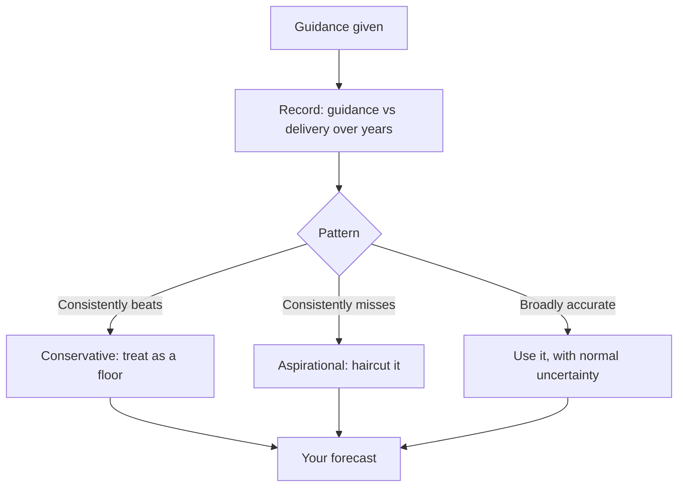

# Understanding and Using Management Guidance

## The Problem / Why this matters
Guidance is the most influential single input into most analysts' forecasts and the least examined. Analysts anchor on it, consensus clusters around it, and stocks move on changes to it — yet its reliability varies enormously by company and is measurable from history. Treating all guidance as equally credible is the default and is a straightforward analytical failure, because the record of who delivers is public.

## Core Idea
Guidance is **a management statement with a track record**, and that record is the input that matters. Build a company-specific credibility assessment from history rather than applying guidance uniformly.

## Why it works this way
Managements have different philosophies about guidance — some deliberately guide conservatively to beat, others guide aspirationally to support the narrative. Both are rational strategies, and both are visible in the historical pattern of guidance versus delivery. An analyst who has that record can adjust guidance systematically rather than accepting it.

## Full technical content

### Building the credibility record

The work that makes guidance usable, and it is a one-off exercise per company:

1. **Collect every piece of guidance** given over the past five years — from transcripts, presentations and press releases.
2. **Record what was actually delivered** against each.
3. **Compute the pattern**: average beat or miss, and consistency.
4. **Note how guidance was revised** during each year — early cuts, late cuts, or none.
5. **Track what happened when guidance was missed** — was it acknowledged, explained, or quietly dropped?

**The output is a credibility multiplier** you apply to future guidance. A management that has beaten its own revenue guidance in nine of ten years is telling you something different from one that has missed in seven.

**The pattern of revision within the year is especially informative.** A company that guides high in the first quarter and cuts in the third every year has a consistent behavioural pattern, and an analyst who knows it can position ahead of the predictable cut.

### Types of guidance and their reliability

| Type | Typical reliability |
|---|---|
| **Revenue or volume growth** | Moderate; depends on demand, which management does not control |
| **Margin** | Better, since cost is more controllable |
| **Capex** | Usually reliable on direction, frequently understated on quantum and slipped on timing |
| **Capacity commissioning dates** | Systematically optimistic across almost all companies |
| **Cost savings from a programme** | Frequently achieved on gross terms and offset elsewhere — check net |
| **Debt reduction targets** | Reliable where there is a defined asset sale, otherwise aspirational |
| **Long-term aspirational targets** (3–5 years) | Weakly informative about outcomes; informative about intent |

**Commissioning dates deserve a standing haircut.** The capex chapter's point applies: assume a slip relative to guidance as the base case, because that is what the historical record across companies supports.

### Reading what guidance signals

Beyond the number itself:

- **Guiding for the first time** signals confidence in visibility.
- **Withdrawing guidance** is a significant negative — it means management has lost confidence in its own forecast, and the stated reason matters.
- **Widening the range** signals rising uncertainty.
- **Narrowing the range** mid-year signals the outcome is becoming clear, and the direction of the narrowing tells you which way.
- **Changing the metric guided** is a warning — a company that guided on revenue growth and now guides on order intake has changed the subject, which the disclosure-quality chapter treats as a red flag.
- **Refusing to guide** where peers do is a choice worth asking about.

### The strategic uses of guidance by management

Understanding the incentives makes the record interpretable:

- **Conservative guidance to beat** builds a record of delivery and supports credibility — a rational long-term strategy, and companies following it often deserve the premium they receive.
- **Aspirational guidance** supports the equity story, may be tied to management incentives, and works until it does not.
- **Guidance ahead of an equity raise** deserves particular scrutiny, since the incentive is obvious.
- **Guidance tied to management compensation** — check whether the guided metrics are the ones that determine variable pay, which the ESOP chapter treats as a governance signal.

**The last two are legitimate questions to raise in a note**, factually and without insinuation: stating that the guided targets coincide with the incentive metrics is an observation, not an accusation.

### Using guidance in the forecast

- **Do not simply adopt it.** An analyst whose forecast equals guidance has added nothing and cannot be differentiated by construction.
- **Adjust by the credibility record** — apply a systematic haircut or uplift derived from history, and state that you have done so.
- **Build your own bottom-up forecast** from operating drivers, then compare it to guidance. Where they differ materially, that gap is either your differentiated view or an error in your model, and resolving which is the analytical work.
- **Model the guided scenario as one case** among your scenarios, not as the base case by default.
- **State explicitly in the note** where you are above or below guidance and why — this is one of the clearest ways to demonstrate a differentiated view.

### The consensus interaction

- **Consensus clusters around guidance**, which means being differentiated usually requires disagreeing with guidance.
- **That is uncomfortable**, since management will push back and the analyst is exposed if wrong — which is precisely why the differentiated position is available.
- **The strongest form of a differentiated call** is a well-evidenced argument that guidance will not be met, with the specific reason identified. The worked short case in an earlier chapter is exactly this structure.
- **Estimate revisions follow guidance changes**, so anticipating a guidance change is anticipating the revision cycle, which the consensus chapter treats as serially correlated and therefore tradeable.

### Guidance in the Indian context

- **Formal quantitative guidance is less common** than in some markets, with IT services being the notable exception where explicit annual revenue growth guidance is standard.
- **Qualitative guidance is prevalent** — "we expect demand to improve in the second half" — and is harder to score. **Build a record anyway**, converting qualitative statements into directional predictions and checking them, which is more work and more valuable precisely because fewer people do it.
- **Capacity and capex guidance is common** across manufacturing and is where the slippage record is most useful.
- **Regulatory constraints** limit what can be said selectively, so guidance is generally given publicly — which means the record is fully reconstructible from transcripts.

## Common mistakes
- Adopting guidance as the **base case** without adjustment.
- Applying the same credibility to **all companies' guidance**.
- Ignoring the **within-year revision pattern**, which is often highly consistent.
- Accepting **commissioning dates** without a slippage haircut.
- Missing a **change in the metric guided** as a red flag.
- Treating **withdrawn guidance** as neutral.
- Not building a record for **qualitative** guidance, where the effort is repaid most.
- Failing to state in the note where you are above or below guidance and why.

## Interview angle
"Management guides to 15% revenue growth. What do you do with that?" Say that guidance is a statement with a track record and the record is what matters, then describe building it: collect every piece of guidance over the past five years from transcripts and presentations, record what was actually delivered, and compute both the average beat or miss and — more usefully — the within-year revision pattern, since a company that guides high in the first quarter and cuts in the third every year is behaving consistently and you can position ahead of it. Apply the resulting credibility adjustment explicitly rather than adopting the number. Then make the point about differentiation: consensus clusters around guidance, so an analyst whose forecast equals guidance cannot be differentiated by construction — the value comes from building a bottom-up forecast from operating drivers and then investigating any material gap against guidance, because that gap is either your differentiated view or an error in your model. Add the types that need standing haircuts, particularly capacity commissioning dates, which are systematically optimistic across almost all companies, and note that withdrawn guidance is a significant negative because management has lost confidence in its own forecast.
