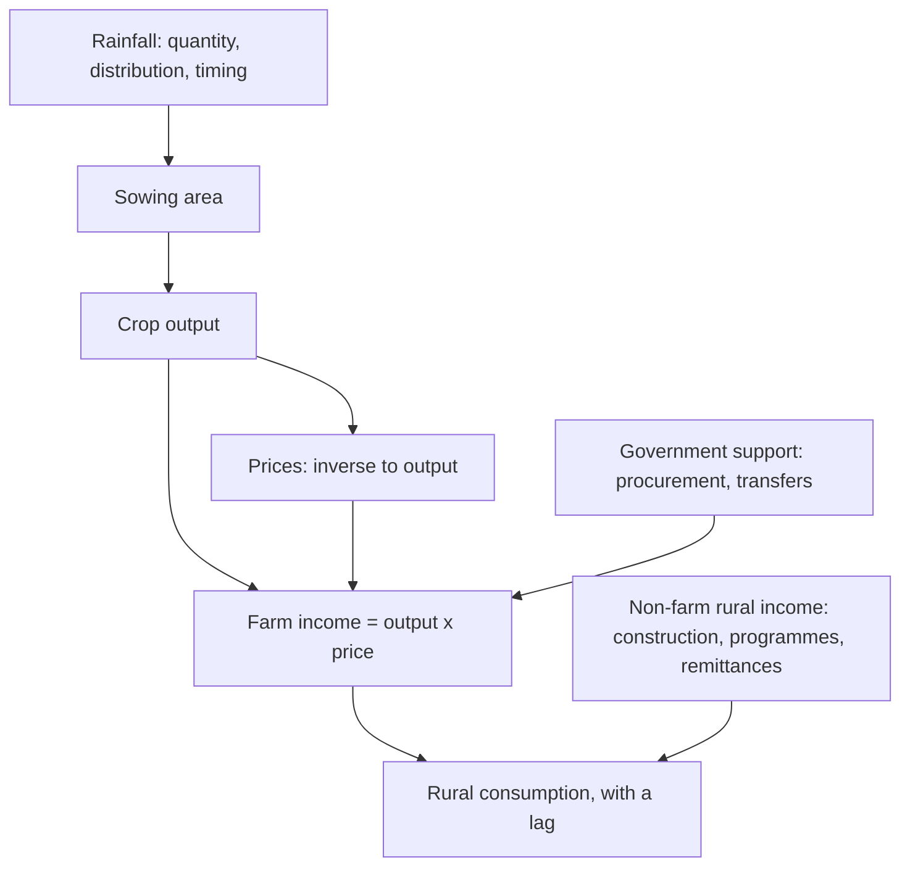

# Monsoon, Rural Demand and Agricultural Linkages

## The Problem / Why this matters
A large share of Indian consumption originates outside the major cities, and a substantial part of that demand is linked to agricultural incomes. The monsoon therefore affects the earnings of companies that appear to have nothing to do with farming — two-wheeler makers, consumer staples, paint companies, gold jewellers, small-ticket lenders. Analysts covering these sectors are asked about the monsoon constantly, and the common answers ("a good monsoon means good rural demand") are too coarse to be useful.

## Core Idea
The transmission from rainfall to consumption runs through **crop output, prices, farm incomes and sentiment**, with lags at each stage — so rainfall alone is a weak predictor, and the intermediate variables are both more informative and independently observable.

## Why it works this way
Rainfall affects output, but output affects income only through prices, and prices move inversely to output. A bumper harvest can depress prices enough that farm incomes do not rise. Meanwhile non-farm rural income — construction, government programmes, remittances — is a large and growing share of rural earnings that has nothing to do with rain at all.

## Full technical content

### What matters about the monsoon

Rainfall quantity is the headline and the least informative element:

| Factor | Why it matters |
|---|---|
| **Distribution across regions** | National average rainfall conceals regional drought; agriculture is regional |
| **Temporal distribution** | Rain at sowing and at critical growth stages matters; the same total delivered at the wrong time is useless or harmful |
| **Onset timing** | A delayed onset delays sowing and can shift the whole cycle |
| **Excess rain** | Damages standing crops; floods are as harmful as drought |
| **Reservoir levels** | Determine irrigation availability for the following rabi season — the forward-looking indicator |
| **Irrigation coverage** | The proportion of area irrigated determines dependence on rain at all |

**Irrigation coverage is the structural point that most commentary misses.** A meaningful share of cropped area is irrigated, which reduces monsoon dependence materially relative to the historical relationship — so applying old rainfall-to-demand relationships overstates the sensitivity.

### The intermediate variables — better than rainfall

Each is published and each is closer to the outcome than rainfall:

1. **Sowing area** — published weekly during the season by crop. The first hard data on farmer response.
2. **Reservoir levels** — published weekly, and forward-looking for the rabi crop.
3. **Crop production estimates** — published in stages through the season.
4. **Mandi prices** — daily wholesale prices by crop and market, the direct input to farm income.
5. **Minimum support prices and procurement volumes** — policy decisions that set a floor for covered crops.
6. **Rural wage data** — published, and a direct measure of rural purchasing power.
7. **Government transfer programmes** — allocation and disbursement data.

**Farm income ≈ output × price**, and the two move inversely, which is why output alone predicts poorly. A bumper crop with collapsing prices can leave incomes flat or lower. **This inverse relationship is the single most important thing to understand about the transmission**, and it explains why "good monsoon, good rural demand" fails as often as it works.

### The lags

- **Sowing to harvest** — months, varying by crop.
- **Harvest to income realisation** — weeks, as produce is sold.
- **Income to discretionary consumption** — a further quarter or two, since farmers meet obligations before discretionary spending.
- **Sentiment** can move faster than income, so demand sometimes improves on expectations before cash arrives.

**Practical consequence:** a good monsoon in one season affects consumption in the following one or two quarters, not immediately. **Analysts forecasting an immediate demand response mistime it consistently**, and the seasonality chapter's discipline applies — the timing is as important as the direction.

### Rural exposure by sector

| Sector | Exposure |
|---|---|
| **Two-wheelers** (entry-level motorcycles) | High; among the clearest rural indicators |
| **Tractors and farm equipment** | Direct, with a lag; also linked to credit availability |
| **Agri inputs** — fertilisers, crop protection, seeds | Direct and immediate on sowing |
| **FMCG** | Significant rural share; staples less sensitive than discretionary categories |
| **Paints** | Rural housing and repainting demand |
| **Gold jewellery** | Rural savings behaviour; harvest-linked purchase seasons |
| **Microfinance and small-ticket lenders** | Both demand and asset quality are rural-income linked |
| **Consumer durables** — entry-level | Rural discretionary |
| **Cement** | Rural housing is a substantial share of demand |

**The asset-quality dimension for lenders is distinct from the demand dimension** and is often the more consequential: a poor agricultural season affects repayment as well as borrowing, and the microfinance sector's history contains episodes where rural distress combined with other factors produced severe credit losses.

### What weakens the historical relationship

Several structural changes mean historical rainfall-to-demand relationships overstate the current sensitivity:

- **Rising irrigation coverage.**
- **Non-farm income growth** in rural areas — construction, services, and migration remittances are a large and growing share.
- **Direct benefit transfers and income support programmes**, which provide a floor independent of the harvest.
- **Crop insurance** schemes, which dampen the income shock from a bad season.
- **Procurement at support prices** for covered crops, which sets a price floor.
- **Diversification** into horticulture, dairy and allied activities with different weather sensitivities.

**The analytical implication:** treat the monsoon as one input among several, not as the determinant. **An analyst who states this, with the reasons, is immediately more credible than one who repeats the traditional relationship** — and it is a genuinely differentiated position in most rural-demand discussions.

### Building it into the analysis

1. **Establish the company's actual rural revenue share** — disclosed by many consumer companies.
2. **Track sowing, reservoir and mandi price data** during the season rather than waiting for results.
3. **Model the lag** appropriate to the category, rather than assuming a contemporaneous response.
4. **Separate volume from value** in rural demand, since down-trading to smaller pack sizes shows up as volume holding with value falling.
5. **Watch the non-farm drivers** — rural construction, programme allocations, wage data.
6. **For lenders, model asset quality separately** from demand.
7. **State the assumption explicitly** in the note, since rural demand assumptions drive a large share of consumer forecasts and readers deserve to see them.

## Common mistakes
- Using **national average rainfall** and ignoring regional distribution.
- Assuming good output means good **farm income**, ignoring the inverse price relationship.
- Forecasting an **immediate** demand response, ignoring the lag.
- Applying **historical rainfall sensitivities** without adjusting for irrigation and non-farm income.
- Ignoring **non-farm rural income**, which is large and growing.
- Treating rural demand as one block rather than by category and price point.
- For lenders, conflating the **demand** and **asset quality** effects.
- Waiting for results rather than tracking published sowing, reservoir and price data.

## Interview angle
"The monsoon is forecast to be above normal. What does that mean for the consumer companies you cover?" Show the transmission chain rather than asserting the conclusion: rainfall affects sowing and output, but farm income is output times price and the two move inversely, so a bumper harvest with collapsing mandi prices can leave incomes flat — which is why rainfall alone predicts poorly and why you track sowing area, reservoir levels and mandi prices during the season instead of waiting for results. Add the lag, since income reaches discretionary consumption a quarter or two after the harvest and analysts forecasting an immediate response mistime it consistently. Then make the structural point that distinguishes the answer: the historical rainfall-to-demand relationship overstates current sensitivity because irrigation coverage has risen, non-farm rural income from construction and remittances is large and growing, and direct transfers, crop insurance and procurement at support prices all provide floors independent of the harvest — so the monsoon is one input among several rather than the determinant. Finish with the practical steps: establish the company's actual disclosed rural revenue share, separate volume from value to catch down-trading, and for lenders treat asset quality as a distinct question from demand.
