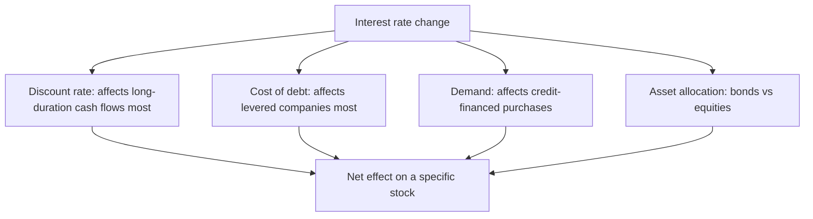

# Interest Rates and Equity Valuation

## The Problem / Why this matters
"Rates up, equities down" is the level at which the relationship is usually handled, and it explains very little. Rates affect equities through at least four distinct channels that sometimes offset, and their effect varies enormously across sectors and across the duration of a company's cash flows. Analysts are asked about this at every rate decision, and the difference between a coarse answer and a structured one is immediately visible.

## Core Idea
Rates reach equity value through the **discount rate, the cost of debt, demand for rate-sensitive products, and the relative attractiveness of the bond alternative** — and the net effect on any specific stock depends on which channels dominate for that business.

## Why it works this way
A higher risk-free rate raises the discount rate applied to every future cash flow, which mathematically reduces present value more for cash flows further out. But rates rise for a reason — usually stronger growth or higher inflation — and that reason may raise the cash flows themselves. The two effects work in opposite directions, which is why the observed relationship between rates and equities is unstable.

## Full technical content

### Channel 1 — The discount rate and duration

The most direct channel, and the one that produces the clearest cross-sectional prediction.

- A higher risk-free rate raises the cost of equity, which lowers the present value of all future cash flows.
- **The effect is larger the further out the cash flows sit.** A company whose value rests mostly on terminal value — high growth, low current earnings — has long-duration cash flows and is more rate-sensitive. A company generating most of its value from near-term cash flows is less so.
- **This is why growth stocks de-rate more than value stocks when rates rise**, and it is a mechanical consequence of discounting rather than a sentiment story.

**The practical calculation:** run your DCF at the current cost of equity and at 100bp higher. The percentage change in fair value is that stock's rate sensitivity, and it is directly comparable across your coverage. **Publishing that sensitivity table is genuinely useful and rare.**

### Channel 2 — The cost of debt

- **Levered companies** face higher interest expense as debt reprices or is refinanced.
- **The timing depends on the debt structure**: floating-rate debt reprices immediately, fixed-rate debt only at maturity. Check the fixed-floating split and the maturity profile, both disclosed.
- **The maturity wall matters** — a company refinancing a large tranche into a higher-rate environment takes a step change in interest cost, and this is a dated, forecastable event.
- **Model interest expense from the actual debt schedule**, not as a percentage of average debt, for a company with material refinancing ahead.

### Channel 3 — Demand for credit-financed purchases

Rates affect the consumer's and business's ability to buy:
- **Housing and real estate** — mortgage rates directly determine affordability, and this is among the strongest rate-demand linkages.
- **Automobiles**, particularly at entry price points, where a large share of purchases are financed.
- **Consumer durables** on EMI schemes.
- **Capital goods** — corporate capex decisions are rate-sensitive at the margin, though less than commonly assumed since strategic considerations dominate.
- **Lenders** face both sides: demand falls, but margins may expand or compress depending on the pace of asset and liability repricing.

### Channel 4 — Asset allocation

- **Bonds become more attractive** relative to equities as yields rise, which can drive allocation shifts.
- **The earnings yield versus bond yield comparison** is a widely used framework — comparing the inverse of the market P/E to the government bond yield. **Treat it with care:** the relationship has been unstable across periods and regimes, and the gap is not a reliable timing indicator. It is a framing device, not a signal.
- **Flow effects** are real where institutional mandates shift allocation between asset classes.

### The offsetting effect that undermines simple conclusions

**Rates rise for a reason.** If they are rising because growth is strong, corporate earnings are rising too, and the earnings effect can more than offset the discount-rate effect. If they are rising because inflation is high and the central bank is tightening into a slowdown, the earnings effect works the same way as the discount-rate effect and equities suffer.

**The analytical question is therefore not "are rates rising" but "why."** Growth-driven rate increases and inflation-driven ones have completely different implications, and stating this distinction is what separates a considered answer from a reflexive one.

### Sector sensitivity

| Sector | Rate sensitivity |
|---|---|
| **Banks** | Complex — margins depend on the relative repricing speed of assets and liabilities; a rising-rate environment often helps initially and hurts later as credit costs rise |
| **NBFCs** | Generally negative — funding costs rise faster than lending rates can be passed through |
| **Real estate** | Strongly negative — affordability and developer funding both hit |
| **Autos** | Negative at entry price points |
| **Capital goods** | Mildly negative |
| **IT services, pharma** | Limited direct sensitivity; indirect through global demand and currency |
| **FMCG staples** | Low demand sensitivity; often defensive |
| **Utilities** | Negative — high leverage and bond-like cash flows |
| **High-growth, low-current-earnings** | Most negative through the duration channel |

**The banks case deserves care** because the popular framing — "rate rises are good for banks" — depends entirely on the repricing structure of a specific bank's book and on where the credit cycle sits. A bank with a floating-rate loan book repricing faster than its deposits benefits initially; the same bank faces higher credit costs later if the rate cycle slows the economy.

### What to do in research

- **Publish a rate sensitivity** for your coverage — the change in fair value per 100bp change in the cost of equity.
- **Model interest expense from the debt schedule** with the fixed-floating split and maturities.
- **Distinguish the reason for the rate move** in any commentary.
- **Do not build a thesis on a rate forecast.** Rate forecasting is unreliable, and where a view depends on it, present scenarios — the same discipline applied to currency and commodities.
- **Watch the real rate**, not just the nominal one, since the effect on a company earning nominal cash flows depends on inflation as well.

## Common mistakes
- Asserting "rates up, equities down" without identifying **which channel** and **why rates moved**.
- Ignoring **duration** — that long-dated cash flows are hit hardest.
- Modelling interest expense as a percentage of average debt when **refinancing** is imminent.
- Missing the **fixed-floating split** and the maturity profile.
- Treating the earnings-yield-versus-bond-yield gap as a **timing signal**.
- Assuming rate rises are uniformly good for banks.
- Building a thesis on a **rate forecast**.
- Ignoring the offsetting earnings effect when rates rise on strong growth.

## Interview angle
"The central bank raises rates 50bp. What happens to your coverage?" Separate the channels rather than giving a direction: the discount-rate channel hits long-duration cash flows hardest, so high-growth companies whose value sits in terminal value de-rate more than near-term cash generators — and that is mechanical, not sentiment. The cost-of-debt channel depends on each company's fixed-floating split and refinancing schedule, both disclosed, which is why interest expense should be modelled from the actual debt schedule rather than as a percentage of average debt. The demand channel matters most where purchases are credit-financed — housing, entry-level autos, durables. Then make the point that undermines the simple answer: rates rose for a reason, and if it is strong growth then earnings are rising too and can offset the discount-rate effect entirely, whereas tightening into a slowdown compounds it — so the question is never just whether rates rose but why. Offer the deliverable a client can use: a table showing the change in fair value per 100bp change in the cost of equity across your coverage.
